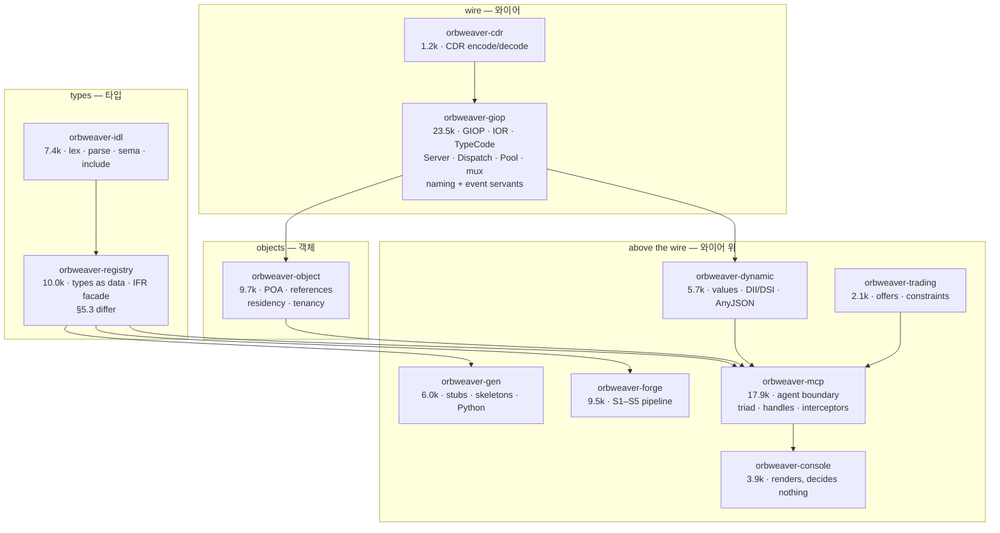
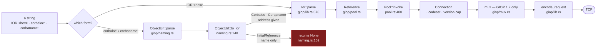
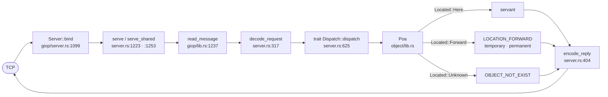
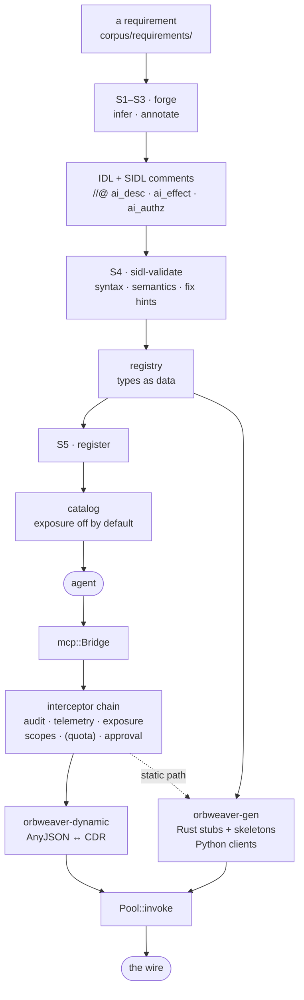
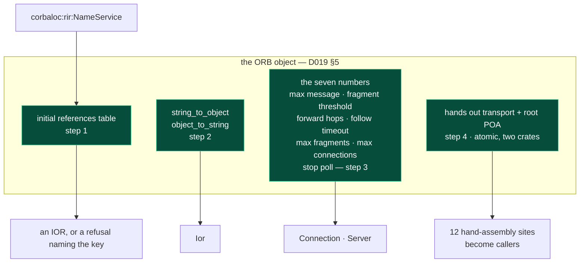

# Flows — the paths, drawn / 흐름 — 경로를 그린 것

Companion to [`ARCHITECTURE.md`](ARCHITECTURE.md), which describes the system
in prose. **This file draws paths and states no facts of its own.** Where a
claim belongs to another document it is linked, not repeated — a diagram that
restates a fact drifts from it exactly like a sentence does, and nothing
compiles a picture either.

Every symbol below was read from the tree on 2026-08-25, and the one gap marked
in red is the subject of [`decisions/D019`](decisions/D019-the-orb-has-no-object.md).

[`ARCHITECTURE.md`](ARCHITECTURE.md)의 동반 문서. **이 파일은 경로를 그리고
자기 사실은 말하지 않는다.** 다른 문서에 속한 주장은 링크하지 다시 적지 않는다 —
사실을 다시 적은 그림은 문장과 똑같이 어긋나고, 그림을 컴파일하는 것도 없다.

---

## 1. Crate ownership / 크레이트 소유

Who owns what, and which way the dependencies point. The rule that shapes this
is in [`ARCHITECTURE.md` §1](ARCHITECTURE.md); the sizes are `wc -l` over
`src/`, 2026-08-25.

## 2. The client call path / 클라이언트 호출 경로

From a string a person holds to bytes on a socket. **The red node is the one
break**: the URL parser understands `corbaloc:rir:` and nothing answers it.

- `Corbaname` resolves *a name inside a naming service whose address you were
  given*; `InitialReference` is the case where **no address is given** and the
  ORB is supposed to know. That is the whole difference, and the whole gap.
- What a reply does on the way back — `LOCATION_FORWARD`, fragment
  reassembly, `CloseConnection` mid-reply — is
  [`ARCHITECTURE.md` §2](ARCHITECTURE.md).

*`Corbaname`은 **주소를 받은** 네이밍 서비스 안에서 이름을 푼다.
`InitialReference`는 **주소가 없는** 경우이고, ORB가 알고 있어야 하는 경우다.
그 차이가 곧 공백이다.*

## 3. The server dispatch path / 서버 디스패치 경로

The servants that ship in-tree — `naming_server`, `event_server` (in
`orbweaver-giop`), `expert_service`, `tenant_service` (in `orbweaver-object`) —
are `Dispatch` implementations. What each serves and refuses, with the wire's
own answer per operation, is the generated block of
[`SERVICES-COVERAGE.md` §8](SERVICES-COVERAGE.md).

## 4. The agent path / 에이전트 경로

A requirement becomes a contract, both halves are generated, and a call is made
under a guard. Stages and their gates are
[`ARCHITECTURE.md` §4](ARCHITECTURE.md); the pipeline's own gates are in
[`PLAN.md`](PLAN.md) §5.

`(quota)` is drawn in parentheses because the seat has an occupant that
`Chain::standard` deliberately does not install — the reason is written at the
seat, in `mcp/interceptor.rs`.

## 5. What D019 proposes, on the same paths / D019가 제안하는 것

The four responsibilities of [`decisions/D019`](decisions/D019-the-orb-has-no-object.md)
§5, drawn where they attach. Green is the object; the red node is §2's break,
closed by step 1.

Steps 1–3 are one crate each and default to today's behaviour. **Step 4 is the
one the approval phrase gates**, because it is where the API becomes one-way.
The sequencing, with each step's oracle and negative control, is D019 §8.

## 6. Where the flows are measured / 흐름이 측정되는 곳

Not a claim about coverage — a map from a path above to the thing that runs it.

| Path | Measured by |
|---|---|
| §2 client, §3 server | `spikes/service_sweep.sh` (every declared operation over the wire), `spikes/differential.sh` |
| §2 forwarding | `spikes/perm_fallback.sh`, `giop/tests/forward_*.rs` |
| §2 wide text, versions | `spikes/jacorb_giop11.sh`, `jacorb_wchar11.sh`, `wide_rust.sh` |
| §3 concurrency | the harness's five-run dispatch group |
| §4 end to end | `spikes/end_to_end.sh`, `spikes/estate/run.sh` |
| §5 step 1 | **a peer resolving `corbaloc:rir:NameService`** — the reason step 1 is first |

The harness runs all of these and its exit code is the verdict; what it cannot
measure it prints as a counted `SKIPPED` group naming the fixture.
