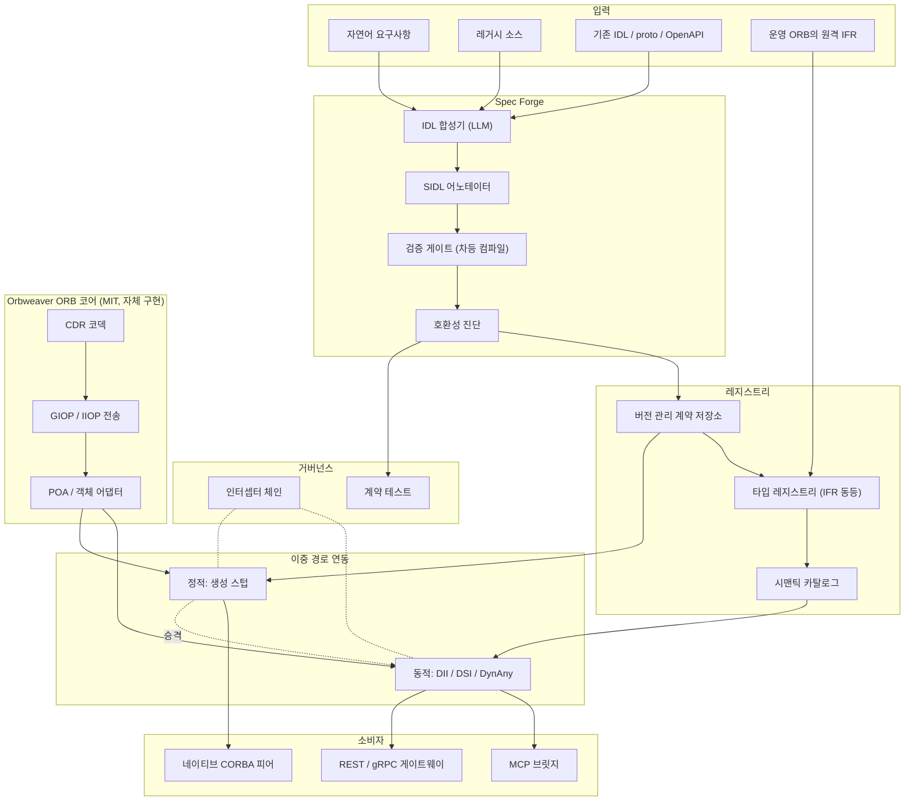

# Orbweaver — 개발 계획서

> 버전 0.3 · 2026-08-12 · **초안, Phase 0 결과에 따라 변경 가능**
> English: [`PLAN.md`](PLAN.md)

**v0.2에서의 변경** — 상세 검토 반영. 추가된 것: 와이어 수준 결정 — GIOP 버전·코드셋 전략, IOR 획득, v1 타입 지원 매트릭스, 런타임 모델(§4.4); 규범적 AnyJSON 매핑(§4.5); 기본 거부 노출을 갖춘 MCP 투영 3종(§4.6); 구체적 와이어 호환 규칙(§5.1); 신규 리스크 둘 — 메타데이터 프롬프트 주입과 브릿지 증폭 — 을 포함한 위협 모델(§9.0, R11–R12); 자가수정 루프를 위한 제품으로서의 진단(§3.3); 벤치마크 규율(§8).

**v0.1에서의 변경** — 라이선스 방침을 *MIT 또는 MIT 동등, 아니면 직접 구현*으로 강화했다. MIT 라이선스 CORBA ORB가 존재하지 않으므로, ORB 코어가 "omniORB/TAO 채택"에서 "공개된 OMG 와이어 명세에 따라 직접 구현"으로 바뀌었다. 기존 ORB는 의존성이 아니라 상호운용 테스트 픽스처가 되었다. 기간은 30주에서 45주로 연장되었다.

---

## 0. 요약

Orbweaver는 자연어 요구사항을 컴파일러로 검증된 OMG IDL 계약으로, 다시 살아있는 ORB 연동으로 바꾼다. 그 경로 어디에도 손으로 쓴 스텁은 없다. 산출물은 MIT 라이선스 ORB 구현체와 그 위에 얹힌 AI 명세 파이프라인이다.

설계를 규정하는 세 가지 명제.

**1. CORBA는 이미 런타임 자기기술 타입 시스템이다.** Interface Repository, `TypeCode`, DII/DSI, `DynAny`를 합치면 한 번도 본 적 없는 인터페이스를 런타임에 발견해 정확히 호출할 수 있다. 생성된 코드는 필요 없다. 이는 MCP가 2025년 `tools/list`로 표준화한 것과 구조적으로 같은 능력이며, CORBA는 1996년에 이미 제공했다. 이 기반 위에 AI 인터페이스 계층을 만든다는 것은 발견 메커니즘을 새로 발명할 필요가 없다는 뜻이다.

**2. LLM에게 IDL의 장황함은 자산이다.** 인간 개발자를 REST로 몰아낸 그 엄격함이, 기계가 생성한 인터페이스를 검증 가능하게 만든다. IDL 컴파일러는 잘못된 IDL을 결정론적으로, 예외 없이 거부한다. OpenAPI 기반 접근이 갖지 못한 정답 채점기를 시스템에 제공한다.

**3. 병목은 코드 생성이 아니라 명세 품질이다.** [AutoMCP](https://arxiv.org/html/2507.16044v2)는 실제 API 50개·엔드포인트 5,066개를 MCP 서버로 컴파일해 즉시 동작 76.5%, API당 평균 19줄의 *명세* 수정 후 99.9%를 달성했다. 남은 실패는 전부 명세 결함이었다 — 보안 스키마 누락 62%, 미문서화 런타임 헤더 47%, 잘못된 base URL 41%. 어려운 부분은 생성이 아니었다. 따라서 본 프로젝트의 1급 산출물은 코드 생성기가 아니라 의미 어노테이션 어휘인 **SIDL**이다.

**전략.** 동적 경로(런타임 호출, 코드 생성 없음)와 정적 경로(생성 스텁)를 모두 만들고, 안정화된 인터페이스를 전자에서 후자로 승격시킨다. 탐색은 동적으로, 정착은 정적으로.

---

## 1. 배경

### 1.1 현재의 비용

| 단계 | 현행 | 소요 | 실패 양상 |
|---|---|---|---|
| 인터페이스 설계 | 수작업 IDL 작성 | 수일~수주 | 도메인 지식 의존, 팀 간 불일치 |
| 스텁/스켈레톤 생성 | 컴파일러 수동 실행 | 분 | 빌드 스크립트 파편화 |
| 서버 구현 | 스켈레톤 상속 후 수작업 | 수주 | 반복 보일러플레이트 |
| 클라이언트 연동 | 팀 간 협의 후 수작업 | 수주 | ORB 버전·정책 불일치 |
| 변경 전파 | 전체 재컴파일·재배포 | 수주 | 하위 호환 영향을 사전에 알 수 없음 |

### 1.2 왜 지금인가

**레거시가 하중을 지탱하고 있다.** 함정 전투체계, 지휘통제, 통신 교환기, 항공관제, 금융 코어, 대형 물리실험 설비. 재작성이 선택지가 아닌 환경이며, 그래서 연동 비용을 영구히 지불한다.

**신규는 DDS로 이동 중이고, 이는 위협이 아니라 기회다.** 국내 국방은 DDS 기반 미들웨어로 표준화 중이며 국산 벤더가 OMG 표준에 등재되어 있다. 결정적으로 **CORBA와 DDS-XTypes는 OMG IDL 4.x를 공유한다.** 하나의 명세 파이프라인이 양쪽을 타깃할 수 있으므로, 축소되는 CORBA 시장이 확장 경로로 바뀐다.

**Java는 스스로 연결을 끊었다.** [JEP 320](https://openjdk.org/jeps/320)이 JDK 11에서 `java.corba`와 `javax.rmi.CORBA`를 제거했다. Java 레거시는 이제 동작 유지만을 위해서도 서드파티 ORB가 필요하며, 그 강제된 마이그레이션 자체가 자동화 수요다.

**호출 주체가 에이전트로 바뀌고 있다.** 사람이 아니라 LLM이 인터페이스를 호출할 때는, 장황하지만 정밀한 계약이 간결하지만 모호한 계약을 이긴다. 인간이 CORBA에서 거부했던 복잡성이 곧 에이전트에게 필요한 정밀성이다.

### 1.3 범위

**포함** — IDL 합성·정규화, 의미 어노테이션, 검증, 코드 생성, 동적 호출 런타임, 타입 레지스트리, 시맨틱 카탈로그, MCP 브릿지, 계약 테스트 생성, 관측·감사.

**제외 (v1)** — CORBA Component Model, 실시간 CORBA 스케줄링, 기존 시스템의 비즈니스 로직 재작성, TCP 이외 프로토콜 위의 GIOP, 양방향 GIOP(방화벽 뒤 콜백형 시스템에 필요, v1 이후 재검토), `valuetype`/`fixed`의 와이어 지원(파서는 수용, 와이어 지원은 Phase 4 결정 게이트 — §4.4).

---

## 2. 왜 CORBA가 AI 자동화에 적합한가

### 2.1 이미 존재하는 메커니즘

| 메커니즘 | 기능 | AI 자동화에서의 가치 |
|---|---|---|
| **Interface Repository** | 모든 IDL 정의의 런타임 질의 가능 저장소 | 이미 존재하는 에이전트 도구 카탈로그. `tools/list`를 발명할 필요 없음 |
| **TypeCode** | 모든 값에 대한 자기기술 타입 표현 | 모델 추론 없이 런타임 타입 검사·마샬링 |
| **DII** | 스텁 없이 런타임에 요청 조립·발행 | **코드 생성 0의 연동** — 자동화의 최단 경로 |
| **DSI** | 스켈레톤 없이 런타임에 요청 수신·디스패치 | 범용 브릿지·목·프록시를 코드젠 없이 |
| **DynAny** | 타입 정보에 맞춰 `any` 값 조립·분해 | LLM이 만든 JSON과 CORBA 파라미터 간 무손실 변환 |
| **Portable Interceptors** | 요청 경로의 횡단 훅 | **가드레일**: 인가, dry-run, 승인, 감사로그, 트레이싱 |
| **POA** | 서번트 생명주기·활성화 정책 | 동적 생성 서비스의 안전한 등록·회수 |
| **Naming / Trading** | 이름·속성 기반 서비스 탐색 | 시맨틱 검색 계층 아래의 백업 저장소 |
| **IOR** | 상태를 가진 원격 객체의 이식 가능 핸들 | 에이전트의 세션·컨텍스트 연속성 |

여기서 따라 나오는 결론 — MCP 생태계가 동적 도구 발견 프로토콜을 처음부터 설계하는 동안, CORBA는 그 요구사항 대부분을 이미 표준화해 두었다. 만들어야 하는 것은 새 프로토콜이 아니라 **IFR과 DII 위에 얹는 의미 계층과 AI 오케스트레이션**이다.

### 2.2 IDL에 없는 것 — 실제 작업

IDL은 구문에 엄격하고 의미에 침묵한다.

```idl
long transfer(in long acct, in long amt);
```

타입은 완벽하다. 그리고 `amt`가 원인지 센트인지, 호출이 멱등한지, 파괴적인지, `acct`가 PII인지, 타임아웃 시 재시도해도 안전한지 — 에이전트에게 아무것도 말해 주지 않는다. AutoMCP가 실무 실패를 지배한다고 밝혀낸 결함이 정확히 이 부류다.

**SIDL**은 OMG IDL 4.x의 표준 `@annotation` 문법으로 이 간극을 메운다. 확장이 아니라 표준 기능이다.

```idl
// sidl_annotations.idl — 프로젝트 표준 어노테이션 어휘
@annotation ai_desc       { string  text;  };  // 자연어 의도
@annotation ai_unit       { string  unit;  };  // KRW, meter, millisecond, ...
@annotation ai_effect     { string  kind;  };  // pure | read | write | destructive
@annotation ai_idempotent { boolean value; };  // 재시도 안전성
@annotation ai_pii        { string  level; };  // none | low | high
@annotation ai_example    { string  json;  };  // few-shot 재료
@annotation ai_precond    { string  expr;  };  // 사전조건, 테스트 생성 근거
@annotation ai_authz      { string  scope; };  // 필요 권한 스코프

module bank {
  @ai_desc("계좌 간 자금을 이체한다. 실패 시 전액 롤백된다.")
  interface Transfer {
    @ai_effect("destructive") @ai_idempotent(FALSE)
    @ai_authz("bank.transfer.write")
    @ai_example("{\"from\":1001,\"to\":2002,\"amount\":50000}")
    void execute(
      @ai_pii("high") in long from,
      @ai_pii("high") in long to,
      @ai_unit("KRW") in long amount
    ) raises (InsufficientFunds, AccountFrozen);
  };
};
```

어노테이션은 타입과 함께 레지스트리에 저장되며, 하나의 어휘가 양방향을 구동한다. 런타임에는 에이전트가 읽는 도구 설명이고, 빌드 타임에는 계약 테스트와 가드레일 정책을 생성하는 근거다.

**이 설계의 리스크** — 배포된 ORB 컴파일러 대부분은 IDL 4 이전 세대라 어노테이션을 거부할 수 있다. Phase 0의 가정 C가 이를 측정한다. 폴백은 구조화 주석과 사이드카 YAML이며, 파서를 우리가 소유하므로 실행 가능하다.

---

## 3. 조사 결과

### 3.1 ORB 구현체와 라이선스 판정

2026-08 GitHub API 및 각 프로젝트 라이선스 원문으로 확인.

| ORB | 언어 | 상태 | 라이선스 (확인됨) | MIT 전용 정책 하 판정 |
|---|---|---|---|---|
| **ACE / TAO** | C++ | DOC Group, 활발히 유지 (2026-03 커밋) | DOC License — 관대함, 실질적으로 MIT 동등, SPDX 식별자 없음 | ⚠️ 문자 그대로는 MIT 아님. **상호운용 대상** |
| **omniORB / omniORBpy** | C++ / Python | 4.3.4 (2026-01-05), 4.3.3 (2025-03) | LGPL (라이브러리) + GPL (툴) | ❌ 배제. **상호운용 대상** |
| **JacORB** | Java | 3.9 안정판, 저장소 활동 2026-04까지 | LGPL | ❌ 배제. **상호운용 대상** |
| **GlassFish CORBA** | Java | Eclipse Foundation, `org.glassfish.corba:glassfish-corba-orb` | EPL / GPLv2+CPE | ❌ 배제 |
| **MICO** | C++ | 유지보수 저조 | GPL / LGPL | ❌ 배제 |
| **Orbacus** | C++ / Java | Micro Focus | 상용 | ❌ 배제 |

**계획을 다시 짜게 만든 발견: MIT로 제공되는 CORBA ORB는 존재하지 않는다.** 엄격한 MIT-또는-직접구현 정책 하에서 성숙한 오픈소스 ORB는 전부 배제되며, ORB 코어는 직접 구현해야 한다.

**그러나 처음 보이는 것보다 훨씬 덜 아픈 이유가 있다 — 상호운용에는 라이선스가 필요 없기 때문이다.** GIOP와 IIOP는 공개된 OMG 명세다. 와이어 프로토콜을 구현하는 것은 TAO, omniORB, JacORB에 대해 어떤 의무도 발생시키지 않는다. 그들의 코드를 링크하지도, 파생하지도, 재배포하지도 않기 때문이다. 따라서 이들은 의존성 목록에서 **상호운용 테스트 매트릭스**로 이동한다. CI에서 일회성 컨테이너로 띄워 Orbweaver가 GIOP를 정확히 구사하는지 검증하고, 배포물에는 절대 포함하지 않는다.

계획에 반영해야 할 두 가지 결과:
- **범위가 커진다.** CDR 인코딩, GIOP 메시지 프레이밍, IIOP 전송, IOR 파싱, POA, 타입 레지스트리가 전부 자체 작업이 된다. 약 15주 추가로 추산한다 (§7).
- **통제력도 함께 커진다.** 파서를 소유하므로 어노테이션 폴백(§2.2)이 가능해지고, 레지스트리를 소유하므로 시맨틱 카탈로그가 외부 IFR에 덧붙는 것이 아니라 레지스트리 자체가 된다.

### 3.2 IDL 파서와 코드 생성

| 프로젝트 | 언어 | IDL 버전 | 라이선스 (확인됨) | 정책상 사용 가능 |
|---|---|---|---|---|
| **foxglove/omgidl** | TypeScript | OMG IDL | **MIT** | ✅ 가능 — 참조 및 시드 후보 |
| tier4/idl_parser | Rust | IDL 4.2 명시 | Apache-2.0 | ⚠️ 관대하나 MIT 아님 — **참조만** |
| eProsima/IDL-Parser | Java | OMG IDL | Apache-2.0 | ⚠️ 참조만 |
| ArduPilot/OMG-IDL-Parser | — | OMG IDL | Apache-2.0 | ⚠️ 참조만 |
| Remedy IT RIDL | Ruby | IDL2/3/3+ | 듀얼, 미확인 | ⚠️ 아키텍처 참조 — 플러그형 제너레이터 프레임워크가 좋은 모델 |
| sugarsweetrobotics/idl_parser | Python | OMG IDL | **라이선스 없음** | ❌ 라이선스 부재는 모든 권리 유보를 뜻함 |
| asenac/idl-parser | C++ | OMG IDL | **라이선스 없음** | ❌ 사용 불가 |
| omniidl | Python 호스팅 | CORBA IDL | GPL 계열 | ❌ 배제. CI에서 **적합성 채점기**로만 사용 |
| tao_idl | C++ | CORBA IDL | DOC License | ⚠️ CI에서 **적합성 채점기**로만 사용 |

**결정.** `orbweaver-idl`을 MIT 라이선스 OMG IDL 4.2 프론트엔드로 직접 작성한다. `foxglove/omgidl`이 유일한 MIT 선행 구현으로 참조가 되고, Apache-2.0 파서들은 문법 처리 방식만 참고하되 코드는 복사하지 않는다. `tao_idl`과 `omniidl`은 CI에서 차등 채점기로 돌린다. 우리 파서와 독립 구현 두 개가 어떤 구문에 대해 의견이 갈리면, 그것은 릴리스가 아니라 버그 리포트다.

### 3.3 AI 스택

- **모델** — 설계와 어려운 추론에 Claude Opus 5, 대량 변환에 Claude Sonnet 5. Tool use와 structured output으로 IDL AST를 직접 생성해 문자열 파싱 오류 부류를 제거한다.
- **프롬프트 캐싱** — 대규모 레거시 IDL 코퍼스를 반복 변환 동안 컨텍스트에 상주시키는 데 필수. 규모가 커지면 비용을 지배한다.
- **검색** — 레지스트리 내용, 기존 IDL, 도메인 용어집을 임베딩해 합성 시 유사 인터페이스를 few-shot 참조로 가져온다.
- **자가수정 루프** — 생성, 컴파일, 컴파일러 진단을 그대로 되먹임, 재생성. IDL 컴파일러는 정확한 오류를 내므로 이 루프가 빠르게 수렴한다. 파이프라인에서 레버리지가 가장 큰 메커니즘이 될 것으로 예상한다.
- **제품 표면으로서의 진단** — 자가수정 루프의 품질은 그것이 먹는 오류 메시지의 품질을 넘지 못한다. 따라서 `orbweaver-idl`은 모델에 그대로 되돌릴 수 있게 설계된 구조화 진단(JSON: 소스 범위, 기대/실제, 수정 힌트)을 낸다. 오류 메시지 품질은 테스트가 붙는 기능이지 부가 사항이 아니다.

### 3.4 인접 표준

| 대상 | 확인된 사실 | 함의 |
|---|---|---|
| **MCP** (2025-11-25 스펙) | 클라이언트는 빌드 타임에 스키마를 읽지 않는다. 런타임 `tools/list`로 살아있는 카탈로그를 받는다 | 구조적으로 IFR + DII의 재도출. 레지스트리를 MCP로 투영하기만 하면 된다 |
| **AutoMCP** (arXiv 2507.16044) | API 50개·엔드포인트 5,066개. 즉시 성공 76.5%, API당 약 19줄 명세 수정 후 99.9%. 실패: 보안 스키마 62%, 미문서화 헤더 47%, 잘못된 base URL 41% | 명세 품질이 병목이라는 직접 증거 — SIDL의 근거 |
| **DDS / DDS-XTypes** | OMG IDL 4.x 공유. 국내 국방 표준화 진행, 국산 벤더 OMG 등재 | 하나의 파이프라인이 CORBA와 DDS 산출물을 모두 낼 수 있다 — CORBA 축소에 대한 전략적 헤지 |
| **CORBA-NG 논의** | IOR·IDL·IIOP 콜백 의미론을 MCP로 이식하자는 커뮤니티 제안. 인간에게 과했던 복잡도가 에이전트에게는 적정하다는 논거 | §2와 같은 통찰. 다만 그 제안들은 IDL을 Protobuf로 대체한다. **Orbweaver는 표준 IDL과 IIOP를 유지**해 기존 자산과 무손실로 연결한다 — 이것이 차별점 |

---

## 4. 아키텍처

### 4.1 전체 구성



### 4.2 구성요소

모든 구성요소는 MIT이며 본 저장소에서 작성한다.

| # | 구성요소 | 책임 |
|---|---|---|
| 01 | `orbweaver-cdr` | OMG CDR 인코딩·디코딩, 양방향 엔디안, 정렬 규칙 |
| 02 | `orbweaver-giop` | GIOP 1.2 네이티브·양방향 1.0/1.1 호환, TCP 위 IIOP, 코드셋 협상, IOR 파싱·생성, `corbaloc:`/`corbaname:` 해석과 CosNaming 클라이언트, 연결 관리 |
| 03 | `orbweaver-poa` | 서번트 생명주기, 객체 활성화 정책, 요청 디스패치 |
| 04 | `orbweaver-idl` | `@annotation` 지원 OMG IDL 4.2 프론트엔드, AST, 플러그형 백엔드 |
| 05 | `orbweaver-registry` | 타입 레지스트리 (IFR 동등). 외부 ORB의 원격 IFR도 흡수 |
| 06 | `orbweaver-dynamic` | DII/DSI/DynAny 동등 기능, JSON ↔ CORBA `any` 무손실 변환 |
| 07 | `orbweaver-forge` | S1–S5 파이프라인: 흡수, 합성, 의미부착, 검증, 등록 |
| 08 | `orbweaver-gen` | 정적 생성: 스텁, 스켈레톤, 서버 스캐폴드, 클라이언트 SDK, 빌드 파일 |
| 09 | `orbweaver-mcp` | 레지스트리를 MCP `tools/list`로 투영, 호출을 `orbweaver-dynamic`에 위임 |
| 10 | `orbweaver-guard` | 인터셉터 체인: 인가, dry-run, 파괴적 호출 승인, 감사로그 |
| 11 | `orbweaver-test` | 어노테이션 기반 계약·property 테스트 생성, DynAny 퍼징 |
| 12 | `orbweaver-console` | 카탈로그 브라우저, 계약 diff 뷰어, 호출 트레이스 |

### 4.3 이중 경로 연동

순수 코드 생성은 스키마가 바뀌는 순간 자동화가 깨진다. 변경마다 재생성과 재배포를 강제하기 때문이다. 순수 동적 호출은 임계 경로에 쓰기엔 느리다. 둘 다 운영하고 사이에서 승격시키면 각 제약이 실제로 작용하는 지점에서 각각 해소된다.

| | 동적 경로 | 정적 경로 |
|---|---|---|
| 메커니즘 | DII + DynAny | 생성 스텁 |
| 생성 코드 | 없음 | 전체 |
| 스키마 변경 | 자동 적응 | 재생성·재배포 |
| 지연 | 높음 | 최저 |
| 타입 안전성 | 런타임 | 컴파일 타임 |
| 적합 용도 | 탐색, 실험, 저빈도 호출 | 임계 경로, 실시간 제약 |

**승격 조건** — 일 1,000회 이상 호출, 스키마 30일 무변경, 회귀 스위트 통과. 파괴적 스키마 변경 시 자동 강등.

### 4.4 와이어 수준 결정

Phase 1 도중에 재론하지 않도록 여기서 확정한다.

**GIOP 버전 전략.** 연결에서 어떤 버전으로 말할지는 상대가 정한다. IOR의 IIOP 프로파일이 클라이언트가 초과할 수 없는 GIOP 마이너 버전을 광고하고, 레거시 클라이언트는 구버전으로 우리에게 접속해 올 수 있다. 따라서 Orbweaver는 **GIOP 1.2를 네이티브로, 1.0/1.1을 양방향 호환으로** 구현하며 각 버전의 헤더·정렬 차이를 준수한다. `Fragment` 처리(1.1 도입)는 수신 필수, 송신 지원. 양방향 GIOP(BiDir)는 명시적으로 보류한다(§1.3).

**코드셋 협상은 뒷전이 아니라 1급 요구사항이다.** GIOP는 CodeSets 서비스 컨텍스트로 협상된 코드셋으로 `char`/`string`, `wchar`/`wstring`을 전송하며, GIOP 1.0에서 `wchar`는 정의되지 않는다. 국내 레거시 시스템은 EUC-KR 계열 네이티브 코드셋을 흔히 사용하므로, 협상이 틀리면 이 프로젝트의 본거지 시장이 다루는 바로 그 텍스트가 깨진다. v1은 UTF-8, UTF-16, ISO-8859-1, EUC-KR 변환을 탑재하고, 상호운용 매트릭스에 모든 픽스처 ORB 대상 한국어 텍스트 왕복을 포함한다.

**객체 참조 획득.** 겨눌 IOR이 없으면 DII는 무용지물이다. v1은 IOR 문자열·파일, `corbaloc:`·`corbaname:` URL, 그리고 표준 INS 표면인 **CosNaming 클라이언트**로 참조를 해석한다 — 레지스트리가 살아있는 객체에 닿지 못하면 발견은 무의미하므로 `orbweaver-giop`에 내장한다.

**v1 와이어 타입 지원 매트릭스.** 기본형, `string`/`wstring`, `enum`, `struct`, `union`, `sequence`, 배열, `exception`, `any`, `TypeCode`(간접 참조 포함)는 완전한 CDR 왕복을 지원한다. **보류: `valuetype`(청크 인코딩과 절단은 그 자체로 하나의 프로젝트다), abstract interface, `fixed`.** 파서는 전부 수용하되, 와이어 지원은 파일럿 수요를 근거로 한 Phase 4 결정 게이트로 미룬다.

**런타임 모델.** Rust 코어는 비동기(tokio)이며 블로킹 C-ABI 파사드를 제공하고, Python 제어평면은 PyO3로 블로킹 파사드에 바인딩한다. 다수의 동시 요청에서 전송 계층의 동시성을 유지하면서 파이프라인 코드에는 비동기 복잡성을 강요하지 않는다.

### 4.5 AnyJSON — JSON ↔ `any` 매핑

동적 경로는 에이전트 쪽 JSON과 CDR 값 사이의 결정론적·무손실·양방향 매핑 위에 서 있다. 여기서 얼버무리면 조용한 데이터 손상이 생기므로, 매핑은 property 테스트로 왕복을 검증하는 규범 명세(**AnyJSON v1**)다.

| IDL 구문 | JSON 인코딩 | 이유 |
|---|---|---|
| `short`/`long`, `float`/`double` | JSON number | IEEE-754 정확 범위 내 |
| `long long` / `unsigned long long` | **JSON string** | JSON number는 2^53 초과 정수 정밀도를 잃는다 |
| `fixed` | JSON string | 십진 정밀도 보존 |
| `octet` sequence | base64 문자열 | 바이너리 안전성 |
| `enum` | 심볼 이름 문자열 | 서수는 와이어 세부사항이지 의미가 아니다 |
| `union` | `{"_d": <판별자>, "_v": <값>}` | 활성 멤버를 명시 |
| `struct`/`exception` | IDL 멤버 순서를 보존한 JSON object | CDR은 위치 기반 |
| `string`/`wstring` | JSON string (UTF-8), 코드셋 변환은 와이어에서 | 에이전트 쪽 텍스트 표현은 하나로 |
| `any` | `{"_t": <TypeCode 표현>, "_v": ...}` | 자기기술이 경계를 넘어 유지된다 |
| NaN / ±Inf | `{"_f": "nan" \| "+inf" \| "-inf"}` | JSON에 인코딩이 없다 |

검증: 골든 코퍼스의 모든 타입에 대해 `any → JSON → any`가 동일한 CDR 바이트를 재생해야 한다(§8).

### 4.6 레지스트리의 MCP 투영

소박한 투영 — 연산 하나당 MCP 도구 하나 — 은 레거시 규모에서 무너진다. 수천 개 연산이면 `tools/list`가 쓸 수 없어지고 에이전트 컨텍스트가 폭발한다. 따라서 기본 투영은 **범용 3종**이다.

- `search_interfaces(query)` — 카탈로그 시맨틱 검색 (이름, SIDL 어노테이션, 임베딩)
- `describe_interface(id)` — 전체 계약: 연산, 타입, 어노테이션, 예시
- `invoke_operation(ref, op, args, options)` — 동적 호출기에 위임, `orbweaver-guard`가 통제

작고 안정적이며 트래픽이 많은 표면에는 선별된 연산별 도구를 옵트인으로 제공한다. **노출은 기본 거부(default-deny)다**: 레지스트리에 있다는 이유만으로 MCP에서 호출 가능해지지 않으며, 명시적 허용 목록에 올려야 한다(§9.0).

---

## 5. 파이프라인

| 단계 | 입력 | 처리 | 출력 | 자동화 목표 |
|---|---|---|---|---|
| **S1** 흡수 | 요구사항, 레거시 소스, IFR 덤프 | 도메인 엔티티·연산 추출 | 중간표현 | 95% |
| **S2** 합성 | IR + 검색된 유사 IDL | IDL 4.2 초안을 AST로 생성 | `.idl` | 90% |
| **S3** 의미부착 | `.idl` | `@ai_*` 어노테이션 추론, 불확실한 것은 검토 큐로 | SIDL | 80% |
| **S4** 검증 | SIDL | 차등 컴파일, 린트, 명명규약, 호환성 검사 | 리포트 또는 자가수정 루프 | 100% |
| **S5** 등록 | 검증된 SIDL | 커밋, 레지스트리 적재, 임베딩 | 카탈로그 엔트리 | 100% |
| **S6** 연동 | 카탈로그 | 동적 호출 또는 정적 생성·빌드 | 동작하는 연동 | 85% |
| **S7** 검증·운영 | 연동 | 계약 테스트, 인터셉터, 트레이싱 | 합격 판정 및 텔레메트리 | 90% |

**S4가 시스템 전체의 안전벨트다.** LLM은 의미상 틀릴 수 있는 그럴듯한 IDL을 쓴다. IDL 컴파일러는 구문상 틀린 IDL을 예외 없이 매번 거부한다. 이 비대칭 — 확률적 합성, 결정론적 검증 — 이 신뢰 모델을 성립시킨다. S4 상류의 모든 것이 불확실해도 되는 이유는 S4가 그렇지 않기 때문이다.

### 5.1 무엇이 파괴적 변경인가

CDR은 태그가 아니라 위치로 인코딩한다. protobuf에서 직관을 익힌 사람은 IDL의 진화 가능성을 과신하게 되므로, 레지스트리가 아래 규칙을 인코딩하고 semantic differ가 강제한다.

| 변경 | 판정 | 이유 |
|---|---|---|
| 인터페이스에 연산·속성 추가 | 클라이언트 호환. **서버 우선 배포 필수** | 구버전 서버는 `BAD_OPERATION` 응답 |
| struct·union·exception 멤버의 추가/삭제/순서변경/타입변경 | **파괴적** | 위치 기반 CDR, 태그 없음 |
| enum 상수를 끝에 추가 | **조건부 파괴적** | 와이어상 합법이나 구버전 수신자에게는 범위 밖 — 수신자가 먼저 갱신되지 않는 한 파괴적으로 취급 |
| 연산 시그니처 변경 (`raises` 절 포함) | **파괴적** | — |
| 새 타입·인터페이스 추가 | 호환 | — |
| 이름 변경 | 계약 수준에서 **파괴적** | Repository ID가 바뀐다 |

결론: 인터페이스 진화는 **버전 붙인 인터페이스**(버전 모듈의 `Transfer_2`와 `@ai_since` 메타데이터)로 하며, 배포된 타입을 제자리에서 고치는 방식은 금지된다. differ는 릴리스된 타입을 수정하는 등록을, 변경이 호환 집합에 속하거나 명시적 승인을 동반하지 않는 한 차단한다.

---

## 6. 기술 결정

| 영역 | 선택 | 근거 |
|---|---|---|
| ORB 코어 | **자체 구현, MIT** | MIT ORB가 없다. GIOP/IIOP는 공개 명세이므로 상호운용에 라이선스가 불필요 |
| 코어 언어 | **Rust** | 와이어 프로토콜 파싱은 전형적인 메모리 안전 위험 지점. 바이너리 처리에 강하고, 임베딩용 C ABI 제공 |
| 제어평면 | **Python 3.12+** | AI SDK 생태계가 가장 풍부. PyO3로 Rust 코어와 바인딩 |
| IDL 프론트엔드 | **`orbweaver-idl`, 자체** | 파서 소유가 어노테이션 폴백을 가능하게 함 |
| 적합성 채점기 | CI의 tao_idl, omniidl | 차등 테스트 전용. 링크·배포하지 않음 |
| 상호운용 매트릭스 | TAO, omniORB, JacORB 컨테이너 | 와이어 호환성 검증. 일회성, 재배포 없음 |
| LLM | **Claude Opus 5 / Sonnet 5** | 긴 컨텍스트, structured output, 프롬프트 캐싱 |
| 에이전트 노출 | **MCP** | 런타임 발견 모델이 IFR/DII와 구조적으로 일치 |
| 저장소 | **PostgreSQL + pgvector** | 계약 메타데이터와 시맨틱 검색을 한 엔진에서 |
| 관측 | 인터셉터를 통한 **OpenTelemetry** | 호출 지점을 건드리지 않는 표준 트레이싱 |
| 배포 | **Docker + Kubernetes** | IOR endpoint 재작성 포함. R7 참조 |

---

## 7. 로드맵

약 45주. ORB 코어 자체 구현이 기존 ORB 채택 대비 약 15주를 추가하며, 그 대가로 완전한 MIT 자유도를 얻는다.

### Phase 0 — 타당성 검증 (3주) — 전체의 관문

무엇을 만들기 전에 네 가지 가정을 검증한다. 그중 둘은 아키텍처를 무효화할 수 있다.

- **A. GIOP 상호운용이 가능한가.** GIOP 1.2 `Request`를 직접 인코딩해 순정 TAO·omniORB 서버로부터 정상 응답을 받고, 응답을 직접 디코딩한다.
  *최소 구현이 상호운용되지 않으면 자체 구현 경로가 무너지고 MIT 전용 제약을 재협상해야 한다. 이것을 가장 먼저 검증한다.*
- **B. LLM이 컴파일되는 IDL을 쓰는가.** 요구사항 20건 → IDL. 목표 1차 통과 ≥60%, 자가수정 3회 내 ≥95%.
- **C. `@annotation`이 실제 툴체인에서 통과하는가.** TAO, omniORB, JacORB 컴파일러의 IDL 4 어노테이션 수용 여부 측정.
  *폴백: 구조화 주석 + 사이드카 YAML.*
- **D. NAT·컨테이너에서 IOR 주소가 동작하는가.** Kubernetes 환경의 endpoint 재작성 검증.

Phase 0에서 함께 진행 — **골든 IDL 코퍼스 v0** 구축. 중첩 struct, union, sequence, typedef, 상속, exception, valuetype, `oneway`, `any`를 망라한 20~30개 케이스. 이것 없이는 AI 품질을 아예 측정할 수 없다. 보류된 와이어 타입(`valuetype`, `fixed`)은 v1 지원 매트릭스(§4.4)에 맞춰 파서 수준까지만 커버하고, 의도적으로 깨뜨린 IDL의 **네거티브 코퍼스**가 진단 품질 — 자가수정 루프의 원재료 — 을 단련한다.

**Go/No-Go** — 가정 A가 관문이다. GIOP 상호운용에 실패하면 코드를 더 쓰기 전에 멈추고 라이선스 제약을 재검토한다.

### Phase 1 — 와이어 프로토콜 코어 (10주)

- `orbweaver-cdr`: CDR 인코딩·디코딩, 양방향 엔디안, 정렬, 모든 기본·구성 타입
- `orbweaver-giop`: GIOP 1.2 프레이밍(`Request`/`Reply`/`LocateRequest`/`CancelRequest`/`Fragment`), 양방향 1.0/1.1 호환, TCP 위 IIOP
- 코드셋 협상: UTF-8, UTF-16, ISO-8859-1, EUC-KR — 상호운용 매트릭스에 한국어 텍스트 왕복 포함
- IOR 파싱·생성, 프로파일 처리, endpoint 재작성, `corbaloc:`/`corbaname:` 해석, CosNaming 클라이언트
- **상호운용 CI**: 매 커밋마다 TAO·omniORB·JacORB 컨테이너 대상 왕복 검증

*산출물: 기존 CORBA 시스템을 호출하고 그로부터 호출받을 수 있는 MIT ORB.*

### Phase 2 — IDL 컴파일러와 레지스트리 (8주)

- `orbweaver-idl`: IDL 4.2 프론트엔드, `@annotation`, AST, 플러그형 백엔드
- tao_idl·omniidl 대상 차등 적합성 테스트
- `orbweaver-registry`: 타입 레지스트리, 원격 IFR 흡수, 버전 관리, semantic diff, 파괴적 변경 탐지
- `orbweaver-poa`: 서번트 생명주기와 디스패치

### Phase 3 — 동적 호출과 AI 파이프라인 (10주) — 하이라이트 데모

- `orbweaver-dynamic`: DII/DSI/DynAny 동등 기능, property 테스트로 왕복이 검증되는 **AnyJSON v1**(§4.5)
- `orbweaver-forge`: S1–S5 — 흡수, 합성, 의미부착, **자가수정 루프를 갖춘 검증 게이트**
- SIDL 어휘 v1 확정
- 시맨틱 카탈로그: 임베딩 인덱스, 자연어 인터페이스 검색
- `orbweaver-mcp`: **기본 거부 허용 목록**을 갖춘 범용 3종 투영(§4.6)
- `orbweaver-guard` v1: `@ai_authz` 스코프 강제, 클라이언트 측 dry-run, `destructive` 호출 사람 승인, 상관된 감사로그

*산출물: AI 에이전트가 생성 코드 없이 기존 CORBA 시스템을 호출한다. 프로젝트가 평가받는 데모.*

### Phase 4 — 정적 생성과 승격 (8주)

- `orbweaver-gen`: 스텁, 스켈레톤, 서버 스캐폴드, 클라이언트 SDK, 빌드 파일
- 다중 타깃 백엔드: Rust, Python, C++, Java
- 승격 엔진: 호출 통계 기반 동적→정적 전환, 회귀 게이팅
- `orbweaver-test`: 어노테이션 기반 계약·property 테스트, DynAny 퍼징
- 동일 IDL에서 DDS-XTypes 타깃 실험
- 결정 게이트: 파일럿 수요를 근거로 한 `valuetype`/`fixed` 와이어 지원(§4.4)
- 선택: 외부 DII 클라이언트가 레지스트리를 열람할 수 있는 읽기 전용 표준 IFR 파사드(`CORBA::Repository`)

### Phase 5 — 운영화 (6주)

- TLS 전송, 인증서 관리, 최소권한 스코프
- 인터셉터를 통한 OpenTelemetry, 대시보드
- 거버넌스: 파괴적 변경 승인 워크플로, `destructive` 호출 휴먼인더루프
- `orbweaver-console`: 카탈로그 브라우저, 계약 diff 뷰어, 호출 트레이스
- 문서화 및 파일럿 시스템 1건 연동

---

## 8. 검증 전략

| 계층 | 방법 | 합격 기준 |
|---|---|---|
| 와이어 프로토콜 | TAO·omniORB·JacORB 대상 왕복 | 상호운용 매트릭스 100% |
| CDR 인코딩 | 골든 코퍼스에 대해 참조 ORB와 차등 비교 | 바이트 동일 |
| IDL 구문 | tao_idl·omniidl 대상 차등 컴파일 | 설명되지 않는 불일치 0건 |
| IDL 의미 | 명명 린트, 어노테이션 커버리지 | 커버리지 ≥ 90% |
| 하위 호환 | semantic diff, 파괴적 변경 탐지 | 미승인 파괴적 변경 0건 |
| 동적 호출 | 골든 코퍼스 대상 DII 왕복 | 무손실 100% |
| 생성 코드 | 컴파일, 계약 테스트, 정적 결과 == 동적 결과 | 불일치 0건 |
| 종단 간 | 실 레거시 시스템 파일럿 연동 | 수작업 대비 ≥80% 단축 |
| AI 품질 | 요구사항 100건 회귀 벤치마크, 매 릴리스 | 1차 통과율 하락 시 릴리스 차단 |
| 코드셋 | 모든 픽스처 ORB 대상 한국어 텍스트 왕복 (EUC-KR / UTF-8 / UTF-16) | 무손실 100% |
| AnyJSON | 골든 코퍼스 전체에 대해 `any → JSON → any` | CDR 바이트 동일 |
| 성능 | LAN 에코 벤치마크, 동적 경로 대 정적 스텁 | §11 목표 이내 |

**벤치마크 규율.** AI 벤치마크는 동결·버전 관리한다. 홀드아웃 부분집합은 프롬프트 개발 중 절대 건드리지 않으며, 릴리스 간 케이스를 순환시켜 파이프라인이 자기 시험지에 과적합하지 않게 한다.

---

## 9. 위협과 리스크

### 9.0 위협 모델

레거시 CORBA 앞에 AI 브릿지를 세우는 것은 리스크 표만으로는 담기지 않는 방식으로 공격 표면을 넓힌다. 상시 태세:

| 위협 | 벡터 | 통제 |
|---|---|---|
| 평문 레거시 IIOP | 683/tcp 도청·중간자 공격 | 신규 경로 TLS, 레거시는 mTLS 터널, 네트워크 분리 (R3) |
| **원격 메타데이터를 통한 도구 오염** | 원격 IFR이나 흡수한 IDL의 이름·주석·어노테이션에 담긴 적대적 텍스트를 에이전트가 지시로 읽음 | 원격 출처 메타데이터는 기본 불신: 정화하고, 지시가 아닌 데이터로 렌더링하며, 사람 승인 전까지 에이전트 가시 설명에서 격리 |
| 과도한 에이전트 권한 | 의도보다 많이 발견하고 파괴적 연산을 호출 | **기본 거부 MCP 노출**(§4.6), `@ai_effect("destructive")`는 사람 승인 필수, `@ai_authz` 스코프를 `orbweaver-guard`가 강제 |
| 무인증 레거시 서버 | 배포된 CORBA 서비스 다수가 네트워크를 신뢰 | 브릿지가 강제 지점이 된다: 대상이 못 해도 브릿지가 호출자를 인증 |
| 감사 공백 | 추적 불가능한 에이전트 행동 | 모든 호출에 호출자 신원, MCP 요청 ID ↔ GIOP 요청 ID 상관, 인자 다이제스트, 판정을 기록 |

**dry-run의 정직성** — 진짜 서버 측 dry-run은 대상의 협조가 필요한데 레거시는 제공하지 않는다. 가드의 dry-run은 **클라이언트 측 게이트**다: 보내지 않은 채 검증·마샬링하고 무엇이 전송될지 보여준다. 문서가 이를 과장해서는 안 된다.

### 9.1 리스크 목록

| ID | 리스크 | 영향 | 확률 | 대응 |
|---|---|---|---|---|
| **R0** | **자체 ORB가 상호운용에 실패** — GIOP에는 버전·벤더별 특이사항이 있다 | 치명 | 중 | **Phase 0 가정 A, 최우선 검증.** Phase 1 첫 커밋부터 상호운용 CI. 실패 시 진행 전 라이선스 제약 재검토 |
| **R1** | **배포된 ORB 컴파일러가 `@annotation` 미지원** — 대부분 IDL 4 이전 | 치명 | 중 | Phase 0 가정 C. 폴백: 구조화 주석 + 사이드카 YAML. 파서 소유로 실행 가능 |
| **R2** | **대상 환경에 IFR이 없음** — 실무에서 흔함 | 높음 | 높음 | 레지스트리가 자체 구현이며 IDL 소스로부터 채운다. IDL 텍스트만으로 동작하는 오프라인 모드 병행 |
| **R3** | **IIOP 기본 비암호화** — GIOP/IIOP는 683/tcp 평문이며 CSIv2+TLS 통합은 벤더 간 비호환의 알려진 원인 | 높음 | 높음 | 신규 경로 TLS 필수. 레거시는 mTLS 터널·사이드카로 감싸 외부 ORB 설정 의존 회피. 침투테스트를 Phase 5 게이트로 |
| **R4** | LLM의 IDL 환각 | 중 | 높음 | 컴파일 게이트가 구문 오류 100% 차단. 의미 오류는 계약 테스트와 사람 검토 큐로 |
| **R5** | AutoMCP 사례대로 명세 결함이 지배 | 중 | 높음 | 어노테이션 커버리지를 KPI로. 임계 미달 시 등록 차단. 부족분은 트래픽 관측으로 역추론 |
| **R6** | CORBA 인력 희소 | 중 | 높음 | ORB·와이어 프로토콜 경험자 최소 1명 확보 또는 외부 자문. 운영 지식 내부 축적 |
| **R7** | **NAT·컨테이너의 IOR 주소** — IOR에 박힌 내부 IP는 외부에서 호출 불가 | 중 | 높음 | 모든 배포에 endpoint 재작성 템플릿화. Phase 0 가정 D에서 검증 |
| **R8** | ORB 코어 구축에 따른 범위 증가 | 중 | 중 | Phase 1–2는 와이어와 컴파일러 작업으로만 엄격히 한정, AI 범위 침범 금지. v1은 TCP 위 GIOP 1.2만 |
| **R9** | CORBA 시장 축소 | 전략 | 중 | IDL 4.x는 DDS와 공유. DDS 타깃을 조기 확보. CORBA 제품이 아니라 OMG IDL 자동화 플랫폼으로 포지셔닝 |
| **R10** | 동적 경로 성능 부족 | 낮음 | 중 | 승격으로 구조적 해결. 임계 경로는 항상 정적 스텁 |
| **R11** | **인터페이스 메타데이터를 통한 프롬프트 주입** — 적대적 IFR/IDL 텍스트가 에이전트를 조종 (도구 오염) | 높음 | 중 | §9.0 통제: 메타데이터 기본 불신, 렌더링 시 정화, 승인 전 격리 |
| **R12** | **브릿지가 레거시 노출을 증폭** — 무인증 내부 서비스가 AI에서 도달 가능해짐 | 높음 | 중 | 기본 거부 허용 목록, 인터페이스별 노출 심사, 브릿지 수준 인증, 네트워크 분리 |

---

## 10. 라이선스 방침

**방침 — 배포하는 모든 구성요소는 MIT 또는 MIT 동등이거나, 여기서 직접 작성한다.**

OMG 명세가 공개되어 있으므로 이는 희망사항이 아니라 달성 가능한 목표다. 와이어 포맷과 인터페이스 언어가 공개된 이상, 깨끗한 MIT 구현은 허가의 문제가 아니라 공학적 노력의 문제다.

| 구성요소 | 라이선스 (2026-08 확인) | 처리 |
|---|---|---|
| Orbweaver 전체 크레이트·패키지 | **MIT** | 배포 |
| `foxglove/omgidl` | **MIT** | 참조. 저작자 표시 하에 IDL 프론트엔드 시드로 사용 가능 |
| tier4/idl_parser, eProsima/IDL-Parser, ArduPilot | Apache-2.0 | 참조만. 코드 복사 없음 |
| ACE / TAO | DOC License (관대, SPDX 식별자 없음) | CI의 상호운용 픽스처·적합성 채점기. 링크·배포 없음 |
| omniORB / omniORBpy | LGPL + GPL 툴 | CI의 상호운용 픽스처·적합성 채점기. 링크·배포 없음 |
| JacORB | LGPL | CI의 상호운용 픽스처. 링크·배포 없음 |
| sugarsweetrobotics/idl_parser, asenac/idl-parser | **라이선스 없음** | 미사용. 라이선스 부재는 모든 권리 유보를 뜻한다 |

**상호운용 픽스처에 관하여.** LGPL·GPL ORB를 CI 컨테이너에서 실행해 와이어 호환성을 검증하는 것은 그 소프트웨어의 2차적 저작물을 만드는 행위가 아니며 Orbweaver에 어떤 라이선스 의무도 부과하지 않는다. 링크도, 코드 재사용도, 재배포도 없기 때문이다. 이 경계는 의도적이며 반드시 유지해야 한다. Orbweaver 코드는 이 프로젝트들의 어떤 부분도 import·링크·벤더링해서는 안 된다.

**픽스처 위생.** GPL·LGPL ORB가 담긴 CI 이미지는 CI 내부에서 빌드하거나 받아오며 프로젝트 산출물로 절대 발행하지 않는다 — 발행하는 순간 재배포가 되며, 이것이 이 경계가 실수로 깨질 수 있는 유일한 경로다.

**상시 요건.** 릴리스마다 라이선스 사실을 재확인하고, 새 의존성은 트리에 들어오기 전 본 방침에 대조해 검토한다.

---

## 11. 성공 지표

| 지표 | 현행 | 목표 |
|---|---|---|
| 신규 인터페이스 정의 소요 | 3~10일 | < 1시간 |
| 신규 서비스 연동 소요 (동적 경로) | 2~4주 | < 10분 |
| IDL 1차 컴파일 통과율 | — | ≥ 85% |
| 자가수정 3회 내 통과율 | — | ≥ 98% |
| 의미 어노테이션 커버리지 | 0% | ≥ 90% |
| 계약 테스트 자동 생성률 | 0% | ≥ 80% |
| 파괴적 변경 사전 탐지율 | 수동 | 100% |
| 상호운용 매트릭스 통과율 | — | 100% |
| 동적 경로 오버헤드 (정적 스텁 대비, LAN 에코 p50) | — | 추가 ≤ 5 ms, ≤ 3× |
| 파이프라인 사람 개입 비율 | 100% | ≤ 15% |

---

## 12. 즉시 액션

1. **Phase 0 착수.** 가정 A(GIOP 상호운용)가 단일 최대 리스크이며 이제 자체 구현 전략 전체의 관문이다. 1주차에 검증한다.
2. **골든 IDL 코퍼스 v0 구축** — 대표 패턴 20~30개.
3. **상호운용 CI 하네스 구성** — TAO·omniORB·JacORB 컨테이너를 Phase 1 코드가 존재하기 전에 미리 연결해 둔다.
4. **파일럿 시스템 선정** — 실제 IDL 자산이 있고, 담당자가 협조적이며, 장애 영향이 작은 시스템.
5. **팀 구성** — ORB·와이어 프로토콜 경험자 1명(필수), 백엔드 2명, AI 엔지니어 1명.
6. **AI 벤치마크 v1 동결** — 프롬프트 튜닝을 시작하기 전에, 홀드아웃 부분집합과 함께.

---

## 부록 — 참고 자료

**표준**
[OMG IDL 4.2](https://www.omg.org/spec/IDL/4.2/) ·
[CORBA 3.4 Interoperability (GIOP/IIOP)](https://www.omg.org/spec/CORBA/3.4/Interoperability/PDF) ·
[MCP Tools 명세 (2025-11-25)](https://modelcontextprotocol.io/specification/2025-11-25/server/tools) ·
[JEP 320](https://openjdk.org/jeps/320)

**참조 구현 (상호운용 대상, 의존성 아님)**
[DOC Group ACE/TAO](https://github.com/DOCGroup/ACE_TAO) ·
[OCI TAO](https://theaceorb.com/) ·
[omniORB 문서](https://omniorb.sourceforge.io/docs.html) ·
[JacORB](https://github.com/JacORB/JacORB) ·
[OMG CORBA 무료 다운로드](https://www.omg.org/corba/corbadownloads.htm)

**IDL 툴링**
[foxglove/omgidl (MIT)](https://github.com/foxglove/omgidl) ·
[tier4/idl_parser (Apache-2.0)](https://github.com/tier4/idl_parser) ·
[eProsima IDL-Parser](https://github.com/eProsima/IDL-Parser) ·
[Remedy IT RIDL](https://www.remedy.nl/opensource/ridl.html)

**동적 호출**
[omniORB — The Dynamic Invocation Interface](https://www.cl.cam.ac.uk/research/dtg/attarchive/omniORB/doc/3.0/omniORB/omniORB011.html) ·
[Oracle Tuxedo — Using the DII](https://docs.oracle.com/cd/E13203_01/tuxedo/tux91/creclient/dii.htm) ·
[VisiBroker — Dynamic Interfaces](https://www.ime.usp.br/~reverbel/SOD-97/Manuais/vbrokerc++/prog_gd/noframes/chap09.htm)

**AI와 인터페이스 자동화**
[AutoMCP (arXiv 2507.16044)](https://arxiv.org/html/2507.16044v2) ·
[A Second Life for CORBA in MCP 2.0](https://dev.to/grimch/a-second-life-for-corba-in-mcp-20-an-example-of-ai-and-humans-leveraging-their-combined-3c64) ·
[OOPS — LLM 기반 REST API 명세 생성](https://www.sciencedirect.com/science/article/abs/pii/S0164121226001470) ·
[AgentModernize (arXiv 2605.17535)](https://arxiv.org/pdf/2605.17535)

**국내 동향 및 보안**
[국방 무기체계에서 검증된 DDS 통신 미들웨어 — 전자신문](https://www.etnews.com/20230508000133) ·
[토종 SW, 통신 미들웨어 첫 국제표준 인정 — 전자신문](https://m.etnews.com/20190617000205) ·
[한화시스템 Smart DDS](https://www.hanwhasystems.com/kr/business/defense/naval/combat02.do) ·
[DDS 보안기술 — ETRI 전자통신동향분석](https://ettrends.etri.re.kr/ettrends/131/0905001659/26-5_112-122.pdf) ·
[Port 683: CORBA IIOP 보안](https://www.connected.app/ports/683)
