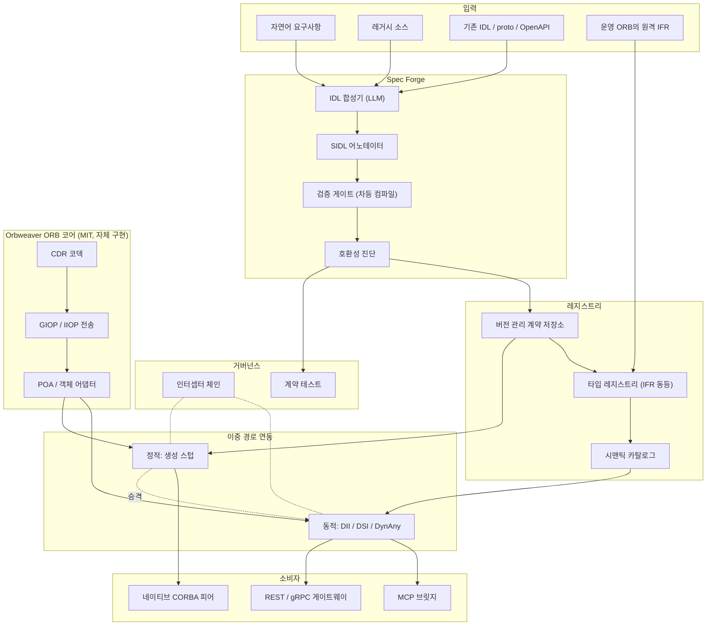

# Orbweaver — 개발 계획서

> 버전 0.7 · 2026-08-13 · **Phase 0–3.5 완료, Phase 4 대부분 착지, Phase 5 절반 착지** — [`PHASE0.md`](PHASE0.md) · [`PHASE1.md`](PHASE1.md) · [`PHASE2.md`](PHASE2.md) · [`PHASE3.md`](PHASE3.md) · [`PHASE5.md`](PHASE5.md)
> English: [`PLAN.md`](PLAN.md)

**v0.5에서의 변경** — §7을 직렬 주간 로드맵에서 **착지 기록 + 병행 스트림**으로 재작성. 직렬 계획은 작업 스레드 하나를 전제했는데 실행이 그것을 앞질렀고(Phase 0–3.5 완료, Phase 5 절반, Phase 4 미착수), 남은 항목들은 더 이상 일렬로 서로를 기다리지 않는다. 남은 각 스트림은 자체 일괄 단위·자체 오라클·성문화 대상을 명시하여 독립적인 일괄 → 오라클 → 보정 → 성문화 루프(§5.1)로 돌 수 있고, 스트림 간 통합 지점은 명시적으로 이름 붙였다. 범위는 더하거나 빼지 않았다 — 이미 계획된 것의 재배열과 정직한 완료 현황이다.

**v0.4에서의 변경** — 객체 모델(§4.7)과 신원·자격증명 전파(§4.8)를 추가했다. 둘은 별개가 아니라 하나의 주제였다: **IOR은 베어러 주소**이므로, 참조를 1급으로 만드는 순간 누가 그것을 쥘 수 있는가가 곧바로 문제가 된다. 결과: AnyJSON에 객체 참조·nil 행 추가, 설계상 원시 IOR 인코딩 없음(§4.5); MCP 경계를 넘는 참조는 IOR이 아니라 능력 핸들; 신규 컴포넌트 3종(`orbweaver-object`, `orbweaver-capability`, `orbweaver-identity`); 신규 리스크 5건(R13–R17), 그중 **R13 혼동된 대리자는 실패 양상이 아니라 기본 동작**이다. Phase 2는 11주로 늘고, 2주짜리 Phase 3.5가 능력 핸들을 MCP 브릿지 *다음이 아니라 함께* 내놓으며, 신원 전파는 자체 Phase 5가 된다. 기간 45주 → 58주.

**v0.3에서의 변경** — 운영 모델 추가(§5.1): 모든 작업을 건건이가 아니라 일괄 → 오라클 → 보정 → 성문화 루프로 수행한다. 근거는 Phase 0 실측 — 생성 20건에서 실패 7건이 나왔고 전부 근본원인 1개를 공유했다. 자동화 역할 구성 추가(§5.2): 루프의 각 단계를 `.claude/agents/`의 정의된 에이전트 역할에 대응시켰다. 작업 규칙을 `CLAUDE.md`로 추출. 와이어 호환 규칙 번호 변경 §5.1 → §5.3.

**v0.2에서의 변경** — 상세 검토 반영. 추가된 것: 와이어 수준 결정 — GIOP 버전·코드셋 전략, IOR 획득, v1 타입 지원 매트릭스, 런타임 모델(§4.4); 규범적 AnyJSON 매핑(§4.5); 기본 거부 노출을 갖춘 MCP 투영 3종(§4.6); 구체적 와이어 호환 규칙(§5.3, 당시 §5.1); 신규 리스크 둘 — 메타데이터 프롬프트 주입과 브릿지 증폭 — 을 포함한 위협 모델(§9.0, R11–R12); 자가수정 루프를 위한 제품으로서의 진단(§3.3); 벤치마크 규율(§8).

**v0.1에서의 변경** — 라이선스 방침을 *MIT 또는 MIT 동등, 아니면 직접 구현*으로 강화했다. MIT 라이선스 CORBA ORB가 존재하지 않으므로, ORB 코어가 "omniORB/TAO 채택"에서 "공개된 OMG 와이어 명세에 따라 직접 구현"으로 바뀌었다. 기존 ORB는 의존성이 아니라 상호운용 테스트 픽스처가 되었다. 기간은 30주에서 45주로 연장되었다.

---

## 0. 요약

Orbweaver는 자연어 요구사항을 컴파일러로 검증된 OMG IDL 계약으로, 다시 살아있는 ORB 연동으로 바꾼다. 그 경로 어디에도 손으로 쓴 스텁은 없다. 산출물은 MIT 라이선스 ORB 구현체와 그 위에 얹힌 AI 명세 파이프라인이다.

설계를 규정하는 세 가지 명제.

**1. CORBA는 이미 런타임 자기기술 타입 시스템이다.** Interface Repository, `TypeCode`, DII/DSI, `DynAny`를 합치면 한 번도 본 적 없는 인터페이스를 런타임에 발견해 정확히 호출할 수 있다. 생성된 코드는 필요 없다. 이는 MCP가 2025년 `tools/list`로 표준화한 것과 구조적으로 같은 능력이며, CORBA는 1996년에 이미 제공했다. 이 기반 위에 AI 인터페이스 계층을 만든다는 것은 발견 메커니즘을 새로 발명할 필요가 없다는 뜻이다.

**2. LLM에게 IDL의 장황함은 자산이다.** 인간 개발자를 REST로 몰아낸 그 엄격함이, 기계가 생성한 인터페이스를 검증 가능하게 만든다. IDL 컴파일러는 잘못된 IDL을 결정론적으로, 예외 없이 거부한다. OpenAPI 기반 접근이 갖지 못한 정답 채점기를 시스템에 제공한다.

**3. 병목은 코드 생성이 아니라 명세 품질이다.** [AutoMCP](https://arxiv.org/html/2507.16044v2)는 실제 API 50개·엔드포인트 5,066개를 MCP 서버로 컴파일해 즉시 동작 76.5%, API당 평균 19줄의 *명세* 수정 후 99.9%를 달성했다. 남은 실패는 전부 명세 결함이었다 — 보안 스키마 누락 62%, 미문서화 런타임 헤더 47%, 잘못된 base URL 41%. 어려운 부분은 생성이 아니었다. 따라서 본 프로젝트의 1급 산출물은 코드 생성기가 아니라 의미 어노테이션 어휘인 **SIDL**이다.

**전략.** 동적 경로(런타임 호출, 코드 생성 없음)와 정적 경로(생성 스텁)를 모두 만들고, 안정화된 인터페이스를 전자에서 후자로 승격시킨다. 탐색은 동적으로, 정착은 정적으로.

---

## 1. 배경

### 1.1 현재의 비용

| 단계 | 현행 | 소요 | 실패 양상 |
|---|---|---|---|
| 인터페이스 설계 | 수작업 IDL 작성 | 수일~수주 | 도메인 지식 의존, 팀 간 불일치 |
| 스텁/스켈레톤 생성 | 컴파일러 수동 실행 | 분 | 빌드 스크립트 파편화 |
| 서버 구현 | 스켈레톤 상속 후 수작업 | 수주 | 반복 보일러플레이트 |
| 클라이언트 연동 | 팀 간 협의 후 수작업 | 수주 | ORB 버전·정책 불일치 |
| 변경 전파 | 전체 재컴파일·재배포 | 수주 | 하위 호환 영향을 사전에 알 수 없음 |

### 1.2 왜 지금인가

**레거시가 하중을 지탱하고 있다.** 함정 전투체계, 지휘통제, 통신 교환기, 항공관제, 금융 코어, 대형 물리실험 설비. 재작성이 선택지가 아닌 환경이며, 그래서 연동 비용을 영구히 지불한다.

**신규는 DDS로 이동 중이고, 이는 위협이 아니라 기회다.** 국내 국방은 DDS 기반 미들웨어로 표준화 중이며 국산 벤더가 OMG 표준에 등재되어 있다. 결정적으로 **CORBA와 DDS-XTypes는 OMG IDL 4.x를 공유한다.** 하나의 명세 파이프라인이 양쪽을 타깃할 수 있으므로, 축소되는 CORBA 시장이 확장 경로로 바뀐다.

**Java는 스스로 연결을 끊었다.** [JEP 320](https://openjdk.org/jeps/320)이 JDK 11에서 `java.corba`와 `javax.rmi.CORBA`를 제거했다. Java 레거시는 이제 동작 유지만을 위해서도 서드파티 ORB가 필요하며, 그 강제된 마이그레이션 자체가 자동화 수요다.

**호출 주체가 에이전트로 바뀌고 있다.** 사람이 아니라 LLM이 인터페이스를 호출할 때는, 장황하지만 정밀한 계약이 간결하지만 모호한 계약을 이긴다. 인간이 CORBA에서 거부했던 복잡성이 곧 에이전트에게 필요한 정밀성이다.

### 1.3 범위

**포함** — IDL 합성·정규화, 의미 어노테이션, 검증, 코드 생성, 동적 호출 런타임, 타입 레지스트리, 시맨틱 카탈로그, MCP 브릿지, 계약 테스트 생성, 관측·감사.

**제외 (v1)** — CORBA Component Model, 실시간 CORBA 스케줄링, 기존 시스템의 비즈니스 로직 재작성, TCP 이외 프로토콜 위의 GIOP, 양방향 GIOP(방화벽 뒤 콜백형 시스템에 필요, v1 이후 재검토), `valuetype`/`fixed`의 와이어 지원(파서는 수용, 와이어 지원은 Phase 4 결정 게이트 — §4.4).

---

## 2. 왜 CORBA가 AI 자동화에 적합한가

### 2.1 이미 존재하는 메커니즘

| 메커니즘 | 기능 | AI 자동화에서의 가치 |
|---|---|---|
| **Interface Repository** | 모든 IDL 정의의 런타임 질의 가능 저장소 | 이미 존재하는 에이전트 도구 카탈로그. `tools/list`를 발명할 필요 없음 |
| **TypeCode** | 모든 값에 대한 자기기술 타입 표현 | 모델 추론 없이 런타임 타입 검사·마샬링 |
| **DII** | 스텁 없이 런타임에 요청 조립·발행 | **코드 생성 0의 연동** — 자동화의 최단 경로 |
| **DSI** | 스켈레톤 없이 런타임에 요청 수신·디스패치 | 범용 브릿지·목·프록시를 코드젠 없이 |
| **DynAny** | 타입 정보에 맞춰 `any` 값 조립·분해 | LLM이 만든 JSON과 CORBA 파라미터 간 무손실 변환 |
| **Portable Interceptors** | 요청 경로의 횡단 훅 | **가드레일**: 인가, dry-run, 승인, 감사로그, 트레이싱 |
| **POA** | 서번트 생명주기·활성화 정책 | 동적 생성 서비스의 안전한 등록·회수 |
| **Naming / Trading** | 이름·속성 기반 서비스 탐색 | 시맨틱 검색 계층 아래의 백업 저장소 |
| **IOR** | 상태를 가진 원격 객체의 이식 가능 핸들 | 에이전트의 세션·컨텍스트 연속성 |

여기서 따라 나오는 결론 — MCP 생태계가 동적 도구 발견 프로토콜을 처음부터 설계하는 동안, CORBA는 그 요구사항 대부분을 이미 표준화해 두었다. 만들어야 하는 것은 새 프로토콜이 아니라 **IFR과 DII 위에 얹는 의미 계층과 AI 오케스트레이션**이다.

### 2.2 IDL에 없는 것 — 실제 작업

IDL은 구문에 엄격하고 의미에 침묵한다.

```idl
long transfer(in long acct, in long amt);
```

타입은 완벽하다. 그리고 `amt`가 원인지 센트인지, 호출이 멱등한지, 파괴적인지, `acct`가 PII인지, 타임아웃 시 재시도해도 안전한지 — 에이전트에게 아무것도 말해 주지 않는다. AutoMCP가 실무 실패를 지배한다고 밝혀낸 결함이 정확히 이 부류다.

**SIDL**은 OMG IDL 4.x의 표준 `@annotation` 문법으로 이 간극을 메운다. 확장이 아니라 표준 기능이다.

```idl
// sidl_annotations.idl — 프로젝트 표준 어노테이션 어휘
@annotation ai_desc       { string  text;  };  // 자연어 의도
@annotation ai_unit       { string  unit;  };  // KRW, meter, millisecond, ...
@annotation ai_effect     { string  kind;  };  // pure | read | write | destructive
@annotation ai_idempotent { boolean value; };  // 재시도 안전성
@annotation ai_pii        { string  level; };  // none | low | high
@annotation ai_example    { string  json;  };  // few-shot 재료
@annotation ai_precond    { string  expr;  };  // 사전조건, 테스트 생성 근거
@annotation ai_authz      { string  scope; };  // 필요 권한 스코프

module bank {
  @ai_desc("계좌 간 자금을 이체한다. 실패 시 전액 롤백된다.")
  interface Transfer {
    @ai_effect("destructive") @ai_idempotent(FALSE)
    @ai_authz("bank.transfer.write")
    @ai_example("{\"from\":1001,\"to\":2002,\"amount\":50000}")
    void execute(
      @ai_pii("high") in long from,
      @ai_pii("high") in long to,
      @ai_unit("KRW") in long amount
    ) raises (InsufficientFunds, AccountFrozen);
  };
};
```

어노테이션은 타입과 함께 레지스트리에 저장되며, 하나의 어휘가 양방향을 구동한다. 런타임에는 에이전트가 읽는 도구 설명이고, 빌드 타임에는 계약 테스트와 가드레일 정책을 생성하는 근거다.

**이 설계의 리스크** — 배포된 ORB 컴파일러 대부분은 IDL 4 이전 세대라 어노테이션을 거부할 수 있다. Phase 0의 가정 C가 이를 측정한다. 폴백은 구조화 주석과 사이드카 YAML이며, 파서를 우리가 소유하므로 실행 가능하다.

---

## 3. 조사 결과

### 3.1 ORB 구현체와 라이선스 판정

2026-08 GitHub API 및 각 프로젝트 라이선스 원문으로 확인.

| ORB | 언어 | 상태 | 라이선스 (확인됨) | MIT 전용 정책 하 판정 |
|---|---|---|---|---|
| **ACE / TAO** | C++ | DOC Group, 활발히 유지 (2026-03 커밋) | DOC License — 관대함, 실질적으로 MIT 동등, SPDX 식별자 없음 | ⚠️ 문자 그대로는 MIT 아님. **상호운용 대상** |
| **omniORB / omniORBpy** | C++ / Python | 4.3.4 (2026-01-05), 4.3.3 (2025-03) | LGPL (라이브러리) + GPL (툴) | ❌ 배제. **상호운용 대상** |
| **JacORB** | Java | 3.9 안정판, 저장소 활동 2026-04까지 | LGPL | ❌ 배제. **상호운용 대상** |
| **GlassFish CORBA** | Java | Eclipse Foundation, `org.glassfish.corba:glassfish-corba-orb` | EPL / GPLv2+CPE | ❌ 배제 |
| **MICO** | C++ | 유지보수 저조 | GPL / LGPL | ❌ 배제 |
| **Orbacus** | C++ / Java | Micro Focus | 상용 | ❌ 배제 |

**계획을 다시 짜게 만든 발견: MIT로 제공되는 CORBA ORB는 존재하지 않는다.** 엄격한 MIT-또는-직접구현 정책 하에서 성숙한 오픈소스 ORB는 전부 배제되며, ORB 코어는 직접 구현해야 한다.

**그러나 처음 보이는 것보다 훨씬 덜 아픈 이유가 있다 — 상호운용에는 라이선스가 필요 없기 때문이다.** GIOP와 IIOP는 공개된 OMG 명세다. 와이어 프로토콜을 구현하는 것은 TAO, omniORB, JacORB에 대해 어떤 의무도 발생시키지 않는다. 그들의 코드를 링크하지도, 파생하지도, 재배포하지도 않기 때문이다. 따라서 이들은 의존성 목록에서 **상호운용 테스트 매트릭스**로 이동한다. CI에서 일회성 컨테이너로 띄워 Orbweaver가 GIOP를 정확히 구사하는지 검증하고, 배포물에는 절대 포함하지 않는다.

계획에 반영해야 할 두 가지 결과:
- **범위가 커진다.** CDR 인코딩, GIOP 메시지 프레이밍, IIOP 전송, IOR 파싱, POA, 타입 레지스트리가 전부 자체 작업이 된다. 약 15주 추가로 추산한다 (§7).
- **통제력도 함께 커진다.** 파서를 소유하므로 어노테이션 폴백(§2.2)이 가능해지고, 레지스트리를 소유하므로 시맨틱 카탈로그가 외부 IFR에 덧붙는 것이 아니라 레지스트리 자체가 된다.

### 3.2 IDL 파서와 코드 생성

| 프로젝트 | 언어 | IDL 버전 | 라이선스 (확인됨) | 정책상 사용 가능 |
|---|---|---|---|---|
| **foxglove/omgidl** | TypeScript | OMG IDL | **MIT** | ✅ 가능 — 참조 및 시드 후보 |
| tier4/idl_parser | Rust | IDL 4.2 명시 | Apache-2.0 | ⚠️ 관대하나 MIT 아님 — **참조만** |
| eProsima/IDL-Parser | Java | OMG IDL | Apache-2.0 | ⚠️ 참조만 |
| ArduPilot/OMG-IDL-Parser | — | OMG IDL | Apache-2.0 | ⚠️ 참조만 |
| Remedy IT RIDL | Ruby | IDL2/3/3+ | 듀얼, 미확인 | ⚠️ 아키텍처 참조 — 플러그형 제너레이터 프레임워크가 좋은 모델 |
| sugarsweetrobotics/idl_parser | Python | OMG IDL | **라이선스 없음** | ❌ 라이선스 부재는 모든 권리 유보를 뜻함 |
| asenac/idl-parser | C++ | OMG IDL | **라이선스 없음** | ❌ 사용 불가 |
| omniidl | Python 호스팅 | CORBA IDL | GPL 계열 | ❌ 배제. CI에서 **적합성 채점기**로만 사용 |
| tao_idl | C++ | CORBA IDL | DOC License | ⚠️ CI에서 **적합성 채점기**로만 사용 |

**결정.** `orbweaver-idl`을 MIT 라이선스 OMG IDL 4.2 프론트엔드로 직접 작성한다. `foxglove/omgidl`이 유일한 MIT 선행 구현으로 참조가 되고, Apache-2.0 파서들은 문법 처리 방식만 참고하되 코드는 복사하지 않는다. `tao_idl`과 `omniidl`은 CI에서 차등 채점기로 돌린다. 우리 파서와 독립 구현 두 개가 어떤 구문에 대해 의견이 갈리면, 그것은 릴리스가 아니라 버그 리포트다.

### 3.3 AI 스택

- **모델** — 설계와 어려운 추론에 Claude Opus 5, 대량 변환에 Claude Sonnet 5. Tool use와 structured output으로 IDL AST를 직접 생성해 문자열 파싱 오류 부류를 제거한다.
- **프롬프트 캐싱** — 대규모 레거시 IDL 코퍼스를 반복 변환 동안 컨텍스트에 상주시키는 데 필수. 규모가 커지면 비용을 지배한다.
- **검색** — 레지스트리 내용, 기존 IDL, 도메인 용어집을 임베딩해 합성 시 유사 인터페이스를 few-shot 참조로 가져온다.
- **자가수정 루프** — 생성, 컴파일, 컴파일러 진단을 그대로 되먹임, 재생성. IDL 컴파일러는 정확한 오류를 내므로 이 루프가 빠르게 수렴한다. 파이프라인에서 레버리지가 가장 큰 메커니즘이 될 것으로 예상한다.
- **제품 표면으로서의 진단** — 자가수정 루프의 품질은 그것이 먹는 오류 메시지의 품질을 넘지 못한다. 따라서 `orbweaver-idl`은 모델에 그대로 되돌릴 수 있게 설계된 구조화 진단(JSON: 소스 범위, 기대/실제, 수정 힌트)을 낸다. 오류 메시지 품질은 테스트가 붙는 기능이지 부가 사항이 아니다.

### 3.4 인접 표준

| 대상 | 확인된 사실 | 함의 |
|---|---|---|
| **MCP** (2025-11-25 스펙) | 클라이언트는 빌드 타임에 스키마를 읽지 않는다. 런타임 `tools/list`로 살아있는 카탈로그를 받는다 | 구조적으로 IFR + DII의 재도출. 레지스트리를 MCP로 투영하기만 하면 된다 |
| **AutoMCP** (arXiv 2507.16044) | API 50개·엔드포인트 5,066개. 즉시 성공 76.5%, API당 약 19줄 명세 수정 후 99.9%. 실패: 보안 스키마 62%, 미문서화 헤더 47%, 잘못된 base URL 41% | 명세 품질이 병목이라는 직접 증거 — SIDL의 근거 |
| **DDS / DDS-XTypes** | OMG IDL 4.x 공유. 국내 국방 표준화 진행, 국산 벤더 OMG 등재 | 하나의 파이프라인이 CORBA와 DDS 산출물을 모두 낼 수 있다 — CORBA 축소에 대한 전략적 헤지 |
| **CORBA-NG 논의** | IOR·IDL·IIOP 콜백 의미론을 MCP로 이식하자는 커뮤니티 제안. 인간에게 과했던 복잡도가 에이전트에게는 적정하다는 논거 | §2와 같은 통찰. 다만 그 제안들은 IDL을 Protobuf로 대체한다. **Orbweaver는 표준 IDL과 IIOP를 유지**해 기존 자산과 무손실로 연결한다 — 이것이 차별점 |

---

## 4. 아키텍처

### 4.1 전체 구성



### 4.2 구성요소

모든 구성요소는 MIT이며 본 저장소에서 작성한다.

| # | 구성요소 | 책임 |
|---|---|---|
| 01 | `orbweaver-cdr` | OMG CDR 인코딩·디코딩, 양방향 엔디안, 정렬 규칙 |
| 02 | `orbweaver-giop` | GIOP 1.2 네이티브·양방향 1.0/1.1 호환, TCP 위 IIOP, 코드셋 협상, IOR 파싱·생성, `corbaloc:`/`corbaname:` 해석과 CosNaming 클라이언트, 연결 관리 |
| 03 | `orbweaver-poa` | 서번트 생명주기, 객체 활성화 정책, 요청 디스패치 |
| 04 | `orbweaver-idl` | `@annotation` 지원 OMG IDL 4.2 프론트엔드, AST, 플러그형 백엔드 |
| 05 | `orbweaver-registry` | 타입 레지스트리 (IFR 동등). 외부 ORB의 원격 IFR도 흡수 |
| 06 | `orbweaver-dynamic` | DII/DSI/DynAny 동등 기능, JSON ↔ CORBA `any` 무손실 변환 |
| 07 | `orbweaver-forge` | S1–S5 파이프라인: 흡수, 합성, 의미부착, 검증, 등록 |
| 08 | `orbweaver-gen` | 정적 생성: 스텁, 스켈레톤, 서버 스캐폴드, 클라이언트 SDK, 빌드 파일 |
| 09 | `orbweaver-mcp` | 레지스트리를 MCP `tools/list`로 투영, 호출을 `orbweaver-dynamic`에 위임 |
| 10 | `orbweaver-guard` | 인터셉터 체인: 인가, dry-run, 파괴적 호출 승인, 감사로그 |
| 11 | `orbweaver-test` | 어노테이션 기반 계약·property 테스트 생성, DynAny 퍼징 |
| 12 | `orbweaver-console` | 카탈로그 브라우저, 계약 diff 뷰어, 호출 트레이스 |
| 13 | `orbweaver-object` | 값으로서의 객체 참조, `_is_a`/`_is_equivalent`/`_hash`, POA 객체 id와 활성화 정책, 서번트 관리자 (§4.7) |
| 14 | `orbweaver-capability` | 핸들 테이블: MCP 경계를 넘는 불투명 참조를 발급·해석·범위지정·만료. 에이전트가 다이얼 가능한 IOR을 쥐는 일이 없게 한다 (§4.7) |
| 15 | `orbweaver-identity` | 자격증명 저장소, OAuth2/JWT ↔ CSIv2 토큰 교환, SAS 컨텍스트 인코딩, 위임 정책 (§4.8) |

### 4.3 이중 경로 연동

순수 코드 생성은 스키마가 바뀌는 순간 자동화가 깨진다. 변경마다 재생성과 재배포를 강제하기 때문이다. 순수 동적 호출은 임계 경로에 쓰기엔 느리다. 둘 다 운영하고 사이에서 승격시키면 각 제약이 실제로 작용하는 지점에서 각각 해소된다.

| | 동적 경로 | 정적 경로 |
|---|---|---|
| 메커니즘 | DII + DynAny | 생성 스텁 |
| 생성 코드 | 없음 | 전체 |
| 스키마 변경 | 자동 적응 | 재생성·재배포 |
| 지연 | 높음 | 최저 |
| 타입 안전성 | 런타임 | 컴파일 타임 |
| 적합 용도 | 탐색, 실험, 저빈도 호출 | 임계 경로, 실시간 제약 |

**승격 조건** — 일 1,000회 이상 호출, 스키마 30일 무변경, 회귀 스위트 통과. 파괴적 스키마 변경 시 자동 강등.

### 4.4 와이어 수준 결정

Phase 1 도중에 재론하지 않도록 여기서 확정한다.

**GIOP 버전 전략.** 연결에서 어떤 버전으로 말할지는 상대가 정한다. IOR의 IIOP 프로파일이 클라이언트가 초과할 수 없는 GIOP 마이너 버전을 광고하고, 레거시 클라이언트는 구버전으로 우리에게 접속해 올 수 있다. 따라서 Orbweaver는 **GIOP 1.2를 네이티브로, 1.0/1.1을 양방향 호환으로** 구현하며 각 버전의 헤더·정렬 차이를 준수한다. `Fragment` 처리(1.1 도입)는 수신 필수, 송신 지원. 양방향 GIOP(BiDir)는 명시적으로 보류한다(§1.3).

**코드셋 협상은 뒷전이 아니라 1급 요구사항이다.** GIOP는 CodeSets 서비스 컨텍스트로 협상된 코드셋으로 `char`/`string`, `wchar`/`wstring`을 전송하며, GIOP 1.0에서 `wchar`는 정의되지 않는다. 국내 레거시 시스템은 EUC-KR 계열 네이티브 코드셋을 흔히 사용하므로, 협상이 틀리면 이 프로젝트의 본거지 시장이 다루는 바로 그 텍스트가 깨진다. v1은 UTF-8, UTF-16, ISO-8859-1, EUC-KR 변환을 탑재하고, 상호운용 매트릭스에 모든 픽스처 ORB 대상 한국어 텍스트 왕복을 포함한다.

**객체 참조 획득.** 겨눌 IOR이 없으면 DII는 무용지물이다. v1은 IOR 문자열·파일, `corbaloc:`·`corbaname:` URL, 그리고 표준 INS 표면인 **CosNaming 클라이언트**로 참조를 해석한다 — 레지스트리가 살아있는 객체에 닿지 못하면 발견은 무의미하므로 `orbweaver-giop`에 내장한다.

**v1 와이어 타입 지원 매트릭스.** 기본형, `string`/`wstring`, `enum`, `struct`, `union`, `sequence`, 배열, `exception`, `any`, `TypeCode`(간접 참조 포함)는 완전한 CDR 왕복을 지원한다. **보류: `valuetype`(청크 인코딩과 절단은 그 자체로 하나의 프로젝트다), abstract interface, `fixed`.** 파서는 전부 수용하되, 와이어 지원은 파일럿 수요를 근거로 한 Phase 4 결정 게이트로 미룬다. **`native`는 이 와이어가 싣지 못하는 네 번째 것이며 보류가 아니다** — 언어 매핑만 아는 타입을 이름하므로 이번 버전에도, 이후 어떤 버전에도 구현할 와이어 형식이 없다. omniORB도 같은 답을 준다: C++ 백엔드는 선언 자체를 거부하고, ORB에는 `create_native_tc`가 아예 없다(2026-08-21, `spikes/native_capture.py`). S4의 `wire/deferred-type` 규칙이 넷 모두를 폐쇄집합으로 묶고 어느 문장이 적용되는지 말하며, `crates/orbweaver-gen/tests/deferred_wire_agreement.rs`가 규칙과 두 이미터를 한 집합으로 묶는다. `ValueBase`는 다섯 번째가 아니다 — 모든 valuetype의 추상 기반이며, omniORB는 VM_NONE의 `tk_value`로 쓴다.

**런타임 모델.** Rust 코어는 비동기(tokio)이며 블로킹 C-ABI 파사드를 제공하고, Python 제어평면은 PyO3로 블로킹 파사드에 바인딩한다. 다수의 동시 요청에서 전송 계층의 동시성을 유지하면서 파이프라인 코드에는 비동기 복잡성을 강요하지 않는다.

### 4.5 AnyJSON — JSON ↔ `any` 매핑

동적 경로는 에이전트 쪽 JSON과 CDR 값 사이의 결정론적·무손실·양방향 매핑 위에 서 있다. 여기서 얼버무리면 조용한 데이터 손상이 생기므로, 매핑은 property 테스트로 왕복을 검증하는 규범 명세(**AnyJSON v1.1**)다.

| IDL 구문 | JSON 인코딩 | 이유 |
|---|---|---|
| `short`/`long`, `float`/`double` | JSON number | IEEE-754 정확 범위 내 |
| `long long` / `unsigned long long` | **JSON string** | JSON number는 2^53 초과 정수 정밀도를 잃는다 |
| `fixed` | JSON string | 십진 정밀도 보존 |
| `octet` sequence | base64 문자열 | 바이너리 안전성 |
| `enum` | 심볼 이름 문자열 | 서수는 와이어 세부사항이지 의미가 아니다 |
| `union` | `{"_d": <판별자>, "_v": <값>}` | 활성 멤버를 명시 |
| `struct`/`exception` | IDL 멤버 순서를 보존한 JSON object | CDR은 위치 기반 |
| `string`/`wstring` | JSON string (UTF-8), 코드셋 변환은 와이어에서 | 에이전트 쪽 텍스트 표현은 하나로 |
| `any` | `{"_t": <TypeCode 표현>, "_v": ...}` | 자기기술이 경계를 넘어 유지된다 |
| **`TypeCode` 표현** | 정체성이 이름 하나에 담기는 타입은 **이름**(`"double"`, `"string"`), 그 밖에는 **구조**: `{"kind": ..., "id": ..., "name": ..., "members"/"element"/"cases": ...}` | v1.1 (D008). 이름은 와이어가 지키는 것을 잃는다 — `string<5>`와 `string`은 한 단어이고 두 TypeCode다 — 저장소 id는 양쪽이 공유하는 레지스트리를 요구하는데, CDR이 TypeCode 전체를 싣는 이유가 바로 그것을 피하기 위해서다. **추가적**이므로 v1 문서는 전부 그대로 읽힌다 |
| **값으로서의 `::CORBA::TypeCode`** | 같은 `<TypeCode 표현>`이 단독으로 | 여기서 타입 코드는 옆에 있는 값의 *설명*이 아니라 값 그 자체다: `describe()`가 돌려주는 것이고, 모든 인터페이스 저장소 서술이 그것으로 이루어져 있다 |
| **객체 참조** | `{"_ref": <핸들>, "_type": <저장소 ID>}` | 원시 IOR이 아니라 **핸들** — §4.7 |
| **nil 참조** | `{"_ref": null}` | 필드 부재와 구별된다 |
| NaN / ±Inf | `{"_f": "nan" \| "+inf" \| "-inf"}` | JSON에 인코딩이 없다 |

검증: 골든 코퍼스의 모든 타입에 대해 `any → JSON → any`가 동일한 CDR 바이트를 재생해야 한다(§8).

### 4.6 레지스트리의 MCP 투영

소박한 투영 — 연산 하나당 MCP 도구 하나 — 은 레거시 규모에서 무너진다. 수천 개 연산이면 `tools/list`가 쓸 수 없어지고 에이전트 컨텍스트가 폭발한다. 따라서 기본 투영은 **범용 3종**이다.

- `search_interfaces(query)` — 카탈로그 시맨틱 검색 (이름, SIDL 어노테이션, 임베딩)
- `describe_interface(id)` — 전체 계약: 연산, 타입, 어노테이션, 예시
- `invoke_operation(ref, op, args, options)` — 동적 호출기에 위임, `orbweaver-guard`가 통제

작고 안정적이며 트래픽이 많은 표면에는 선별된 연산별 도구를 옵트인으로 제공한다. **노출은 기본 거부(default-deny)다**: 레지스트리에 있다는 이유만으로 MCP에서 호출 가능해지지 않으며, 명시적 허용 목록에 올려야 한다(§9.0).

---

## 5. 파이프라인

| 단계 | 입력 | 처리 | 출력 |
|---|---|---|---|
| **S1** 흡수 | 요구사항, 레거시 소스, IFR 덤프 | 도메인 엔티티·연산 추출 | 중간표현 |
| **S2** 합성 | IR + 검색된 유사 IDL | IDL 4.2 초안을 AST로 생성 | `.idl` |
| **S3** 의미부착 | `.idl` | `@ai_*` 어노테이션 추론, 불확실한 것은 검토 큐로 | SIDL |
| **S4** 검증 | SIDL | 차등 컴파일, 린트, 명명규약, 호환성 검사 | 리포트 또는 자가수정 루프 |
| **S5** 등록 | 검증된 SIDL | 커밋, 레지스트리 적재, 임베딩 | 카탈로그 엔트리 |
| **S6** 연동 | 카탈로그 | 동적 호출 또는 정적 생성·빌드 | 동작하는 연동 |
| **S7** 검증·운영 | 연동 | 계약 테스트, 인터셉터, 트레이싱 | 합격 판정 및 텔레메트리 |

**이 표가 2026-08-19까지 달고 있던 *자동화 목표* 열 — 95 / 90 / 80 / 100 / 100 / 85 / 90 — 은 이제 §11의 지향 A9다.** 백분율 일곱 개인데 트리의 어떤 실행도 그중 하나를 계산하지 않는다. 단계의 "자동화"에 분모를 준 적이 없기 때문이다: *무엇의* 자동화인가 — 항목, 연산, 사람의 손길? 단계별로 실제 측정되는 것은 다른 양이다 — `forge-pipeline`이 돌리는 단계마다 하나씩 찍는 `first-pass:` 줄로, 이것은 §11의 1차 통과율 행이며 S1–S4까지만 다룬다. S4·S5는 결정론적 프로그램이므로 거기의 백분율은 목표가 아니라 범주 오류다. S6·S7은 단계별로 무엇이든 보고하는 실행이 없다. 시험 불가한 수치 일곱 개짜리 표는 열이 없는 것보다 나쁘므로, 열은 시험 불가한 수치가 사는 곳으로 옮겼고 그것을 시험 가능하게 만들 방아쇠를 달았다.

**S4가 시스템 전체의 안전벨트다.** LLM은 의미상 틀릴 수 있는 그럴듯한 IDL을 쓴다. IDL 컴파일러는 구문상 틀린 IDL을 예외 없이 매번 거부한다. 이 비대칭 — 확률적 합성, 결정론적 검증 — 이 신뢰 모델을 성립시킨다. S4 상류의 모든 것이 불확실해도 되는 이유는 S4가 그렇지 않기 때문이다.

**S4가 게이트하지 않는 것: 재현성.** 같은 요구사항에 같은 프롬프트로 S1–S3를 두 번 돌리면 서로 다른 계약이 나오고 두 계약 모두 모든 게이트를 통과한다 — 이름이 다르고, 파라미터 타입이 다르며, 요구사항이 문자 그대로 적은 인가 스코프가 다른 값으로 바뀌었다([`pipeline-runs/2026-08-14-end-to-end.md`](pipeline-runs/2026-08-14-end-to-end.md), 근본원인 A). S2가 무엇을 고를 수 있는가, 그리고 재생성이 이미 등록된 계약에 무엇을 빚지는가는 방침 문제였고 [`decisions/D005-contract-stability.md`](decisions/D005-contract-stability.md)로 정리되었다(**승인됨**): 먼저 C안 — 요구사항이 문자 그대로 적은 스코프 토큰이 S3가 내는 `//@ ai_authz`까지 살아남아야 하며 모델 없이 문자열 동등성으로 검사한다 — 그다음 B안, 재생성을 이미 등록된 것과 대조하는 `validate_against`.

### 4.7 객체 모델

지금까지는 대상을 주소와 연산 이름으로만 다뤘다. 일회성 호출에는 충분하고 그 밖의
어떤 것에도 부족하다. CORBA의 객체 모델 — 값으로서의 참조, 동일성, 생명주기 — 이
*대화*를 가능하게 하며, AI 경로에는 대화가 필요하다. `search_interfaces` →
`describe_interface` → `invoke_operation`은 단계 사이에서 무언가가 참조를 쥐고
있어야 하는 워크플로다. 참조를 쥘 수 없는 에이전트는 이미 알던 대상만 호출할 수
있고, 그것이 바로 이 프로젝트가 벗어나려는 정적 세계다.

**값으로서의 참조.** `Object` 타입 파라미터와 반환값은 인라인으로 마샬링된다
(§9.3.6, 캡슐화가 아니다). 레지스트리가 나눠 주고, 팩토리가 반환하고, 콜백이
전달한다. 이것이 없으면 `Registry::lookup(in string name) -> Target`처럼 평범한
인터페이스조차 호출할 수 없다.

**동일성.** 좁히기용 `_is_a`, 비교용 `_is_equivalent`·`_hash`, 생존 확인용
`_non_existent`. 이 중 둘은 미리 알아 둘 날카로운 면이 있다. `_is_equivalent`는
같은 객체를 가리키는 두 참조에 대해 false를 반환해도 **적법**하므로 동일성을
확인할 수는 있어도 반증할 수는 없다. 그리고 `_is_a`는 레지스트리의 상속 그래프에서
**로컬로** 답할 수 있어 더 빠르고, 대상에 닿지 못할 때도 동작한다.

**생명주기.** 객체 id와 활성화 정책을 갖춘 POA, 그리고 서번트 관리자.
`ServantLocator`가 `LOCATION_FORWARD`를 만들어내며, 클라이언트는 이미 이를 따라가지만
(Batch 1) 아직 *발행*하지는 못한다. 동적으로 생성된 서비스는 사라진 서번트에 대한
참조를 흘리지 않는 등록·회수가 필요하다.

#### IOR은 베어러 주소이며, 그것이 MCP 표면을 바꾼다

여기서 객체 모델은 데이터 모델링 문제이기를 멈춘다.

**IOR은 엔드포인트와 객체 키만 담는다.** 그것을 쥐고 네트워크에 닿을 수 있는 누구든
대상을 직접 호출할 수 있다. 원시 IOR을 에이전트에 넘기는 것은 `orbweaver-guard`를
우회할 수단을 넘기는 것이다 — 인가 검사도, `destructive` 승인도, 감사로그도 함께
우회된다(§4.6, R12). 가드는 아키텍처 다이어그램에는 남고 호출 경로에서는 사라진다.

그래서 MCP 경계를 넘는 참조는 **능력 핸들**이다. 브릿지가 자기 테이블에서 IOR로
매핑하는 불투명·추측불가 토큰이며, 에이전트는 이를 `invoke_operation`에 되돌려 줄
수는 있어도 직접 다이얼할 수는 없다. 핸들은 대상의 저장소 ID를 담아 에이전트가
타입을 추론할 수 있게 하고, 발급한 세션에 종속되며, 만료된다.

원시 IOR은 정적 경로의 네이티브 CORBA 피어에게는 그대로 제공된다. 그쪽 호출자는
이미 신뢰 경계 안에 있다. 핸들은 프로토콜을 위한 것이 아니라 경계를 위한 것이다.

### 4.8 신원과 자격증명 전파

브릿지는 **자기** 자격증명으로 레거시 대상에 인증한다. 따라서 대상은 어떤 사용자나
에이전트가 요청했든 모든 호출에서 `orbweaver`만 본다. 모든 감사 기록이 같은 주체를
남기고, 대상이 내리는 인가 판단은 잘못된 주체에 대한 판단이 된다. 혼동된 대리자
문제이며, AI 브릿지는 신뢰받고 오래 살아 있으며 많은 호출자가 닿을 수 있어 유난히
매력적인 대리자다.

전달되어야 할 것이 셋이고, 서로 다른 것이다:

| 계층 | 답하는 질문 | 메커니즘 |
|---|---|---|
| **전송 신원** | 어떤 프로세스가 연결되어 있는가 | mTLS / SSLIOP 인증서 |
| **호출자 신원** | 누구를 대신해 호출하는가 | CSIv2 SAS 신원 토큰 |
| **인가 속성** | 그 호출자에게 무엇이 허용되는가 | 스코프, `@ai_authz`와 대조 |

**표준 표면은 CSIv2다.** IOR의 `TAG_CSI_SEC_MECH_LIST`(33)가 대상이 수용하는 것을
선언하고, `SecurityAttributeService` 컨텍스트(ServiceId 15)가 클라이언트 인증·신원·
인가 토큰을 담은 `EstablishContext`를 나른다. GSSUP가 아이디/비밀번호를,
`ITTPrincipalName`·`ITTX509CertChain`·`ITTAnonymous`가 신원 단언을 담당한다.

**브릿지는 토큰 교환 지점이며, 이는 매핑 함수가 아니라 신뢰 경계다.** 에이전트는
OAuth2나 JWT를 들고 도착하고, 레거시 대상은 GSSUP나 신원 토큰을 이해한다. 무언가가
한쪽을 다른 쪽으로 바꿔야 하는데, 그 변환을 수행하는 주체는 대상에게 "대상이 스스로
검증할 수 없는 주장이 참이다"라고 단언하는 것이다. 조회 테이블로 구현할 일이 아니라
설계하고 기록하고 제한할 일이다.

#### 지금 미리 밝혀 둘 불편한 사실 넷

1. **CSIv2는 벤더 간 상호운용이 나쁘다.** Phase 1 감사가 지적했고 문헌도 일치한다.
   지목한 피어별로 동작하는 부분집합과 명시적 폴백을 계획하고, "CSIv2 지원"을
   있고 없고의 기능이 아니라 **피어별 주장**으로 다룬다.
2. **레거시 대상 다수는 인증 자체가 없다.** 그런 대상에는 위임할 수 없고 *기록*만 할
   수 있다. 대상이 무시하는 신원을 주장하는 것은 연극이며, 그것을 보안 통제라고
   문서화하는 것은 아예 빼는 것보다 나쁘다. 대상이 강제할 수 없는 곳에서는 브릿지가
   유일한 강제 지점이며, 카탈로그에 그렇게 표시해야 한다.
3. **잘못된 위임은 권한 상승이다.** 가장(impersonation)은 기본 거부이며, 인터페이스
   단위로 기록된 결정과 함께 활성화된다. "에이전트가 접속할 만큼 신뢰받았다"에서
   상속되지 않는다.
4. **토큰 수명과 연결 수명이 어긋난다.** CORBA 연결은 설계상 오래 살고 토큰은 설계상
   만료된다. 연결 중간에 재수립이 일어나야 하며, 만료된 컨텍스트로 호출이 조용히
   진행되어서는 안 된다.

**자격증명 위생.** 레거시 시스템에 닿는 자격증명 저장소는 고가치 표적이며 그렇게
취급한다. 기록하지 않고, 복구 가능한 형태로 디스크에 쓰지 않으며, 유용한 최소 수명만
보유하고, 진단에서 제외하되 "지우는 것을 기억하는" 방식이 아니라 구조적으로 제외한다.
감사 로그는 *어떤* 주체가 단언되었는지를 남기고, 그것을 단언한 자료는 남기지 않는다.

### 5.1 운영 모델: 일괄 → 오라클 → 보정 → 성문화

위의 모든 단계는 건건이가 아니라 **일괄 루프**로 돈다. 전체를 한 번에 작업하고,
한 번에 검증하고, 근본원인 단위로 고치고, 그 원인이 다시 발생하지 못하게 만든다.

이는 취향이 아니라 Phase 0이 측정한 결과다. IDL 20건을 한 번에 생성해 실패 7건이
나왔고, **7건 전부가 하나의 근본원인**을 공유했다(대소문자 무시 식별자 충돌).
건건이 처리했다면 별개의 패치 7개가 나왔을 뿐 규칙은 드러나지 않았다. 일괄
처리가 원인을 보이게 했고, 수정 하나가 65%를 100%로 옮겼다.

| 단계 | 규칙 | 이유 |
|---|---|---|
| **1. 일괄** | 전체를 1회 패스로 생성한다. **생성 중 오라클을 보지 않는다.** | 중간에 보면 1차 통과율이 오염되고, 증상을 하나씩 때우게 되어 공통 원인이 숨는다 |
| **2. 오라클** | 전체 배치에 모든 결정론적 검사를 돌린 뒤 **진단을 항목이 아니라 근본원인으로 묶는다** | 묶는 것이 산출물이다. 원인을 공유하는 실패 7건은 발견 1건이다 |
| **3. 보정** | 원인 하나당 수정 하나를, 영향받은 전 항목에 한 번에 적용한다. **전체** 배치를 재검증한다 | 한 항목에만 듣는 수정은 군집이 잘못 그어졌다는 뜻이다. 덮지 말고 보고한다 |
| **4. 성문화** | 확인된 원인을 린트 규칙·프롬프트 제약·코퍼스 케이스·프로젝트 규칙으로 바꾼다 | 고치기만 한 원인은 돌아오고, 성문화된 원인은 돌아오지 못한다. 다음 라운드를 더 싸게 만드는 단계다 |

새 원인이 나오지 않을 때까지 반복한다. **1차 통과율과 라운드 수를 따로 보고한다** —
전자는 생성기를, 후자는 오라클을 측정한다.

핵심은 경제성이다. 건건이 작업은 배치마다 비용이 일정하지만, 성문화는 한계
배치를 더 싸게 만든다. Phase 0의 지배적 원인이 그 예다 — 파일 7개를 고친 것은
배치 하나를 샀고, 린트 규칙 + 프롬프트 제약 + 네거티브 코퍼스 케이스는 앞으로의
모든 배치를 산다.

**피드백 원천.** 결정론적 오라클(IDL 컴파일러, `cargo test`, 상호운용 하네스)은
무엇이 틀렸는지 잡는다. 무엇이 *빠졌는지*는 잡지 못한다 — 구현되지 않은
`Fragment` 처리는 큰 메시지를 보내지 않는 모든 테스트에 보이지 않는다. 명세 대조
적대적 검토가 그 두 번째 종류의 피드백을 공급하며, 둘은 서로를 대체하지 못한다.

### 5.2 자동화 역할 구성

루프는 정의된 에이전트 역할(`.claude/agents/`)이 수행하며, 각자 자기 단계에
필요한 도구 권한만 갖는다.

| 역할 | 단계 | 도구 | 동작을 성립시키는 제약 |
|---|---|---|---|
| `batch-synth` | 생성 | Bash 없음 | 오라클을 **실행할 수 없어** 1차 통과율이 정직하게 유지되고 공통 원인이 드러난다 |
| `oracle-sweep` | 검증 | 읽기 + Bash | 실패 목록이 아니라 영향 항목이 붙은 원인 목록을 반환해야 한다 |
| `batch-repair` | 보정 | 편집 + Bash | 원인당 수정 하나. 실행 전 군집을 검증하고, 새로 깨진 항목을 헤드라인으로 보고 |
| `codifier` | 영속화 | 편집 + Bash | 새 규칙이 원래 실패에 실제로 걸리는지 증명한 뒤에만 성문화를 주장 |
| `spec-auditor` | 검토 | 읽기 + 웹 | 테스트가 아니라 명세를 기준으로 감사. 미문서화 누락과 계획된 보류를 구분 |

`batch-synth`에서 Bash를 빼는 것이 설계 전체의 하중을 지탱한다. 그것이 1차 통과
수치에 의미를 부여하고 근본원인을 밖으로 끌어낸다.

### 5.3 무엇이 파괴적 변경인가

CDR은 태그가 아니라 위치로 인코딩한다. protobuf에서 직관을 익힌 사람은 IDL의 진화 가능성을 과신하게 되므로, 레지스트리가 아래 규칙을 인코딩하고 semantic differ가 강제한다.

| 변경 | 판정 | 이유 |
|---|---|---|
| 인터페이스에 연산·속성 추가 | 클라이언트 호환. **서버 우선 배포 필수** | 구버전 서버는 `BAD_OPERATION` 응답 |
| struct·union·exception 멤버의 추가/삭제/순서변경/타입변경 | **파괴적** | 위치 기반 CDR, 태그 없음 |
| enum 상수를 끝에 추가 | **조건부 파괴적** | 와이어상 합법이나 구버전 수신자에게는 범위 밖 — 수신자가 먼저 갱신되지 않는 한 파괴적으로 취급 |
| 연산 시그니처 변경 (`raises` 절 포함) | **파괴적** | — |
| 새 타입·인터페이스 추가 | 호환 | — |
| 이름 변경 | 계약 수준에서 **파괴적** | Repository ID가 바뀐다 |

결론: 인터페이스 진화는 **버전 붙인 인터페이스**(버전 모듈의 `Transfer_2`와 `@ai_since` 메타데이터)로 하며, 배포된 타입을 제자리에서 고치는 방식은 금지된다. differ는 릴리스된 타입을 수정하는 등록을, 변경이 호환 집합에 속하거나 명시적 승인을 동반하지 않는 한 차단한다.

**상태 — 구현 및 실측 완료 (Phase 2 Batch 5).** `orbweaver-registry::diff`가 위 표를 구현하고, `idl-diff`가 게이트 역할을 한다. `BREAKING`과 `조건부 파괴적`에 대해 0이 아닌 코드로 종료하며, `--approve <사유>`를 주면 통과시키되 — 2026-08-19부터는 **승인 기록을 쓴다**(`<proposed>.approvals.tsv`: 지적 사항, 사유, 필수 `--approver`, 두 단위의 SHA-256, 시각)이고 다음 실행이 그것을 읽어 되살리며 한 바이트만 바뀌어도 무효가 된다; 그 전에는 사유를 지적 사항 옆에 출력만 했다 — 승인은 변경을 안전하게 만드는 것이 아니라 책임 소재를 기록으로 남기는 것이다.

표의 핵심 주장은 단언이 아니라 **와이어에서 검증**했다. 이전 계약으로 빌드된 omniORB 서번트를 상대로, 구조체 멤버 두 개를 맞바꾼 클라이언트가 호출하자 **예외 없이 다른 멤버의 값**이 돌아왔다. 호출자는 이를 탐지할 수단이 없으며, 검사가 릴리스 이전에 이뤄져야 하는 이유가 여기에 있다. *서버 우선* 행도 양쪽 상태에서 확인했다 — 갱신 전 서버에서는 `BAD_OPERATION`, 추가형 릴리스 이후에는 정상 응답, 그동안 재컴파일하지 않은 구버전 클라이언트는 영향 없음. `docs/PHASE2.md` 참조.

한계 둘: 현재 "릴리스됨"은 기준 레지스트리에서 읽은 계약이 아니라 `idl-diff`에 지정한 파일을 뜻하며, valuetype과 `fixed`는 아직 와이어에 올라가지 않았으므로 진화 규칙도 아직 없다.

---

## 6. 기술 결정

| 영역 | 선택 | 근거 |
|---|---|---|
| ORB 코어 | **자체 구현, MIT** | MIT ORB가 없다. GIOP/IIOP는 공개 명세이므로 상호운용에 라이선스가 불필요 |
| 코어 언어 | **Rust** | 와이어 프로토콜 파싱은 전형적인 메모리 안전 위험 지점. 바이너리 처리에 강하고, 임베딩용 C ABI 제공 |
| 제어평면 | **Python 3.12+** | AI SDK 생태계가 가장 풍부. PyO3로 Rust 코어와 바인딩 |
| IDL 프론트엔드 | **`orbweaver-idl`, 자체** | 파서 소유가 어노테이션 폴백을 가능하게 함 |
| 적합성 채점기 | CI의 tao_idl, omniidl | 차등 테스트 전용. 링크·배포하지 않음 |
| 상호운용 매트릭스 | TAO, omniORB, JacORB 컨테이너 | 와이어 호환성 검증. 일회성, 재배포 없음 |
| LLM | **Claude Opus 5 / Sonnet 5** | 긴 컨텍스트, structured output, 프롬프트 캐싱 |
| 에이전트 노출 | **MCP** | 런타임 발견 모델이 IFR/DII와 구조적으로 일치 |
| 저장소 | **PostgreSQL + pgvector** | 계약 메타데이터와 시맨틱 검색을 한 엔진에서 |
| 관측 | 인터셉터를 통한 **OpenTelemetry** | 호출 지점을 건드리지 않는 표준 트레이싱 |
| 배포 | **Docker + Kubernetes** | IOR endpoint 재작성 포함. R7 참조 |

---

## 7. 로드맵

### 7.1 이 절을 읽는 법

이 절이 담고 있던 직렬 58주 계획은 작업 스레드 하나를 전제했다. 실행이 그것을
앞질렀다: 각 배치의 오라클이 이미 자리에 있었기 때문에 Phase 3.5까지와 Phase 5의
절반이 Phase 4보다 먼저 착지했다. 그래서 남은 작업은 단계가 아니라 **병행
스트림**으로 조직한다. 각 스트림은 독립적으로 유용하고, 자체 일괄 → 오라클 → 보정 →
성문화 루프(§5.1)를 돌며, 자기가 답해야 할 오라클을 명시한다. 스트림들은 §7.4의
통합 지점에서만 만난다.

운영 모델에서 그대로 이어지는 규칙 둘:

- **스트림은 한 번에 한 배치씩** 전체 집합 단위로 전진하고, 오라클은 배치 전체에
  대해 돈다. 어떤 항목도 한 배치보다 오래 "진행 중"이지 않다.
- **스트림을 막는 것은 명시된 의존성뿐**이며, 다른 스트림의 일정은 결코 아니다.
  §7.3의 모든 스트림은 오늘 시작할 수 있다.

### 7.2 착지한 것, 측정과 함께

| 계획상 | 실제 착지 | 근거 |
|---|---|---|
| Phase 0 — 타당성 (3주) | 완료, 판정 GO. 상호운용 12/12 단언, B: 한 라운드에 65% → 100% | `PHASE0.md` |
| Phase 1 — 와이어 코어 (10주) | 완료. omniORB 4.3.4 **및** JacORB 3.9와 GIOP 1.0/1.1/1.2 양방향 상호운용, EUC-KR 포함 코드셋 협상, 단편화, 네이밍 | `PHASE1.md` |
| Phase 2 — IDL·레지스트리·객체 (11주) | 완료. 프론트엔드 오라클 완전 일치, TypeCode 파생을 두 피어로 검증, POA + 객체 모델, §5.3 differ의 파괴 케이스를 **와이어에서 실증**, 차등 적합성 CI 상시화 | `PHASE2.md` |
| Phase 3 — 동적 + 브릿지 (10주) | S1–S3 제외 완료: 두 피어 대상 동적 호출, 바이트 동일 왕복의 AnyJSON, stdio 위 MCP 3종, 수정 커버리지 측정된(9/10) S4 게이트 | `PHASE3.md` |
| Phase 3.5 — 능력 핸들 (2주) | 완료, 요구대로 브릿지와 **동시** 착지: 세션 종속·만료·엔트로피 기반, 전사 검색 유출 테스트 | `PHASE3.md` |
| Phase 5 — 신원 (8주) | **절반 착지.** CSIv2 와이어(SAS, GSSUP, 메커니즘 목록)를 양쪽 바이트 순서로 단위 시험, 사유 기록 필수의 기본 거부 위임, 구조적 자격증명 위생, `@ai_authz` 스코프 강제. 실측: 두 픽스처 모두 CSIv2를 전혀 광고하지 않음 | `PHASE5.md` |

| Phase 4 — 정적 생성·승격 (v0.6 시점 미착수) | **대부분 착지.** 두 피어 대상 §8 정적=동적 오라클을 갖춘 Rust 클라이언트 스텁, omniORB 자체 python 클라이언트가 구동한 **서버 스켈레톤**(narrow, 속성, `out` 파라미터, 한 연결에서 oneway 다음 twoway, 사용자 예외를 클래스로), 실검증된 승격 게이트 I4. 남은 것은 여기 다시 적지 않는다 — `COMPONENTS.md`의 `orbweaver-gen` 행이 웨이브마다 갱신되며 그것을 담는다. 이 표의 소관은 계획 대비 착지이고, 이 칸이 열거하던 세 항목은 이미 전부 착지한 뒤에도 여기 남아 있었다 | `COMPONENTS.md`, 하네스 스트림 B 그룹 |

원래 계획에서 미착수: Phase 6(운영화). 모델이 루프에 들어가는 S1–S3는 2026-08-13에
실제 모델로 **착지·측정**되었다(20건 1차 통과 S1 90 % / S2 95 % / S3 100 %,
`docs/pipeline-runs/2026-08-13-split-pipeline.md`); 이 문장은 그 뒤 엿새 동안
"미착수"라고 말하고 있었고 2026-08-19 계획 검토가 찾았다 — 상태는 `COMPONENTS.md`에
살고, 이 줄은 이제 한 번도 시작하지 않은 것만 말한다.

**v0.6 이후 착지, 스트림별** — 아래 스트림들은 상태가 아니라 범위로 쓰여 있으므로
상태는 여기에, 측정은 웨이브마다 갱신되는 [`COMPONENTS.md`](COMPONENTS.md)에 둔다:
**B** 스텁 + 스켈레톤, **C** 기본 꺼짐 기능 뒤의 SSLIOP(피어 증명은 BLOCKED로 실측
— brew의 omniORBpy에 `sslTP` 바인딩이 없다), **D** search v2와 D003-A의 벡터 합집합
(동의어 부류는 UNMEASURED로 남는다 — 여기 키가 없다), D004 승인·1단계 착지,
**E** 상한과 `CloseConnection` 거부를 갖춘 동시 연결, **F** 상주 상태 기계·트레이딩
와이어 표면·인터셉터 체인·이벤트 채널·테넌시. 그 밖에 CosNaming 서버, 읽기 전용
IFR 파사드, 그리고 재귀 타입이 애초에 마샬링되지 않았음을 퍼즈로 찾아낸 계약·속성
크레이트.

### 7.3 남은 작업, 병행 스트림으로

> 스트림 F(MoE 컨트롤 플레인 — 첫 응용 도메인)는 [`PLAN-MOE.md`](PLAN-MOE.md)에
> 명세되어 있다 (2026-08-14 검토·채택). 그 스트림을 정의하는 철칙 — *데이터
> 플레인은 영구히 CORBA 밖에 있다* — 은 이 프로젝트의 어떤 게이트도 강제하지
> 않으며 계약에 대한 술어로 온전히 쓸 수도 없다 — 승인이 바꾸지 못한 발견이다.
> 이를 어떻게 할 것인가는
> [`decisions/D006-plane-rule-tensor.md`](decisions/D006-plane-rule-tensor.md)
> 로 정리되었다(**승인됨**): E안, `Expert::process`와 `Router::dispatch`를
> 상한으로 묶는 대신 **제외**한다 — 어떤 검사도 활성값을 다른 `Tensor`와
> 구분하지 못하기 때문이다. `Router::select`는 그곳에서 의도적으로 열어 둔다.
> CORBA 기본 서비스(Naming·Event·Trading·LifeCycle·IFR 파사드)는
> [`PLAN-SERVICES.md`](PLAN-SERVICES.md)에 서비스 스위트로 계획되어 있다 (2026-08-14).
> 그 스위트가 의도적으로 제외한 것(Notification·OTS·Time·PSS·동시성 제어·
> Collections·연합·CSIv2 너머의 보안 서비스)은 유예 해제 방아쇠와 함께
> [`PLAN-DEFERRED.md`](PLAN-DEFERRED.md)에 스케치되어 있다 (2026-08-13).

각 스트림은 **무엇을**(v0.5에서 범위 불변), **의존성**(명시 없으면 오늘 충족),
**일괄 단위**(루프 1회가 만드는 것), **오라클**(배치 전체를 결정론적으로 검증하는
것)을 명시한다.

#### 스트림 A — AI 파이프라인: S1–S3 (Phase 3의 모델 절반)

- **무엇:** ~~`orbweaver-forge`의 S1 수집, S2 합성, S3 주석~~(착지 — 각각 생산자와
  자기 게이트, 2026-08-13 측정); ~~S4의 `--repair-prompt`로 도는 자가수정 루프~~(착지,
  인프로세스 라운드, 원인별 프롬프트); ~~SIDL 어휘 v1 확정~~(두 크레이트에 미러된 상수 하나, 2026-08-19부터
  **버전 있음**: `SIDL_VERSION`, `//@ sidl_version`, S3·S7의 미지 버전 소견); 그리고 릴리스마다의 라이브 실행(§8 *AI 품질*)은 실행
  시 모델이 필요하며 그때까지 하네스에서 카운트되는 `SKIPPED`다.
- **의존성:** S4(착지), 말뭉치(착지), 실행 시 모델 API 키.
- **일괄 단위:** 요구사항 집합 하나 → IDL N개를 한 번에 생성, **생성 중 오라클
  엿보기 금지**(§5.1 규칙 1).
- **오라클:** 배치 전체에 S4(`sidl-validate --json`), 이어서 차등 컴파일러.
  1차 통과율과 라운드 수는 따로 보고.
- **성문화:** 프롬프트 제약과 신규 말뭉치 케이스. 확인된 생성 실패는 전부
  negative 말뭉치 파일이 된다.

#### 스트림 B — 정적 생성과 승격 (구 Phase 4)

- **무엇:** 레지스트리에서 `orbweaver-gen` 스텁/스켈레톤(Rust 먼저, 다음 Python);
  승격 엔진(회귀 게이트를 갖춘 동적 → 정적); 주석에서 계약 테스트 생성;
  ~~`valuetype`/`fixed` 와이어 결정 게이트~~(2026-08-19 S4의 `wire/deferred-type`로
  착지 — 기본은 경고, 파이프라인과 `--wire v1`에서는 거부 — 생성기 skip 집합과
  일치함을 테스트로 검증; *와이어 지원* 결정 자체는 §4.4의 Phase 4 게이트로 남는다).
- **의존성:** 레지스트리와 동적 경로(착지). 그 외 없음.
- **일괄 단위:** 백엔드 타깃 하나를 **golden 말뭉치 전체**에 — 모든 스텁을 생성,
  모든 스텁을 컴파일, 전부 픽스처에 대고 실행.
- **오라클:** §8의 *정적 결과 = 동적 결과* 규칙. 두 피어·양쪽 바이트 순서에서
  연산별 바이트 비교. 동적 경로가 정적 경로가 일치해야 할 참조 구현이다.
- **성문화:** 생성기 템플릿 수정. 발견된 모든 불일치는 그것을 훈련하는 말뭉치
  케이스가 된다.

#### 스트림 C — 전송 보안과 토큰 교환 (Phase 5의 나머지)

- **무엇:** ~~SSLIOP/TLS 전송~~(기본 꺼짐 기능 뒤로 착지, 피어 증명은 BLOCKED
  실측 — `spikes/tls/PEER-STATUS.md`); ~~브릿지의 OAuth2/JWT → `Caller` 토큰
  교환~~(이음매로 착지 — 검증기는 이 프로젝트가 구현하지 않는 트레이트다.
  받아들이는 방향으로 틀린 검증기는 정직한 토큰과 완벽히 상호운용하면서
  위조 토큰도 받아들이고, 우리가 가진 오라클은 그 차이를 보지 못한다);
  토큰 만료 시 연결 중 재수립(R17 — *안전한 실패* 절반은 착지: `Expiry`가 체인의 첫
  좌석이고 만료된 컨텍스트의 호출은 `CredentialExpired`로 거부; *재수립* 절반은
  미구축, 발급자가 필요, D010 B2); ~~강제 불가 대상의 카탈로그 표기~~(2026-08-19 착지: IOR에서 읽는
  `identity::PeerCapability`, `orbweaver-console catalog --ior`가 피어별로 렌더,
  두 픽스처 실측 = bridge only).
- **의존성:** csiv2 모듈과 `Caller` 이음매(착지). TLS는 인증서 픽스처가 필요한데
  이는 1차 배치의 산출물이지 의존성이 아니다.
- **일괄 단위:** 메커니즘 하나를 **모든 픽스처 피어**에 — 예컨대 "SSLIOP 켠
  omniORB와 SSL 켠 JacORB에 양방향 TLS"가 배치 하나이지 둘이 아니다.
- **오라클:** 배치마다 확장되는 하네스. §4.8이 요구한 대로 피어별 주장을
  카탈로그에 기록("CSIv2 지원"은 피어별이지 기능 플래그가 아니다).
- **성문화:** 피어별 능력 기록, 신규 하네스 그룹.

#### 스트림 D — 카탈로그 심화와 운영성 (구 Phase 6에서 TLS 제외)

- **무엇:** ~~`search_interfaces` 뒤의 임베딩 인덱스와 시맨틱 검색~~(착지: 인덱스,
  캐시 형식, 자구∪벡터 합집합 — D003-A; 모델은 설계상 부재이고 동의어 부류는 카운트되는
  `SKIPPED`); ~~인터셉터 경유 OpenTelemetry~~(D004 1단계 착지; 2–3단계는 방아쇠와
  함께 사전 승인, 미발화); ~~`orbweaver-console`~~(페이지 셋); ~~`idl-diff --approve`
  중심의 거버넌스 워크플로~~(2026-08-19 승인 저장소로 착지 — 기록, 재생, 한 바이트
  수정 시 무효화, 필수 승인자 이름; 남은 것은 신원: 승인자는 이름이지 자격증명이
  아니다).
- **의존성:** MCP 브릿지(착지). 임베딩은 실행 시 모델 필요, 나머지는 자족.
- **일괄 단위:** 운영성 표면 하나를 기존 하네스 그룹 전체에 — 예컨대 "모든
  스파이크가 트레이스 스팬을 낸다"가 배치 하나.
- **오라클:** 정답이 알려진 동결 질의 집합에 대한 검색 품질 측정; 트레이스는
  하네스에서 존재를 단언하지 가정하지 않는다.
- **성문화:** §8의 규율을 따르는 동결 질의 벤치마크.

#### 스트림 E — 와이어 견고화 (이월되어 온 알려진 공백의 묶음)

- **무엇:** 이월 목록 대부분 착지: ~~`LocateRequest`~~, ~~`CancelRequest`/
  `CloseConnection` 송신~~, ~~다중 프로파일 페일오버~~,
  ~~`TAG_ALTERNATE_IIOP_ADDRESS`~~ (전부 두 피어로 실측, 2026-08-13/14),
  ~~동시 연결~~(상한 64, 거부는 §9.4.7의 `CloseConnection`으로 발화),
  ~~동시 **디스패치**~~(2026-08-14: "giop 한정 배치에 끼워 넣지 말라"던 바로 그
  크레이트 횡단 배치 — `SharedDispatch`는 `&self`/`Sync`이고, 서번트 다섯을 모두
  이식했으며 공유 방식은 서번트마다 따로 논증했고, 락 규율은 문서가 아니라
  `orbweaver_giop::guarded`가 강제한다), ~~단편 *수신*의 독립 검증~~(단편을 내는
  피어가 없으므로 규격이 오라클이다 — 손으로 만든 §9.4.9 스트림이 수신 버그 둘을
  찾았다), ~~요청 다중화~~, ~~연결 풀링~~(1.2에서만 다중화하고 그 아래는 거부한다 — 1.1 `Fragment`에는 request id가 없어 조각난 1.1 응답은 위치로만 귀속되고 수신자가 검증할 수 없다), ~~`#pragma prefix`~~. **이 목록에 남은 것은 없다.**
  이 목록은 마지막 세 항목의 지워지지 않은 사본을 세 번의 갱신에 걸쳐 끌고
  다녔다 — 갱신할 때마다 첫 사본만 지우고 둘째를 남겼다. §7.2가 상태를 다시
  적기를 그만둔 이유 중 하나다.

  그 배치의 측정 하나는 남겨 둘 값이 있다. 다음 동시성 변경도 같은 실수를 할
  것이기 때문이다: 중첩을 증명하려고 만든 서버 측 카운터
  (`ServerStats::peak_at_servant`)는 서번트 자신의 락 *바깥*에 있어서, 락을 쥔
  호출뿐 아니라 락을 기다리는 호출까지 센다 — 그래서 직렬 서버에서도 N에
  도달했다. 락 바깥의 카운터는 중첩과 대기를 구분하지 못한다. 증인은 호출이
  실제로 동시일 때만 완료되는 랑데부여야 한다. 이것을 찾아낸 것은 리뷰가 아니라
  음성 대조군이다.
- **의존성:** 없음. 순수 `orbweaver-giop` 작업.
- **일괄 단위:** 능력 하나를 **두 피어 × GIOP 세 버전**에 한 번에.
- **오라클:** 상호운용 하네스. 독립 피어 검증이 없는 능력은 매번 보고서에
  자체 시험뿐이라고 기록한다.
- **성문화:** 하네스 그룹. 회귀는 "측정되지 않은 것은 통과가 아니다" 규칙이
  이미 덮는다.

### 7.4 통합 지점 — 스트림이 만나야 하는 곳

스트림 간 동기화 지점은 아래가 전부다. 그 외는 구조적으로 독립이다.

| 지점 | 스트림 | 참이어야 하는 것 |
|---|---|---|
| **I1. 생성된 스텁도 가드를 지난다** ✅ | B × C | 정적 스텁이 동적 호출과 같은 `Exposure`/`Delegation`/감사 경로를 지난다. 가드를 우회하는 스텁은 §4.7의 우회를 컴파일된 형태로 재현한다. 정적 클라이언트에 대해 전사 유출 테스트를 돌려 검사. **검증 완료**: 스텁은 `Invoker` 제네릭이고, `Guarded`가 노출·`ai_authz` 스코프·`destructive` 승인을 연산 단위로 적용하며, 전송 전에 `NO_PERMISSION`으로 거부하고, 감사 로그를 omniORB 실환경에서 유출 검사했다. |
| **I2. 파이프라인 산출물은 안전하게 노출된다** ✅ | A × D | S5 등록은 **노출 꺼짐**으로 카탈로그에 들어간다. **검증 완료**: `pipeline::register`가 게이트에서 전 항목을 재검사(위조된 `Valid`는 거부)하고 아무것도 부여하지 않는다 — 노출 가능 목록은 전 행 `exposed=no`인 `exposure.todo.tsv` 메뉴일 뿐이며, 증명은 등록된 배치 위에 실제 `Bridge`를 세워 돌린다: `Exposure::nothing()`에서는 불가시, `allow_interface` 하나가 정확히 하나만 노출, 이웃은 어둡게 유지. 영속 저장소(§6)는 향후 작업이고 `register`가 그 이음매다. |
| **I3. 검색이 주석을 세탁하지 않는다** ● | A × D | 임베딩 인덱스는 `ai_desc`를 데이터로 다룬다(R11). negative 말뭉치의 주입 케이스가 동결 질의 벤치마크에 포함된다. **부분 검증**: 주입 부류는 동결 v1과 확장 v2 양쪽에서, 자구 검색과 벡터 인덱스를 붙인 상태 모두에서 5/5를 유지한다. 이 규율은 값을 했다 — D003-A의 첫 실행에서 JSON 형태의 주입 질의가 0.617로 0.60 게이트를 통과했는데, `interface_text`가 repository-id 보일러플레이트를 본문으로 임베딩했기 때문이었고 지금은 고정된 벤치 테스트다. **미검증**: 실제 임베딩 모델에 대한 같은 부류 — 여기 API 키가 없고, 하네스는 그 갈래를 통과가 아니라 SKIPPED로 보고한다. 건너뛴 줄은 미측정으로 남기는 두 부류 — 동의어 비율과 실제 모델 대상 주입 — 를 모두 이름 붙인다. |
| **I4. 승격은 신원을 보존한다** ✅ | B × C | 승격된 정적 경로는 대체한 동적 경로와 동일한 `Caller` 단언 동작을 가진다. **게이트 착지 + 라이브 검증**: gen-corpus 오라클에서 두 경로의 실제 결과를 순정 ORB에 대고 `verify_promotion`에 통과 — 정적 감사 라인은 실제 `Guarded`에서 포획, 같은 호출을 호출자 없이 재구성하면 결과가 동일한데도 `IdentityDropped`로 거부, 관측 트래픽을 `PromotionPolicy`가 권고. 동적 경로의 감사 라인은 **재구성이 아니라 포획**이다: `Bridge::audit()`가 가드와 같은 감사 단계로 쓰고 오라클이 거기서 가져간다(이 행은 브릿지가 감사 라인을 내보낸 뒤로도 며칠간 "재구성"이라 말했다 — 2026-08-19 계획 검토가 찾음). 잔여: `Bridge::stats()`가 `Bridge::invoke`로만 채워져 오라클의 I4 호출이 지역 `CallStats`에 기록됨 — 같은 검토의 배치가 닫는다. |

### 7.5 병행 실행의 일괄 규율

스트림을 병행으로 돌리는 것은 §5.1을 느슨하게 하지 않는다 — 두 규칙을 벼린다:

- **한 스트림, 한 루프.** 배치는 결코 스트림을 가로지르지 않는다. 통합
  지점(§7.4)은 기여 배치들이 착지한 뒤 **전용 배치**로 검증하지, "하는 김에"
  검증하지 않는다.
- **하네스가 병합 게이트다.** 모든 스트림은 같은 `run_checks.sh` + CI를 통해
  착지한다. 스트림은 그룹을 더할 수는 있어도 기존 그룹을 건너뛸 수는 없다. 같은
  주에 두 스트림이 착지하면 전체 배치 단위로 교차하므로, 빨간 하네스는 언제나
  정확히 하나의 배치를 지목한다.

## 8. 검증 전략

| 계층 | 방법 | 합격 기준 |
|---|---|---|
| 와이어 프로토콜 | **omniORB·JacORB** 대상 양방향 왕복 — 상호운용 매트릭스란 이 두 피어 × {우리 클라이언트 → 피어 서버, 피어 클라이언트 → 우리 서버}이며, `run_checks.sh`에 셀마다 그룹이 하나씩 있다(JacORB는 2026-08-19부터 둘 — 두 방향이 카운터 하나를 나눠 써서 초록 하네스가 "둘 다 통과"와 "하나는 도달 못 함"을 구별하지 못했다) | 네 셀 전부 측정되고 통과. 픽스처가 없으면 `SKIPPED`로 보고하고 미측정으로 센다 — 통과가 아니다 |
| CDR 인코딩 | **omniORB·JacORB** 대상, 세 가지로: 각 피어를 왕복한 값을 **디코딩된 값**으로 비교; 피어가 쓴 바이트 — `crates/orbweaver-giop/tests/*_from_a_peer.rs`와 `crates/orbweaver-registry/tests/*_from_a_peer.rs`에 출처와 함께 기록되고(v0.5.0에 일곱 파일) `spikes/*_capture.py`가 매 실행 살아 있는 픽스처에서 다시 캡처하는 — 를 우리 인코더로 **재인코딩**; IDL에서 유도한 `TypeCode`를 각 피어가 돌려주는 것과 비교(`registry-check`, 하네스 그룹 *type registry*) | 디코딩된 값이 같다; 재인코딩한 바이트가 명세가 정의하는 모든 바이트에서 같다 — **패딩은 마스크로 제외하며 절대 비교하지 않는다**; 유도한 `TypeCode`가 피어의 것과 구조적으로 같다. 원시 버퍼에 대한 "바이트 동일"은 결코 아니다: 아래 CDR 문단을 보라 |
| IDL 구문 | omniidl과 JacORB IDL 컴파일러 대상 차등 컴파일(CI에서 둘 다 필수); `tao_idl`은 선택적 셋째 열로 여기에도 CI에도 없다(지향 A6) | 설명되지 않는 불일치 0건; 없는 오라클의 열은 `SKIPPED`이지 통과가 아니다 |
| IDL 의미 | S4 규칙(하네스에서는 코퍼스 대상 `idl-check`; `sidl-validate`는 같은 규칙에 수정 힌트를 더한 것), 파이프라인이 내보내는 모든 것에 대한 S3 자체 어노테이션 게이트(유닛 테스트됨; 파이프라인 산출물에 대해서는 라이브 실행이 있을 때만 — *AI 품질* 참조) | S4 오류 0건, 파이프라인 산출물에 `s3/missing-ai_desc`·`-ai_effect`·`-ai_authz` 0건 — *거기서는* 어노테이션 완전성이 100%로 게이트된다. 그리고 **임의의 계약 집합에 대해 어노테이션 커버리지 비율을 계산하는 실행은 없다** |
| 하위 호환 | semantic diff, 파괴적 변경 탐지 | 미승인 파괴적 변경 0건 |
| 동적 호출 | `spikes/echo.idl` 대상 두 피어에 DII(IDL 텍스트만으로 만든 호출); 골든 코퍼스는 DynAny와 속성 스윕의 AnyJSON 다리를 지난다(CDR 왕복 5248회가 함께 건넘, 바닥 고정) | 무손실 100% |
| 생성 코드 | 컴파일(린트까지), 정적 결과 == 동적 결과, 생성된 스켈레톤이 손으로 쓴 서번트처럼 답함; 계약 테스트는 생성되지 **않는다**(지향 A8) | 불일치 0건 |
| 종단 간 | `spikes/estate/run.sh` — 레거시 형태의 계약 13건, 수집부터 에이전트 호출까지 9단계 | 모든 단계가 측정되고 모든 단언이 성립. 측정할 수 없는 단계는 실패이며 건너뜀이 아니다. 이것이 재는 것은 **경로 완주이지 절감된 노력이 아니다** |
| AI 품질 | `corpus/requirements/inputs`(20건, 동결)와 `corpus/requirements/inputs-v2`(26건 — 그 20건을 바이트 단위로 그대로 포함하고 6건 추가)에 대한 `forge-pipeline`, 매 릴리스 — **v0.5.0에서는 하지 않았다**: 여기엔 모델 키가 없었고, 하네스는 이제 2026-08-13 기록의 재생을 `ok`로 찍는 대신 모델 팔을 `SKIPPED`로 센다 | 두 집합 모두 실행. 단계별 1차 통과율과 라운드 수를 `docs/pipeline-runs/`에 기록하고, 릴리스 리뷰에서 직전 릴리스 기록과 비교한다. n = 20에서 한 건은 5.0 포인트이므로 그보다 작은 "하락"은 신호가 아니다 |
| 코드셋 | 두 픽스처 ORB 대상 양방향 한국어 텍스트 왕복(UTF-8·UTF-16); EUC-KR은 독립 코덱(Python)에 대해 검증했고 **협상하는 피어가 없어 와이어에서는 미측정**(`spikes/codeset_peer_probe.py`: 열한 구성 전부 UTF-8에 도달) | 측정된 곳에서 무손실 100%; EUC-KR 와이어 셀은 `SKIPPED`류 |
| AnyJSON | 골든 코퍼스 전체에 대해 `any → JSON → any` | CDR 바이트 동일 |
| 성능 | `call-bench`: 동적 경로 대 정적 스텁, 두 클라이언트가 공유하는 루프백 연결 하나 위에서 네 가지 연산 형태, 호출을 교대로 | 모든 계열이 측정되고 두 경로의 응답이 전부 일치; p50 비율을 보고하고, §11 목표 대비 판정은 릴리스 리뷰에서 |

**벤치마크 규율.** AI 벤치마크는 동결·버전 관리한다(v1: 20건, 바이트 단위 고정; v2: 그것에 6건 추가). 홀드아웃 부분집합과 릴리스 간 순환은 **지향 A7의** 절차이지 아직 이 프로젝트의 관행이 아니다: 트리에 홀드아웃은 없고, `inputs-v2`는 6건을 더했을 뿐 순환하지 않았으며, 생성기와 평가기가 같은 모델이다 — A7의 방아쇠가 독립 평가기인 이유.

**이 표가 판정 기준으로 달고 있었으나 시험할 수 없었던 네 행에 관하여.** 각 행은 아무것도 계산하지 않는 수치를 명시했다. 위에서 트리의 실제 내용에 맞춰 다시 적었고 — 기억이 아니라 2026-08-18에 직접 센 값이다 — 남는 부분은 여기서 판정 기준으로 두지 않고 **§11의 지향**으로, 방아쇠와 함께 남긴다.

- **와이어 프로토콜**은 **TAO**를 왕복 피어로 지목했다. `tao_idl`은 `spikes/differential.sh`의 선택적 *프론트엔드* 채점기이며 — 이 글을 쓴 머신에는 없어서 스크립트가 `SKIPPED`로 보고하고 미측정으로 센다 — 트리 안 어디에도 TAO를 상대로 와이어 수준 왕복을 하는 것은 없다. 실재하는 피어는 omniORB와 JacORB이고 양방향이며 셀마다 `run_checks.sh` 그룹이 있다. 그래서 "상호운용 매트릭스 100%"는 이제 그것이 가리키는 네 셀을 명시한다. TAO 와이어 피어는 지향 **A6**이 된다.
- **IDL 의미**는 **어노테이션 커버리지 ≥ 90%**를 요구했고, 그것을 계산한 것은 지금까지 없었다. `contract-check`의 어노테이션 출력은 구조적으로 0을 반환하는 조언이다 — 바이트 불안정은 우리가 쓴 코드의 결함이고 어노테이션 냄새는 남이 쓴 산문에 대한 의견이므로 둘이 종료 코드를 공유해서는 안 된다 — 그리고 이 트리의 어떤 실행도 커버리지 비율을 출력하지 않는다. 실제로 *게이트하는* 것은 더 좁고 더 엄격하다: S3 자체 검사가 `s3/missing-ai_desc`·`s3/missing-ai_effect`·`s3/missing-ai_authz`를 Error 등급으로 올리므로, 파이프라인이 내보내는 모든 연산은 셋을 다 갖거나 단계가 실패한다. 그리고 MCP 경계에서 `ai_effect`가 명시되지 않은 연산은 허용이 아니라 거부된다. **90%를 오늘의 코드가 우연히 도달하는 수치로 낮추지 않았다.** 산술은 사소하고 분모는 그렇지 않다 — *어떤* 계약들의 커버리지인지, 연산 단위인지 파라미터까지인지 — 그리고 행을 초록으로 만들려고 분모를 지어내는 것이 바로 이번 개정이 다루는 실패다. 지향 **A3**.
- **종단 간**은 **"실 레거시 시스템 파일럿 연동, 수작업 대비 ≥80% 단축"**을 약속했다. 파일럿도, 협조하는 소유자도, 기록된 수작업 기준선도 없다 — §1.1의 "수일~수주"는 출처도 측정 절차도 없는 추정 표다 — 따라서 그 백분율에는 분모가 없고 어떤 실행도 그것을 실패시킬 수 없었다. `spikes/estate/run.sh`가 트리에서 가장 가까운 것이며 다른 양을 잰다: 15년 묵은 자산의 질감을 가진 계약 13건이 9단계를 통과하고 모든 단계가 단언된다. 어느 지점에서도 시계를 읽지 않는다. 이제 행은 그것만을 주장하고, 파일럿은 지향 **A5**다.
- **AI 품질**은 **100건** 벤치마크를 요구했다. `corpus/requirements/inputs`에는 20건, `inputs-v2`에는 26건이 있다(2026-08-18 직접 셈). v1은 의도적으로 동결되어 있다 — 이 프로젝트가 발표한 모든 가정 B 수치의 분모이므로 문장 하나를 만족시키려고 늘리지 않는다. 합격 기준은 시험 가능한 쪽이고 두 가지를 고쳐 유지한다. "1차 통과율"은 단수인데 2026-08-13 단계 분리 이후 이 벤치마크는 하나의 수치를 내놓지 않는다: 한 번의 실행이 단계별로 하나씩의 비율을 내며, 한 수치만 인용하면 어느 단계가 움직였는지 가린다. 그리고 n = 20에서 한 건은 5 포인트이므로 한정 없는 "하락"은 항목 하나에도 발화한다. 100건은 지향 **A7**이다.

**CDR 행에 관하여.** 2026-08-19까지 이 행은 *"골든 코퍼스에 대해 참조 ORB와 차등 비교 — 바이트 동일"*이었고, 이는 이 프로젝트 자신의 작업 지침이 담고 있는 와이어 규칙과 모순됐다: CDR 패딩의 내용은 명세가 정의하지 않고 omniORB는 그것을 0으로 채우지 않으므로, 참조 ORB와의 바이트 단위 비교는 거짓 실패를 낳는다 — 가설이 아니라 `spikes/union_label_capture.py`가 일주일 동안 실제로 겪은 일이다. 로컬 omniORB에서는 초록이었고 Linux의 omniORB에서는 CI 열 번이 빨갰으며, 명세가 아무 말도 하지 않는 바이트에서였다. 그 스크립트의 헤더가 기록하고 있다. 그리고 피어를 상대로 한 골든 코퍼스 차등 비교는 애초에 있은 적이 없다: 코퍼스는 **우리 자신의** 인코더를 상대로 왕복하며(*동적 호출*·*AnyJSON* 행 — 양쪽이 다 우리 것이므로 거기서는 바이트 동일을 요구할 자격이 있다), 피어 비교는 `spikes/echo.idl`의 타입과 기록된 캡처 위에서 돈다. 행은 이제 실재하는 세 비교와 각각이 단언하는 한 가지를 명시한다. 바이트 동일은 딱 한 곳에만, 의도적으로 남는다: 피어가 쓴 기록된 바이트를 우리가 재인코딩한 것, 명세가 정의하는 바이트에 대해서만. 그것이 우리 자신의 왕복으로는 결코 할 수 없던 검사이기 때문이다 — 인코드와 디코드는 어느 바이트 순서에서도 서로 합의했는데 `long long` 판별 유니언은 아예 디코딩되지 않았다.

**성능 행에 관하여.** 이 행은 v0.2 이래로 *LAN*이라고 적혀 있었고, 실재하는 것은 루프백이다. `call-bench`(`crates/orbweaver-test/src/bin/call_bench.rs`)는 한 프로세스 안에서 두 클라이언트를 하나의 루프백 연결로 우리 서번트에 붙여 돌린다 — 그래서 행도 이제 루프백이라고 말한다. LAN 홉·NIC·외부 피어의 비용은 **양쪽 열에 똑같이** 더해지므로 §11이 목표로 삼는 *비율*은 이동해도 살아남고 절대 마이크로초 값은 살아남지 않는다. 실제 LAN, 외부 ORB, 동시성은 여전히 미측정이다. `run_checks.sh`는 `--samples 200`으로 이 벤치마크를 돌리되, 계열을 측정하지 못했거나 두 경로의 응답이 어긋난 경우에만 실패한다 — 둘 다 어떤 머신에서 어떤 속도로 돌든 결함이기 때문이다. 비율 목표는 거기서 게이트하지 않는다. §11을 보라.

---

## 9. 위협과 리스크

### 9.0 위협 모델

레거시 CORBA 앞에 AI 브릿지를 세우는 것은 리스크 표만으로는 담기지 않는 방식으로 공격 표면을 넓힌다. 상시 태세:

| 위협 | 벡터 | 통제 |
|---|---|---|
| 평문 레거시 IIOP | 683/tcp 도청·중간자 공격 | 신규 경로 TLS, 레거시는 mTLS 터널, 네트워크 분리 (R3) |
| **원격 메타데이터를 통한 도구 오염** | 원격 IFR이나 흡수한 IDL의 이름·주석·어노테이션에 담긴 적대적 텍스트를 에이전트가 지시로 읽음 | 원격 출처 메타데이터는 기본 불신: 정화하고, 지시가 아닌 데이터로 렌더링하며, 사람 승인 전까지 에이전트 가시 설명에서 격리 |
| 과도한 에이전트 권한 | 의도보다 많이 발견하고 파괴적 연산을 호출 | **기본 거부 MCP 노출**(§4.6), `@ai_effect("destructive")`는 사람 승인 필수, `@ai_authz` 스코프를 `orbweaver-guard`가 강제 |
| 무인증 레거시 서버 | 배포된 CORBA 서비스 다수가 네트워크를 신뢰 | 브릿지가 강제 지점이 된다: 대상이 못 해도 브릿지가 호출자를 인증 |
| 감사 공백 | 추적 불가능한 에이전트 행동 | 모든 호출에 호출자 신원, MCP 요청 ID ↔ GIOP 요청 ID 상관, 인자 다이제스트, 판정을 기록 |

**dry-run의 정직성** — 진짜 서버 측 dry-run은 대상의 협조가 필요한데 레거시는 제공하지 않는다. 가드의 dry-run은 **클라이언트 측 게이트**다: 보내지 않은 채 검증·마샬링하고 무엇이 전송될지 보여준다. 문서가 이를 과장해서는 안 된다.

### 9.1 리스크 목록

| ID | 리스크 | 영향 | 확률 | 대응 |
|---|---|---|---|---|
| **R0** | **자체 ORB가 상호운용에 실패** — GIOP에는 버전·벤더별 특이사항이 있다 | 치명 | 중 | **Phase 0 가정 A, 최우선 검증.** Phase 1 첫 커밋부터 상호운용 CI. 실패 시 진행 전 라이선스 제약 재검토 |
| **R1** | **배포된 ORB 컴파일러가 `@annotation` 미지원** — 대부분 IDL 4 이전 | 치명 | 중 | Phase 0 가정 C. 폴백: 구조화 주석 + 사이드카 YAML. 파서 소유로 실행 가능 |
| **R2** | **대상 환경에 IFR이 없음** — 실무에서 흔함 | 높음 | 높음 | 레지스트리가 자체 구현이며 IDL 소스로부터 채운다. IDL 텍스트만으로 동작하는 오프라인 모드 병행 |
| **R3** | **IIOP 기본 비암호화** — GIOP/IIOP는 683/tcp 평문이며 CSIv2+TLS 통합은 벤더 간 비호환의 알려진 원인 | 높음 | 높음 | 신규 경로 TLS 필수. 레거시는 mTLS 터널·사이드카로 감싸 외부 ORB 설정 의존 회피. 침투테스트를 Phase 5 게이트로 |
| **R4** | LLM의 IDL 환각 | 중 | 높음 | 컴파일 게이트가 구문 오류 100% 차단. 의미 오류는 계약 테스트와 사람 검토 큐로 |
| **R5** | AutoMCP 사례대로 명세 결함이 지배 | 중 | 높음 | S3 게이트가 `ai_desc`·`ai_effect`·`ai_authz`가 빠진 파이프라인 산출물을 거부하고, MCP 경계는 효과가 명시되지 않은 연산을 거부한다. **커버리지 *비율*은 계산되지 않으며 어떤 등록도 막지 않는다** — §11 A3. 부족분은 트래픽 관측으로 역추론 |
| **R6** | CORBA 인력 희소 | 중 | 높음 | ORB·와이어 프로토콜 경험자 최소 1명 확보 또는 외부 자문. 운영 지식 내부 축적 |
| **R7** | **NAT·컨테이너의 IOR 주소** — IOR에 박힌 내부 IP는 외부에서 호출 불가 | 중 | 높음 | 모든 배포에 endpoint 재작성 템플릿화. 위험 자체는 Phase 0 가정 D에서 검증했고, 재작성기는 `orbweaver_giop::nat`와 `Server::ior_mapped`이며 `spikes/nat_rewrite.sh`가 실제 다이얼로 측정한다(docs/PHASE6.md). 실제 라우팅 도메인은 **측정되었다** — `spikes/nat/vm/run.sh`가 multipass VM을 가로질러 5회 연속 통과(docs/PHASE6.md), `ORBWEAVER_NAT_VM=1`로 돌릴 때까지 하네스에서 카운트되는 `SKIPPED`. 아직 미측정: 컨테이너 프로브(docker 없음), 그리고 재작성된 참조를 외부 ORB가 읽는 것 |
| **R8** | ORB 코어 구축에 따른 범위 증가 | 중 | 중 | Phase 1–2는 와이어와 컴파일러 작업으로만 엄격히 한정, AI 범위 침범 금지. ("v1은 TCP 위 GIOP 1.2만"은 v0.1의 완화였고 §7.3의 스트림이 그것을 뒤집었다 — 1.0/1.1/1.2, 피처 뒤의 SSLIOP, 서비스 여섯; 리스크는 이제 버전 상한이 아니라 D010의 구분으로 경계 지어진다) |
| **R9** | CORBA 시장 축소 | 전략 | 중 | IDL 4.x는 DDS와 공유. DDS 타깃을 조기 확보. CORBA 제품이 아니라 OMG IDL 자동화 플랫폼으로 포지셔닝 |
| **R10** | 동적 경로 성능 부족 | 낮음 | 중 | 승격으로 구조적 해결. 임계 경로는 항상 정적 스텁 |
| **R11** | **인터페이스 메타데이터를 통한 프롬프트 주입** — 적대적 IFR/IDL 텍스트가 에이전트를 조종 (도구 오염) | 높음 | 중 | §9.0 통제: 메타데이터 기본 불신(수집 시 `HostileIdentifier`), 렌더링 시 이스케이프(`Markup::text`, 경계 퍼징); **격리는 하지 않는다** — 설계상 그대로 실어 나르고 `ai_effect` 외에는 주석 텍스트로 어떤 결정도 내리지 않는다(PHASE3), 지우는 것이 그 자체로 실패이므로 |
| **R12** | **브릿지가 레거시 노출을 증폭** — 무인증 내부 서비스가 AI에서 도달 가능해짐 | 높음 | 중 | 기본 거부 허용 목록, 인터페이스별 노출 심사, 브릿지 수준 인증, 네트워크 분리 |
| **R13** | **혼동된 대리자** — 대상이 모든 호출에서 브릿지 신원만 보므로, 인가 판단과 감사 기록이 잘못된 주체에 대한 것이 된다 | 치명 | **높음** — 실패 양상이 아니라 기본 동작이다 | 두 절반. **착지·측정:** 대상이 강제할 수 없는 경우 브릿지가 유일한 강제 지점이며 — 카탈로그가 **피어별로 기록**하고(`--ior`, `PeerCapability`) 감사 라인이 같은 레코드에서 파생되어 그렇게 말한다(`Assertion::RecordedOnly`) — 두 픽스처 피어 모두 CSIv2를 광고하지 않음, 매 실행 측정. **D010 B2의 픽스처까지는 지향:** CSIv2 SAS로 호출자 신원 전파(§4.8) — 와이어는 양 바이트 순서로 유닛 테스트되고, 검증기는 의도적으로 비어 있으며, 하네스는 그 다리를 `SKIPPED`로 센다 |
| **R14** | **원시 IOR이 에이전트로 유출** — IOR은 베어러 주소라 쥐는 순간 가드가 완전히 우회된다 | 치명 | 중 | MCP 경계의 능력 핸들(§4.7). 원시 IOR을 에이전트 가시 페이로드로 직렬화하지 않으며, AnyJSON에 그것을 담을 인코딩 자체가 없다 |
| **R15** | **CSIv2 벤더 간 상호운용이 나쁨** — 놀랄 일이 아니라 알려진 약점 | 높음 | 높음 | 지목한 피어별 동작 부분집합, 명시적 폴백, "CSIv2 지원"을 기능 플래그가 아니라 피어별로 보고 — 피어별 기록은 2026-08-19 착지; *지명된 피어별 동작 부분집합*은 여전히 미측정(어느 픽스처도 메커니즘을 광고하지 않음, D010 B2) |
| **R16** | **자격증명 저장소가 고가치 표적** | 높음 | 중 | 기록·복구가능 저장 금지, 최소 수명, 진단에서 구조적 제외. 감사는 단언된 주체만 남기고 자료는 남기지 않는다 |
| **R17** | **토큰 수명과 연결 수명 불일치** — CORBA 연결은 오래 살고 토큰은 만료된다 | 중 | 높음 | 두 절반. **착지:** 만료된 컨텍스트의 호출은 조용히 진행하지 않고 실패한다(`Expiry`가 체인의 첫 좌석; 호스트가 시계를 안 찍으면 `Unstamped::Refuse`). **미구축:** 연결 중 재수립 — 다시 교환할 발급자가 필요(D010 B2) |
| **R18** | **피어의 결함이 우리의 규격이 된다** — 표준이 아니라 두 피어가 받아 주는 것에서 정한 와이어 선택(2026-08-19: union `default:` 레이블은 판별자 폭의 0인데, JacORB가 0이어야 하는 옥텟 하나로 읽고 omniORB는 값을 무시하기 때문; §9.3.5.1.4는 그 값에 의미가 없다고 한다) | 높음 — 두 결함 모두 살아 있다 | 중 — `any` 안의 모든 default 있는 union에 보임 | 기록 하네스는 그 두 피어에만 재확인하므로 JacORB가 리더를 고쳐도 초록이고 셋째 ORB에 대해 아무 말도 못 한다. 완화, 2026-08-19 착지: 우리 리더는 슬롯에 무엇이 있든 무시한다 — 손으로 만든 레이블 42개 × 2 순서, TypeCode·값 수준; 셋째 값 오라클은 A6의 방아쇠에 남는다. 도중 발견: 우리 자신의 0 레이블이 실제 `case 0:`/`case FALSE:`/첫 열거자 케이스와 충돌한다 — 우리와 omniORB는 무시, JacORB는 첫 옥텟 0이라 수용 — 양 순서에서 JacORB의 옥텟-하나 검사 아래 모든 충돌을 피하는 값은 없다 |

---

## 10. 라이선스 방침

**방침 — 배포하는 모든 구성요소는 MIT 또는 MIT 동등이거나, 여기서 직접 작성한다.**

OMG 명세가 공개되어 있으므로 이는 희망사항이 아니라 달성 가능한 목표다. 와이어 포맷과 인터페이스 언어가 공개된 이상, 깨끗한 MIT 구현은 허가의 문제가 아니라 공학적 노력의 문제다.

| 구성요소 | 라이선스 (2026-08 확인) | 처리 |
|---|---|---|
| Orbweaver 전체 크레이트·패키지 | **MIT** | 배포 |
| `foxglove/omgidl` | **MIT** | 참조. 저작자 표시 하에 IDL 프론트엔드 시드로 사용 가능 |
| tier4/idl_parser, eProsima/IDL-Parser, ArduPilot | Apache-2.0 | 참조만. 코드 복사 없음 |
| ACE / TAO | DOC License (관대, SPDX 식별자 없음) | CI의 상호운용 픽스처·적합성 채점기. 링크·배포 없음 |
| omniORB / omniORBpy | LGPL + GPL 툴 | CI의 상호운용 픽스처·적합성 채점기. 링크·배포 없음 |
| JacORB | LGPL | CI의 상호운용 픽스처. 링크·배포 없음 |
| sugarsweetrobotics/idl_parser, asenac/idl-parser | **라이선스 없음** | 미사용. 라이선스 부재는 모든 권리 유보를 뜻한다 |

**상호운용 픽스처에 관하여.** LGPL·GPL ORB를 CI 컨테이너에서 실행해 와이어 호환성을 검증하는 것은 그 소프트웨어의 2차적 저작물을 만드는 행위가 아니며 Orbweaver에 어떤 라이선스 의무도 부과하지 않는다. 링크도, 코드 재사용도, 재배포도 없기 때문이다. 이 경계는 의도적이며 반드시 유지해야 한다. Orbweaver 코드는 이 프로젝트들의 어떤 부분도 import·링크·벤더링해서는 안 된다.

**픽스처 위생.** GPL·LGPL ORB가 담긴 CI 이미지는 CI 내부에서 빌드하거나 받아오며 프로젝트 산출물로 절대 발행하지 않는다 — 발행하는 순간 재배포가 되며, 이것이 이 경계가 실수로 깨질 수 있는 유일한 경로다.

**상시 요건.** 릴리스마다 라이선스 사실을 재확인하고, 새 의존성은 트리에 들어오기 전 본 방침에 대조해 검토한다.

---

## 11. 성공 지표

| 지표 | 현행 | 목표 | 그 수치를 재는 계측기 |
|---|---|---|---|
| 신규 인터페이스 정의 소요 | 3~10일 — §1.1의 추정이며 측정된 적 없음 | < 1시간 | **없음** — 지향 **A1** |
| 신규 서비스 연동 소요 (동적 경로) | 2~4주 — §1.1의 추정이며 측정된 적 없음 | < 10분 | **없음** — 지향 **A2** |
| IDL 1차 컴파일 통과율 | — | ≥ 85% | `corpus/requirements/inputs`에 대한 `forge-pipeline`. **단계마다 블록 하나** — `S1 ingest`, `S2 synthesize`, `S3 annotate`, `S4 validate` — 를 찍고 각각에 `first-pass: a/N valid (x%) — after round 1, before any repair` 줄이 있다. *이* 행은 게이트가 컴파일인 단계, `S2 synthesize` 블록이다. `S1`·`S3`의 줄은 그 곁에 `docs/pipeline-runs/`에 기록되며 이 행은 그 둘에 목표를 두지 않는다. `S4 validate`도 같은 줄을 찍지만 아무것도 고쳐 쓰지 않고 `1 allowed` 라운드로 돌므로 그 수치는 게이트 판정이지 1차 통과율이 아니다 |
| 자가수정 3회 내 통과율 | — | ≥ 98% | 같은 블록의 `rounds: r used, 3 allowed`(`--max-rounds 3`이 기본값)와 그 `result:` 줄 — `all N item(s) valid`, 또는 `NOT all valid — k item(s) still failing after r round(s)` — 에서 비율은 (N − k)/N |
| 의미 어노테이션 커버리지 | 0% | ≥ 90% | **없음** — 커버리지 비율을 계산하는 실행이 없다. 대신 게이트되는 것은 §8에 있다. 지향 **A3** |
| 계약 테스트 자동 생성률 | 0% | ≥ 80% | **없음** — 2026-08-19 감사: `orbweaver-gen`은 스텁·스켈레톤·런타임을 내고 테스트는 내지 않는다. "주석에서 계약 테스트 생성"은 아직 스트림 B(§7.3)의 범위 문장이다. 생성기가 자기가 내는 것을 세게 되면 다시 적는다. 지향 **A8** |
| 파괴적 변경 사전 탐지율 | 수동 | 100% | `idl-diff`(§5.3), `run_checks.sh`가 게이트 |
| 상호운용 매트릭스 통과율 | — | 100% | §8이 명시하는 네 셀. 셀마다 `run_checks.sh` 그룹 하나 |
| 동적 경로 오버헤드 (정적 스텁 대비) — `call-bench` p50 비율, 루프백, 워밍업 300쌍 후 형태별·경로별 n ≥ 2000 | 가장 넓은 형태(`echo_many`, 24 B 문자열 64개)에서 1.06~1.07×, 12코어 랩톱 부하 ~3~4, 2026-08-18 | **모든** 형태에서 ≤ 1.5×; 절대 지연 조항 없음 | 릴리스 리뷰에서 `call-bench --samples 2000 --max-ratio 1.5`. `run_checks.sh`에서는 게이트하지 않음 |
| 파이프라인 사람 개입 비율 | 100% | ≤ 15% | **없음** — 지향 **A4** |

**성능 행 읽기.** v0.2부터 이번 개정 직전까지 이 행은 *"추가 ≤ 5 ms, ≤ 3× (LAN 에코, p50)"*였고, 무엇도 이것을 통과하거나 실패할 수 없었다. 연산 형태도 페이로드도 명시하지 않았다 — 측정된 오버헤드는 네 형태에서 1.00×~1.07×이며 다섯 번째 형태를 넣으면 어느 쪽으로든 움직인다. 샘플 수도, 머신도, "p50" 이상의 백분위 규율도 없었다. 그리고 두 조항이 세 자릿수 차이로 어긋난다: ~21µs 호출에서 "추가 ≤ 5 ms"는 호출 240회분의 오버헤드를 허용하고 "≤ 3×"는 42µs를 허용하므로, 어느 조항이 구속하느냐에 따라 완전히 다른 시험이 된다. 위의 행은 대신 벤치마크 이름, 그것이 고정하는 형태 — `add`(long 2개), `echo_text`(16 B와 4 KiB), `echo_many`(24 B 문자열 64개) — 전송 경로, 샘플 수, 워밍업을 명시한다. 두 번의 실행이 같은 것을 측정하게 하기 위해서다.

**왜 1.1×가 아니라 1.5×인가.** 2026-08-18, 12코어 랩톱 부하 ~3~4에서 측정 (형태별·경로별 n = 2000, 그리고 더 짧은 n = 400 재실행): p50 추가량은 스칼라 형태 0.1~0.6µs, 16 B 0.4µs, 4 KiB 0.5µs, 문자열 64개 1.9~2.0µs — 비율로는 1.00~1.03×, 1.02×, 1.02×, 1.06~1.07×. 이 p50들은 부하 걸린 머신에서 같은 바이너리를 다시 돌려도 0.1µs 남짓씩 움직이고, 이는 비율로 ±0.02~0.03×다. 따라서 1.1×는 오늘의 가장 넓은 수치에서 잡음 폭 두어 개 위에 놓일 뿐이고, ORB가 느려진 날이 아니라 머신이 바쁜 날에 실패한다. 모두에게 재실행을 가르치는 임계값은 임계값이 없는 것보다 나쁘다. 1.5×는 이 전송 경로에서 대략 10µs의 추가 비용이다: 호출당 변경이 현실적으로 치를 수 있는 값보다 크고 — D009의 코드셋 간접참조는 **문자열당** ~31 ns로 측정되었으므로 한 호출에 문자열 300개쯤 실려야 그 값에 닿는다 — 그러면서도 정말 중요한 변화에는 실패할 만큼 좁다: 왕복 1회 추가, 호출마다 파일시스템을 건드리는 조회, 페이로드 바이트에 비례하는 복사. 폐기된 3×는 동적 경로가 두 배 비싸지는 동안에도 조용했을 것이다. 또한 루프백은 이 비율이 가질 수 있는 가장 가혹한 분모다: 느린 전송 경로는 고정 비용을 양쪽 열에 더하므로, 동일한 절대 오버헤드는 현장에서 *더 작은* 비율로 읽힌다 — 여기서 통과하는 수치는 LAN에서도 통과한다.

**이 목표가 다루지 않는 것.** LAN이 아니라 루프백. 외부 ORB가 아니라 같은 프로세스 안의 우리 서버와 우리 스켈레톤. 연결 하나에 한 번에 한 호출 — 두 경로가 동시성 아래 어떻게 동작하는지는 여기서 아무것도 말하지 않는다. 머신 등급도 하나다. 그래서 절대 마이크로초 값은 보고만 하고 의도적으로 목표에 넣지 않는다. 비율은 `run_checks.sh`가 게이트하지 **않는다**. 그 실행은 측정 여부만 게이트한다(§8). 비율은 릴리스 리뷰에서 한가한 머신에 `cargo run -q --release -p orbweaver-test --bin call-bench -- --samples 2000 --max-ratio 1.5`로 확인한다. 이 옵션은 형태별로 실패하며 기본값은 꺼져 있고, 수치는 그것이 나온 머신과 함께 기록한다. 위 머신에서 `--max-ratio 1.5`는 `--samples 400`에서 0으로 종료했다.

### 지향 — 선언되어 있으나 계측기가 없는 것

어떤 행은 게이트이고 어떤 행은 소망인데 둘을 구분해 주는 것이 아무것도 없는 표는 둘 중 어느 쪽보다도 나쁘다. 독자가 이 프로젝트가 어떤 주장을 실제로 감당하는지 알 수 없기 때문이다. 위 표의 마지막 열이 그 구분이며, **없음**이라고 적힌 행들을 여기 모은다 — 검증 표에서 같은 성질이었던 §8의 두 행, 그리고 §5가 2026-08-19까지 달고 있던 열과 함께.

이들을 삭제하지 않는다. 이것이 이 프로젝트가 존재하는 이유이며, 엄밀해 보이려고 의도를 숨기는 계획서는 한 종류의 부정직을 다른 종류로 바꾼 것일 뿐이다. 대신 각 항목은 [`PLAN-DEFERRED.md`](PLAN-DEFERRED.md)가 유예에 요구하는 것을 갖는다: 느낌이 아니라 **관측 가능한 방아쇠**. "필요해지면"은 방아쇠가 아니다.

| ID | 지향 | 없는 것 | 관측 가능한 방아쇠 |
|---|---|---|---|
| **A1** | 신규 인터페이스 정의 < 1시간 | 파이프라인 어디에서도 시계를 읽지 않으며, 3~10일 기준선은 출처도 절차도 없는 §1.1의 추정이다 | **같은** 인터페이스에 대해 두 경로를 모두 기록해 줄 파일럿 소유자 — 자동 실행과 손으로 쓴 실행 — 그래야 비율의 분모가 같은 방식으로 두 번 측정된다 |
| **A2** | 신규 서비스 연동 < 10분 | A1과 같음 | A1과 같되, 소유자가 아직 손으로 연동하지 않은 서비스에 대해 |
| **A3** | 의미 어노테이션 커버리지 ≥ 90% | 커버리지 비율을 계산하는 것이 없다. `contract-check`의 어노테이션 출력은 의도적으로 게이트하지 않는 조언이고, S3의 게이트는 코퍼스에 대한 비율이 아니라 파이프라인 산출물에 대한 전부-아니면-전무다 | 게이트가 아니라 **보고**의 대상이 되는 첫 계약 집합 — 소유자가 "이 중 얼마를 에이전트가 실제로 읽을 수 있느냐"고 묻는 흡수된 자산. 그 질문이 분모를 고정하며, 어려운 쪽은 그쪽이다 |
| **A4** | 파이프라인 사람 개입 ≤ 15% | 사람의 개입 횟수를 세는 실행이 없고, 분모를 정의한 것도 없다 — 계약당·연산당·릴리스당은 서로 다른 세 지표다 | 모든 사람 개입이 *이미* 기록인 첫 파이프라인 실행 — MCP 승인, 검토 큐 항목, 손 수정 — 그러면 사람에게 계측기를 붙이지 않고도 분자를 셀 수 있다 |
| **A5** | 실 레거시 시스템 파일럿 연동, 수작업 대비 ≥80% 단축 (구 §8 *종단 간*) | 파일럿도, 협조하는 소유자도, 기록된 수작업 기준선도 없다. `spikes/estate/run.sh`가 재는 것은 우리가 쓴 계약에 대한 경로 완주이지, 남이 유지보수하는 계약에서 절감된 노력이 아니다 | 측정과 사고 반경을 함께 받아들이는 소유자가 있는 실제 자산. A1·A2는 같은 방아쇠를 반대편에서 본 것이며, 파일럿 하나가 셋을 모두 충족한다 |
| **A6** | TAO를 와이어 왕복 피어로 (구 §8 *와이어 프로토콜*이 지목) | `tao_idl`은 프론트엔드 채점기일 뿐이며 `spikes/differential.sh`에서 선택적이고 여기에는 없다. TAO **서버** 픽스처는 트리 어디에도 없다 | TAO를 돌리는 피어 — 파일럿, 또는 발행하지 않은 채로 담을 수 있는 CI 이미지(§10 픽스처 위생) |
| **A7** | 요구사항 100건 벤치마크 (구 §8 *AI 품질*) | `inputs/`에 동결된 20건, `inputs-v2/`에 26건(2026-08-18 직접 셈). v1은 발표된 모든 가정 B 수치의 분모이므로 동결을 유지한다 | 이 벤치마크가 보고가 아니라 릴리스를 **게이트**하게 되는 시점. 그러려면 독립 평가자가 먼저 필요하다 — 생성자와 평가자가 여전히 같은 모델이므로 여기의 모든 비율은 참고치이고, §8의 기준은 임계값이 아니라 비교다 |
| **A8** | 계약 테스트 자동 생성률 ≥ 80% (§11 행) | 테스트를 생성하는 것이 없다: `orbweaver-gen`은 스텁·스켈레톤·런타임을 낸다. 분자가 존재하지 않고 분모 — 연산당 테스트 하나? 어노테이션당? — 는 정의되지 않았다 | 생성기가 첫 테스트를 내는 시점. 그때 생성기는 자기가 내는 것을 세고 비율은 두 반쪽을 다 갖는다. 그것은 스트림 B의 "주석에서 계약 테스트 생성"이지 지표 배치가 아니다 |
| **A9** | 단계별 자동화 목표 — S1 95 / S2 90 / S3 80 / S4 100 / S5 100 / S6 85 / S7 90 (구 §5의 *자동화 목표* 열) | 단계의 "자동화"에는 분모가 없다: 한 단계가 사람 없이 한 것과 사람과 함께 한 것을 세는 실행이 없다. 가장 가까운 측정치인 `forge-pipeline`의 단계별 `first-pass:` 줄은 자동화가 아니라 유효성을 재며 S4에서 멈춘다 | A4와 같되 단계별로 — 모든 사람 개입이 이미 기록인 첫 실행. 그러면 한 단계의 자동화 비율은 추정이 아니라 셈이 된다. A4는 같은 수를 파이프라인 전체에 대해 본 것이다 |

**굳이 하나를 먼저 꼽자면 A7.** 아홉 중 외부 당사자가 필요 없는 것은 A7과 A8뿐이고 — 파일럿 소유자도, 라이선스 경계가 걸리는 픽스처도 필요 없다 — A8은 측정이 아니라 구축(스트림 B)이므로, 이 프로젝트가 *측정으로서* 혼자 움직일 수 있는 유일한 항목은 A7이다. A5·A6은 둘 다 남을 기다리고, A1·A2·A4는 A5를, A9는 A4를 기다린다.

---

## 12. 즉시 액션

v0.1의 목록을 쓰인 그대로 둔다: 첫날 계획이 무엇을 요구했는지의 기록이며, 그에 대해 무엇이 착지했는지는 여기가 아니라 §7.2에 산다. 항목 하나는 트리에 없는 피어를 지목하므로 주석을 단다.

1. **Phase 0 착수.** 가정 A(GIOP 상호운용)가 단일 최대 리스크이며 이제 자체 구현 전략 전체의 관문이다. 1주차에 검증한다.
2. **골든 IDL 코퍼스 v0 구축** — 대표 패턴 20~30개.
3. **상호운용 CI 하네스 구성** — TAO·omniORB·JacORB 컨테이너를 Phase 1 코드가 존재하기 전에 미리 연결해 둔다. *역사적 기록, 쓰인 그대로 둠.* 실제로 선 것은 §8의 매트릭스 — **omniORB·JacORB**, 양방향, 셀마다 `run_checks.sh` 그룹 하나 — 이고 TAO는 와이어 피어가 된 적이 없다: `tao_idl`은 선택적 프론트엔드 채점기이며 TAO 서버 픽스처는 트리 어디에도 없다. 이 항목을 "피어 둘"로 고쳐 쓰지 않는 것은, 그러면 처음부터 둘을 요구했던 것처럼 읽히기 때문이다. 빠진 셋째는 §11의 지향 **A6**이며 방아쇠는 거기 있다. [`decisions/D010-what-remains-and-what-cannot-be-measured-here.md`](decisions/D010-what-remains-and-what-cannot-be-measured-here.md) B6은 같은 부재를 픽스처 쪽에서 본 것이다. 어느 쪽도 여기서 다시 적지 않는다.
4. **파일럿 시스템 선정** — 실제 IDL 자산이 있고, 담당자가 협조적이며, 장애 영향이 작은 시스템.
5. **팀 구성** — ORB·와이어 프로토콜 경험자 1명(필수), 백엔드 2명, AI 엔지니어 1명.
6. **AI 벤치마크 v1 동결** — 프롬프트 튜닝을 시작하기 전에, 홀드아웃 부분집합과 함께.

---

## 부록 — 참고 자료

**표준**
[OMG IDL 4.2](https://www.omg.org/spec/IDL/4.2/) ·
[CORBA 3.4 Interoperability (GIOP/IIOP)](https://www.omg.org/spec/CORBA/3.4/Interoperability/PDF) ·
[MCP Tools 명세 (2025-11-25)](https://modelcontextprotocol.io/specification/2025-11-25/server/tools) ·
[JEP 320](https://openjdk.org/jeps/320)

**참조 구현 (상호운용 대상, 의존성 아님)**
[DOC Group ACE/TAO](https://github.com/DOCGroup/ACE_TAO) ·
[OCI TAO](https://theaceorb.com/) ·
[omniORB 문서](https://omniorb.sourceforge.io/docs.html) ·
[JacORB](https://github.com/JacORB/JacORB) ·
[OMG CORBA 무료 다운로드](https://www.omg.org/corba/corbadownloads.htm)

**IDL 툴링**
[foxglove/omgidl (MIT)](https://github.com/foxglove/omgidl) ·
[tier4/idl_parser (Apache-2.0)](https://github.com/tier4/idl_parser) ·
[eProsima IDL-Parser](https://github.com/eProsima/IDL-Parser) ·
[Remedy IT RIDL](https://www.remedy.nl/opensource/ridl.html)

**동적 호출**
[omniORB — The Dynamic Invocation Interface](https://www.cl.cam.ac.uk/research/dtg/attarchive/omniORB/doc/3.0/omniORB/omniORB011.html) ·
[Oracle Tuxedo — Using the DII](https://docs.oracle.com/cd/E13203_01/tuxedo/tux91/creclient/dii.htm) ·
[VisiBroker — Dynamic Interfaces](https://www.ime.usp.br/~reverbel/SOD-97/Manuais/vbrokerc++/prog_gd/noframes/chap09.htm)

**AI와 인터페이스 자동화**
[AutoMCP (arXiv 2507.16044)](https://arxiv.org/html/2507.16044v2) ·
[A Second Life for CORBA in MCP 2.0](https://dev.to/grimch/a-second-life-for-corba-in-mcp-20-an-example-of-ai-and-humans-leveraging-their-combined-3c64) ·
[OOPS — LLM 기반 REST API 명세 생성](https://www.sciencedirect.com/science/article/abs/pii/S0164121226001470) ·
[AgentModernize (arXiv 2605.17535)](https://arxiv.org/pdf/2605.17535)

**국내 동향 및 보안**
[국방 무기체계에서 검증된 DDS 통신 미들웨어 — 전자신문](https://www.etnews.com/20230508000133) ·
[토종 SW, 통신 미들웨어 첫 국제표준 인정 — 전자신문](https://m.etnews.com/20190617000205) ·
[한화시스템 Smart DDS](https://www.hanwhasystems.com/kr/business/defense/naval/combat02.do) ·
[DDS 보안기술 — ETRI 전자통신동향분석](https://ettrends.etri.re.kr/ettrends/131/0905001659/26-5_112-122.pdf) ·
[Port 683: CORBA IIOP 보안](https://www.connected.app/ports/683)
