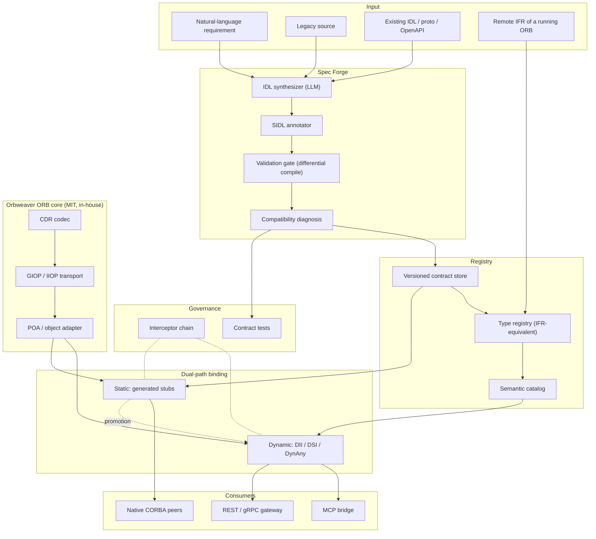

# Orbweaver — Development Plan

> Version 0.2 · 2026-08-12 · **Draft, pending Phase 0 outcome**
> 한국어판: [`PLAN.ko.md`](PLAN.ko.md)

**Changes from v0.1** — The licensing policy was tightened to *MIT or MIT-equivalent, otherwise build it ourselves*. Since no CORBA ORB exists under MIT, the ORB core moved from "adopt omniORB/TAO" to "implement in-house against the published OMG wire specification". Existing ORBs are now interoperability test fixtures rather than dependencies. Timeline extended from 30 to 45 weeks.

---

## 0. Summary

Orbweaver turns a natural-language requirement into a compiler-verified OMG IDL contract and then into a live ORB binding, with no hand-written stubs anywhere in the path. It ships as an MIT-licensed ORB implementation plus an AI specification pipeline layered on top of it.

Three propositions define the design.

**1. CORBA is already a runtime self-describing type system.** The Interface Repository, `TypeCode`, DII/DSI and `DynAny` together let a caller discover and correctly invoke an interface it has never seen, at runtime, with zero generated code. This is structurally the same capability MCP standardized as `tools/list` in 2025 — CORBA shipped it in 1996. Building an AI interface layer on this foundation means the discovery mechanism does not have to be invented.

**2. For an LLM, IDL's verbosity is an asset.** The strictness that drove human developers to REST is exactly what makes machine-generated interfaces verifiable. An IDL compiler rejects malformed IDL deterministically, every time. That gives the system a ground-truth oracle that OpenAPI-based approaches lack.

**3. The bottleneck is specification quality, not code generation.** [AutoMCP](https://arxiv.org/html/2507.16044v2) compiled 5,066 endpoints across 50 real APIs into MCP servers: 76.5% worked immediately, reaching 99.9% after an average of 19 lines of *specification* fixes per API. The residual failures were spec defects — missing security schemes (62%), undocumented runtime headers (47%), malformed base URLs (41%). Generation was not the hard part. Consequently the first-class deliverable here is **SIDL**, a semantic annotation vocabulary, not a code generator.

**Strategy.** Build both a dynamic path (runtime invocation, no codegen) and a static path (generated stubs), and promote interfaces from the first to the second once they stabilize. Explore dynamically, settle statically.

---

## 1. Background

### 1.1 Current cost

| Stage | Today | Elapsed | Failure mode |
|---|---|---|---|
| Interface design | Hand-written IDL | days–weeks | Depends on domain expertise; inconsistent across teams |
| Stub/skeleton generation | Manual compiler invocation | minutes | Fragmented build scripts |
| Server implementation | Inherit skeleton, implement by hand | weeks | Repetitive boilerplate |
| Client integration | Cross-team negotiation, then hand-coding | weeks | ORB version and policy mismatches |
| Change propagation | Recompile and redeploy everything | weeks | Backward-compatibility impact is unknowable in advance |

### 1.2 Why now

**The legacy is load-bearing.** Naval combat systems, command and control, telecom switching, air traffic control, core banking, large physics installations. These are environments where a rewrite is not an option, so the integration cost is paid forever.

**New builds are moving to DDS, and that is an opportunity rather than a threat.** Korean defense programs are standardizing on DDS-based middleware, with domestic vendors registered against the OMG standard. Critically, **CORBA and DDS-XTypes share OMG IDL 4.x** — one specification pipeline can target both, converting a shrinking CORBA market into an expansion path.

**Java severed its own connection.** [JEP 320](https://openjdk.org/jeps/320) removed `java.corba` and `javax.rmi.CORBA` in JDK 11. Java legacy now requires a third-party ORB simply to keep running, and that forced migration is itself demand for automation.

**Agents are becoming the callers.** When an LLM rather than a person invokes an interface, a contract that is verbose but precise outperforms one that is terse but ambiguous. The complexity humans rejected in CORBA is the precision agents need.

### 1.3 Scope

**In scope** — IDL synthesis and normalization, semantic annotation, validation, code generation, dynamic invocation runtime, type registry, semantic catalog, MCP bridge, contract-test generation, observability and audit.

**Out of scope (v1)** — CORBA Component Model, Real-Time CORBA scheduling, rewriting business logic in existing systems, GIOP over protocols other than TCP.

---

## 2. Why CORBA suits AI automation

### 2.1 Mechanisms that already exist

| Mechanism | Function | Value for AI automation |
|---|---|---|
| **Interface Repository** | Runtime-queryable store of every IDL definition | An agent tool catalog that already exists; no `tools/list` to invent |
| **TypeCode** | Self-describing type representation for any value | Runtime type checking and marshalling without model inference |
| **DII** | Assemble and issue a request at runtime, no stub | **Integration with zero code generation** — the shortest path to automation |
| **DSI** | Receive and dispatch a request at runtime, no skeleton | Generic bridges, mocks and proxies without codegen |
| **DynAny** | Compose and decompose `any` values against type information | Lossless conversion between LLM-produced JSON and CORBA parameters |
| **Portable Interceptors** | Cross-cutting hooks on the request path | **Guardrails**: authorization, dry-run, approval, audit logging, tracing |
| **POA** | Servant lifecycle and activation policy | Safe registration and retirement of dynamically created services |
| **Naming / Trading** | Name- and property-based service lookup | Backing store beneath the semantic search layer |
| **IOR** | Portable handle to a stateful remote object | Session and context continuity for agents |

The conclusion that follows: while the MCP ecosystem designs a dynamic tool-discovery protocol from scratch, CORBA has most of those requirements standardized already. What needs building is not a new protocol but **a semantic layer and AI orchestration on top of IFR and DII**.

### 2.2 What IDL lacks — the actual work

IDL is strict about syntax and silent about meaning. Consider:

```idl
long transfer(in long acct, in long amt);
```

Perfectly typed. It tells an agent nothing about whether `amt` is won or cents, whether the call is idempotent, whether it is destructive, whether `acct` is PII, or whether a timeout is safe to retry. This is precisely the class of defect AutoMCP found dominating real-world failures.

**SIDL** closes the gap using OMG IDL 4.x's own `@annotation` construct — a standard feature, not an extension:

```idl
// sidl_annotations.idl — project-standard annotation vocabulary
@annotation ai_desc       { string  text;  };  // intent, in prose
@annotation ai_unit       { string  unit;  };  // KRW, meter, millisecond, ...
@annotation ai_effect     { string  kind;  };  // pure | read | write | destructive
@annotation ai_idempotent { boolean value; };  // safe to retry
@annotation ai_pii        { string  level; };  // none | low | high
@annotation ai_example    { string  json;  };  // few-shot material
@annotation ai_precond    { string  expr;  };  // precondition; drives test generation
@annotation ai_authz      { string  scope; };  // required permission scope

module bank {
  @ai_desc("Transfers funds between accounts. Rolls back in full on failure.")
  interface Transfer {
    @ai_effect("destructive") @ai_idempotent(FALSE)
    @ai_authz("bank.transfer.write")
    @ai_example("{\"from\":1001,\"to\":2002,\"amount\":50000}")
    void execute(
      @ai_pii("high") in long from,
      @ai_pii("high") in long to,
      @ai_unit("KRW") in long amount
    ) raises (InsufficientFunds, AccountFrozen);
  };
};
```

Annotations are stored alongside the type in the registry, where one vocabulary drives both directions: at runtime it is the tool description an agent reads; at build time it is the source for generated contract tests and guardrail policy.

**Risk on this design** — most deployed ORB compilers predate IDL 4 and may reject annotations outright. Phase 0 assumption C measures this. The fallback is structured comments plus a sidecar YAML file, which remains viable because we own the parser.

---

## 3. Research findings

### 3.1 ORB implementations, and the licensing verdict

Verified 2026-08 via the GitHub API and each project's license text.

| ORB | Language | Status | License (verified) | Verdict under MIT-only |
|---|---|---|---|---|
| **ACE / TAO** | C++ | DOC Group, actively maintained (commits through 2026-03) | DOC License — permissive, MIT-equivalent in effect; no SPDX identifier | ⚠️ Not literally MIT. **Interop target** |
| **omniORB / omniORBpy** | C++ / Python | 4.3.4 released 2026-01-05; 4.3.3 in 2025-03 | LGPL (libraries) + GPL (tools) | ❌ Excluded. **Interop target** |
| **JacORB** | Java | 3.9 stable; repository active through 2026-04 | LGPL | ❌ Excluded. **Interop target** |
| **GlassFish CORBA** | Java | Eclipse Foundation, `org.glassfish.corba:glassfish-corba-orb` | EPL / GPLv2+CPE | ❌ Excluded |
| **MICO** | C++ | Low maintenance | GPL / LGPL | ❌ Excluded |
| **Orbacus** | C++ / Java | Micro Focus | Commercial | ❌ Excluded |

**The finding that reshapes this plan: no CORBA ORB is available under MIT.** Under a strict MIT-or-build-it policy, every mature open-source ORB is excluded, and the ORB core must be implemented in-house.

**This is materially less painful than it first appears, because interoperability requires no license.** GIOP and IIOP are published OMG specifications. Implementing the wire protocol creates no obligation toward TAO, omniORB or JacORB — we are not linking their code, deriving from it, or redistributing it. Those ORBs therefore move from the dependency list to the **interoperability test matrix**: pulled into throwaway CI containers to verify that Orbweaver speaks GIOP correctly, never shipped.

Two consequences worth planning around:
- **Scope grows.** CDR encoding, GIOP message framing, IIOP transport, IOR parsing, POA and a type registry are all now first-party work. Estimated at ~15 additional weeks (§7).
- **Control grows with it.** Owning the parser makes the annotation fallback (§2.2) possible, and owning the registry means the semantic catalog is not bolted onto a foreign IFR but is the registry.

### 3.2 IDL parsers and code generation

| Project | Language | IDL version | License (verified) | Usable under policy |
|---|---|---|---|---|
| **foxglove/omgidl** | TypeScript | OMG IDL | **MIT** | ✅ Yes — reference and possible seed |
| tier4/idl_parser | Rust | IDL 4.2 explicit | Apache-2.0 | ⚠️ Permissive but not MIT — **reference only** |
| eProsima/IDL-Parser | Java | OMG IDL | Apache-2.0 | ⚠️ Reference only |
| ArduPilot/OMG-IDL-Parser | — | OMG IDL | Apache-2.0 | ⚠️ Reference only |
| Remedy IT RIDL | Ruby | IDL2/3/3+ | Dual, unverified | ⚠️ Architecture reference — its pluggable generator framework is a good model |
| sugarsweetrobotics/idl_parser | Python | OMG IDL | **None declared** | ❌ No license means all rights reserved |
| asenac/idl-parser | C++ | OMG IDL | **None declared** | ❌ Unusable |
| omniidl | Python-hosted | CORBA IDL | GPL-family | ❌ Excluded. Useful as a **conformance oracle** in CI only |
| tao_idl | C++ | CORBA IDL | DOC License | ⚠️ **Conformance oracle** in CI only |

**Decision.** Write `orbweaver-idl` as an MIT-licensed OMG IDL 4.2 front end. `foxglove/omgidl` is the only MIT prior art and serves as reference; the Apache-2.0 parsers inform grammar handling but no code is copied. `tao_idl` and `omniidl` run in CI as differential oracles — if our parser and two independent implementations disagree about a construct, that is a bug report, not a release.

### 3.3 AI stack

- **Models** — Claude Opus 5 for design and hard reasoning; Claude Sonnet 5 for bulk transformation. Tool use plus structured output produces the IDL AST directly, eliminating a class of string-parsing errors.
- **Prompt caching** — Required to keep a large legacy IDL corpus resident across repeated transformations; this dominates cost at scale.
- **Retrieval** — Registry contents, existing IDL and a domain glossary are embedded so that synthesis can retrieve similar interfaces as few-shot references.
- **Self-repair loop** — Generate, compile, feed the compiler's diagnostics back verbatim, regenerate. IDL compilers emit precise errors, which makes this loop converge quickly. Expected to be the single highest-leverage mechanism in the pipeline.

### 3.4 Adjacent standards

| Subject | Established fact | Implication |
|---|---|---|
| **MCP** (2025-11-25 spec) | Clients no longer read schemas at build time; they call `tools/list` at runtime and receive a live catalog | Structurally a re-derivation of IFR + DII. The registry only needs projecting into MCP |
| **AutoMCP** (arXiv 2507.16044) | 50 APIs, 5,066 endpoints. 76.5% immediate success; 99.9% after ~19 lines of spec fixes per API. Failures: security schemes 62%, undocumented headers 47%, bad base URLs 41% | Direct evidence that specification quality is the bottleneck — the basis for SIDL |
| **DDS / DDS-XTypes** | Shares OMG IDL 4.x. Korean defense standardization underway with domestic vendors on the OMG register | One pipeline can emit both CORBA and DDS artifacts — the strategic hedge against CORBA's decline |
| **CORBA-NG discussion** | Community proposals to port IOR, IDL and IIOP callback semantics into MCP, arguing that complexity excessive for humans is appropriate for agents | Same insight as §2, but those proposals replace IDL with Protobuf. **Orbweaver keeps standard IDL and IIOP**, preserving lossless connection to existing assets — the differentiator |

---

## 4. Architecture

### 4.1 Overview



### 4.2 Components

All components are MIT-licensed and written in this repository.

| # | Component | Responsibility |
|---|---|---|
| 01 | `orbweaver-cdr` | OMG Common Data Representation encode/decode, both endiannesses, alignment rules |
| 02 | `orbweaver-giop` | GIOP 1.0–1.2 message framing, IIOP over TCP, IOR parse and emit, connection management |
| 03 | `orbweaver-poa` | Servant lifecycle, object activation policies, request dispatch |
| 04 | `orbweaver-idl` | OMG IDL 4.2 front end with `@annotation`, AST, pluggable back ends |
| 05 | `orbweaver-registry` | Type registry (IFR-equivalent); also ingests remote IFRs from foreign ORBs |
| 06 | `orbweaver-dynamic` | DII/DSI/DynAny equivalents; lossless JSON ↔ CORBA `any` conversion |
| 07 | `orbweaver-forge` | S1–S5 pipeline: ingest, synthesize, annotate, validate, register |
| 08 | `orbweaver-gen` | Static generation: stubs, skeletons, server scaffolds, client SDKs, build files |
| 09 | `orbweaver-mcp` | Projects the registry as MCP `tools/list`; delegates invocation to `orbweaver-dynamic` |
| 10 | `orbweaver-guard` | Interceptor chain: authorization, dry-run, approval for destructive calls, audit log |
| 11 | `orbweaver-test` | Contract and property test generation from annotations; DynAny-driven fuzzing |
| 12 | `orbweaver-console` | Catalog browser, contract diff viewer, invocation traces |

### 4.3 Dual-path binding

Pure code generation breaks automation the moment a schema changes, because every change forces regeneration and redeployment. Pure dynamic invocation is too slow for a hot path. Running both and promoting between them satisfies each constraint where it actually binds.

| | Dynamic path | Static path |
|---|---|---|
| Mechanism | DII + DynAny | Generated stubs |
| Code generated | None | Full |
| Schema change | Adapts automatically | Regenerate and redeploy |
| Latency | Higher | Lowest |
| Type safety | Runtime | Compile time |
| Best for | Discovery, experiments, low-frequency calls | Hot paths, real-time constraints |

**Promotion criteria** — at least 1,000 calls per day, schema unchanged for 30 days, and a green regression suite. Demotion is automatic on a breaking schema change.

---

## 5. Pipeline

| Stage | Input | Processing | Output | Automation target |
|---|---|---|---|---|
| **S1** Ingest | Requirements, legacy source, IFR dumps | Extract domain entities and operations | Intermediate representation | 95% |
| **S2** Synthesize | IR plus retrieved similar IDL | Generate IDL 4.2 draft as AST | `.idl` | 90% |
| **S3** Annotate | `.idl` | Infer `@ai_*` annotations; queue uncertain ones for review | SIDL | 80% |
| **S4** Validate | SIDL | Differential compile, lint, naming rules, compatibility check | Report, or self-repair loop | 100% |
| **S5** Register | Validated SIDL | Commit, load into registry, embed | Catalog entry | 100% |
| **S6** Bind | Catalog | Dynamic invocation, or static generation and build | Working binding | 85% |
| **S7** Verify | Binding | Contract tests, interceptors, tracing | Pass verdict plus telemetry | 90% |

**S4 is the safety belt of the whole system.** An LLM writes plausible IDL that may be semantically wrong; an IDL compiler rejects syntactically wrong IDL every time without exception. That asymmetry — probabilistic synthesis, deterministic verification — is what makes the trust model work. Everything upstream of S4 is allowed to be uncertain because S4 is not.

---

## 6. Technology decisions

| Area | Choice | Rationale |
|---|---|---|
| ORB core | **In-house, MIT** | No MIT ORB exists. GIOP/IIOP are open specifications, so interoperability needs no license |
| Core language | **Rust** | Wire-protocol parsing is the classic memory-safety hazard; strong binary handling; C ABI for embedding |
| Control plane | **Python 3.12+** | Richest AI SDK ecosystem; binds to the Rust core via PyO3 |
| IDL front end | **`orbweaver-idl`, in-house** | Owning the parser makes the annotation fallback possible |
| Conformance oracles | tao_idl, omniidl in CI | Differential testing only; never linked or shipped |
| Interop matrix | TAO, omniORB, JacORB containers | Wire-compatibility verification; disposable, never redistributed |
| LLM | **Claude Opus 5 / Sonnet 5** | Long context, structured output, prompt caching |
| Agent exposure | **MCP** | Its runtime discovery model matches IFR/DII structurally |
| Storage | **PostgreSQL + pgvector** | Contract metadata and semantic search in one engine |
| Observability | **OpenTelemetry** via interceptors | Standard tracing without touching call sites |
| Deployment | **Docker + Kubernetes** | With IOR endpoint rewriting; see R7 |

---

## 7. Roadmap

Approximately 45 weeks. Building the ORB core in-house adds roughly 15 weeks over an adopt-an-ORB plan, purchased in exchange for full MIT freedom.

### Phase 0 — Feasibility spike (3 weeks) — gates everything

Four assumptions are tested before anything else is built. Two can invalidate the architecture.

- **A. GIOP interoperability is reachable.** Hand-encode a GIOP 1.2 `Request` and obtain a correct reply from stock TAO and omniORB servers; hand-decode the reply.
  *If a minimal implementation cannot interoperate, the in-house path fails and the MIT-only constraint must be renegotiated. Test this first.*
- **B. LLMs write compilable IDL.** 20 requirements to IDL. Target ≥60% first-pass compile, ≥95% within three self-repair rounds.
- **C. `@annotation` survives real toolchains.** Measure IDL 4 annotation acceptance across TAO, omniORB and JacORB compilers.
  *Fallback: structured comments plus sidecar YAML.*
- **D. IOR addressing works under NAT and containers.** Verify endpoint rewriting under Kubernetes.

Also in Phase 0: build the **golden IDL corpus v0**, 20–30 cases covering nested structs, unions, sequences, typedefs, inheritance, exceptions, valuetypes, `oneway`, and `any`. Without it, AI quality cannot be measured at all.

**Go/No-Go** — assumption A is the gate. If GIOP interop fails, stop and revisit the licensing constraint before writing further code.

### Phase 1 — Wire protocol core (10 weeks)

- `orbweaver-cdr`: CDR encode/decode, both endiannesses, alignment, all primitive and constructed types
- `orbweaver-giop`: GIOP 1.0–1.2 framing, `Request`/`Reply`/`LocateRequest`/`CancelRequest`, IIOP over TCP
- IOR parsing and emission, profile handling, endpoint rewriting
- **Interop CI**: round-trip against TAO, omniORB and JacORB containers on every commit

*Deliverable: an MIT ORB that can call and be called by existing CORBA systems.*

### Phase 2 — IDL compiler and registry (8 weeks)

- `orbweaver-idl`: IDL 4.2 front end, `@annotation`, AST, pluggable back ends
- Differential conformance testing against tao_idl and omniidl
- `orbweaver-registry`: type registry, remote IFR ingestion, versioning, semantic diff, breaking-change detection
- `orbweaver-poa`: servant lifecycle and dispatch

### Phase 3 — Dynamic invocation and the AI pipeline (10 weeks) — the headline demo

- `orbweaver-dynamic`: DII/DSI/DynAny equivalents, lossless JSON ↔ `any`
- `orbweaver-forge`: S1–S5 — ingest, synthesize, annotate, **validation gate with self-repair loop**
- SIDL vocabulary v1 finalized
- Semantic catalog: embedding index, natural-language interface search
- `orbweaver-mcp`: registry projected as MCP tools
- `orbweaver-guard` v1: authorization, dry-run, audit logging

*Deliverable: an AI agent invokes an existing CORBA system with no generated code. This is the demo the project is judged on.*

### Phase 4 — Static generation and promotion (8 weeks)

- `orbweaver-gen`: stubs, skeletons, server scaffolds, client SDKs, build files
- Multi-target back ends: Rust, Python, C++, Java
- Promotion engine: call-statistics-driven dynamic-to-static transition with regression gating
- `orbweaver-test`: contract and property tests from annotations; DynAny fuzzing
- DDS-XTypes target experiment from the same IDL

### Phase 5 — Productionization (6 weeks)

- TLS transport, certificate management, least-privilege scopes
- OpenTelemetry via interceptors; dashboards
- Governance: breaking-change approval workflow, human-in-the-loop for `destructive` calls
- `orbweaver-console`: catalog browser, contract diff viewer, invocation traces
- Documentation and one pilot system integration

---

## 8. Verification strategy

| Layer | Method | Pass criterion |
|---|---|---|
| Wire protocol | Round-trip against TAO, omniORB, JacORB | 100% of the interop matrix |
| CDR encoding | Differential against reference ORBs on the golden corpus | Byte-identical |
| IDL syntax | Differential compile against tao_idl and omniidl | Zero unexplained disagreements |
| IDL semantics | Naming lint, annotation coverage | Coverage ≥ 90% |
| Backward compatibility | Semantic diff, breaking-change detection | Zero unapproved breaking changes |
| Dynamic invocation | DII round-trip over the golden corpus | 100% lossless |
| Generated code | Compile, contract tests, static result equals dynamic result | Zero mismatches |
| End to end | Pilot integration with a real legacy system | ≥80% reduction versus manual |
| AI quality | 100-case requirement regression benchmark, every release | Release blocked on a drop in first-pass rate |

---

## 9. Risk register

| ID | Risk | Impact | Likelihood | Mitigation |
|---|---|---|---|---|
| **R0** | **In-house ORB fails to interoperate** — GIOP has version and vendor-specific quirks | Critical | Medium | **Phase 0 assumption A, tested first.** Interop CI from the first commit of Phase 1. If it fails, revisit the licensing constraint before proceeding |
| **R1** | **`@annotation` unsupported by deployed ORB compilers** — most predate IDL 4 | Critical | Medium | Phase 0 assumption C. Fallback: structured comments plus sidecar YAML, viable because we own the parser |
| **R2** | **No IFR deployed in the target environment** — common in practice | High | High | Registry is first-party and populated from IDL source. Offline mode operates from IDL text alone |
| **R3** | **IIOP is insecure by default** — GIOP/IIOP is plaintext on 683/tcp; CSIv2+TLS integration is a known source of cross-vendor incompatibility | High | High | TLS mandatory on new paths. Legacy wrapped in mTLS tunnels or sidecars to avoid depending on foreign ORB configuration. Penetration test as a Phase 5 gate |
| **R4** | LLM hallucinates IDL | Medium | High | Compile gate blocks 100% of syntactic errors. Semantic errors caught by contract tests and human review queue |
| **R5** | Specification defects dominate, per AutoMCP | Medium | High | Annotation coverage is a KPI; registration blocked below threshold. Gaps back-inferred from traffic observation |
| **R6** | CORBA expertise is scarce | Medium | High | Secure at least one experienced ORB engineer or external advisor. Accumulate operational knowledge internally |
| **R7** | **IOR addressing under NAT/containers** — an internal IP baked into an IOR is uncallable externally | Medium | High | Endpoint rewriting templated into every deployment. Verified in Phase 0 assumption D |
| **R8** | Scope growth from building the ORB core | Medium | Medium | Phases 1–2 are strictly wire and compiler work with no AI scope creep. GIOP 1.2 over TCP only in v1 |
| **R9** | CORBA market contraction | Strategic | Medium | IDL 4.x is shared with DDS; land a DDS target early. Position as an OMG IDL automation platform, not a CORBA product |
| **R10** | Dynamic path too slow | Low | Medium | Structurally solved by promotion. Hot paths always use static stubs |

---

## 10. Licensing policy

**Policy — every shipped component is MIT or MIT-equivalent, or it is written here.**

Because the OMG specifications are open, this is achievable rather than aspirational: the wire format and the interface language are public, so a clean MIT implementation is a matter of engineering effort, not permission.

| Component | License (verified 2026-08) | Disposition |
|---|---|---|
| Orbweaver, all crates and packages | **MIT** | Shipped |
| `foxglove/omgidl` | **MIT** | Reference; may seed the IDL front end with attribution |
| tier4/idl_parser, eProsima/IDL-Parser, ArduPilot | Apache-2.0 | Reference only; no code copied |
| ACE / TAO | DOC License (permissive, no SPDX id) | Interop fixture and conformance oracle in CI; never linked or shipped |
| omniORB / omniORBpy | LGPL + GPL tools | Interop fixture and conformance oracle in CI; never linked or shipped |
| JacORB | LGPL | Interop fixture in CI; never linked or shipped |
| sugarsweetrobotics/idl_parser, asenac/idl-parser | **No license declared** | Not used. Absent a license, all rights are reserved |

**On the interop fixtures.** Running an LGPL or GPL ORB in a CI container to verify wire compatibility does not create a derivative work of it and imposes no license obligation on Orbweaver — no linking, no code reuse, no redistribution. This boundary is deliberate and must be preserved: no Orbweaver code may import, link, or vendor any part of these projects.

**Standing requirement.** License facts are re-verified before each release, and any new dependency is checked against this policy before it enters the tree.

---

## 11. Success metrics

| Metric | Baseline | Target |
|---|---|---|
| Time to define a new interface | 3–10 days | < 1 hour |
| Time to bind a new service (dynamic path) | 2–4 weeks | < 10 minutes |
| IDL first-pass compile rate | — | ≥ 85% |
| Compile rate within three self-repair rounds | — | ≥ 98% |
| Semantic annotation coverage | 0% | ≥ 90% |
| Contract tests auto-generated | 0% | ≥ 80% |
| Breaking changes caught pre-merge | Manual | 100% |
| Interop matrix pass rate | — | 100% |
| Human intervention across the pipeline | 100% | ≤ 15% |

---

## 12. Immediate actions

1. **Start Phase 0.** Assumption A (GIOP interop) is the single highest-risk item and now gates the entire in-house strategy. Test it in week 1.
2. **Build golden IDL corpus v0** — 20–30 representative patterns.
3. **Stand up the interop CI harness** — TAO, omniORB and JacORB containers, wired before Phase 1 code exists.
4. **Select a pilot system** — real IDL assets, a cooperative owner, low blast radius.
5. **Staff the team** — one engineer with ORB and wire-protocol experience (essential), two backend engineers, one AI engineer.

---

## Appendix — References

**Standards**
[OMG IDL 4.2](https://www.omg.org/spec/IDL/4.2/) ·
[CORBA 3.4 Interoperability (GIOP/IIOP)](https://www.omg.org/spec/CORBA/3.4/Interoperability/PDF) ·
[MCP Tools specification (2025-11-25)](https://modelcontextprotocol.io/specification/2025-11-25/server/tools) ·
[JEP 320](https://openjdk.org/jeps/320)

**Reference implementations (interop targets, not dependencies)**
[DOC Group ACE/TAO](https://github.com/DOCGroup/ACE_TAO) ·
[OCI TAO](https://theaceorb.com/) ·
[omniORB documentation](https://omniorb.sourceforge.io/docs.html) ·
[JacORB](https://github.com/JacORB/JacORB) ·
[OMG free CORBA downloads](https://www.omg.org/corba/corbadownloads.htm)

**IDL tooling**
[foxglove/omgidl (MIT)](https://github.com/foxglove/omgidl) ·
[tier4/idl_parser (Apache-2.0)](https://github.com/tier4/idl_parser) ·
[eProsima IDL-Parser](https://github.com/eProsima/IDL-Parser) ·
[Remedy IT RIDL](https://www.remedy.nl/opensource/ridl.html)

**Dynamic invocation**
[omniORB — The Dynamic Invocation Interface](https://www.cl.cam.ac.uk/research/dtg/attarchive/omniORB/doc/3.0/omniORB/omniORB011.html) ·
[Oracle Tuxedo — Using the DII](https://docs.oracle.com/cd/E13203_01/tuxedo/tux91/creclient/dii.htm) ·
[VisiBroker — Dynamic Interfaces](https://www.ime.usp.br/~reverbel/SOD-97/Manuais/vbrokerc++/prog_gd/noframes/chap09.htm)

**AI and interface automation**
[AutoMCP (arXiv 2507.16044)](https://arxiv.org/html/2507.16044v2) ·
[A Second Life for CORBA in MCP 2.0](https://dev.to/grimch/a-second-life-for-corba-in-mcp-20-an-example-of-ai-and-humans-leveraging-their-combined-3c64) ·
[OOPS — LLM-generated REST API specs](https://www.sciencedirect.com/science/article/abs/pii/S0164121226001470) ·
[AgentModernize (arXiv 2605.17535)](https://arxiv.org/pdf/2605.17535)

**Korean industry context and security**
[Defense-proven DDS middleware — ETNews](https://www.etnews.com/20230508000133) ·
[Hanwha Systems Smart DDS](https://www.hanwhasystems.com/kr/business/defense/naval/combat02.do) ·
[DDS security — ETRI trends analysis](https://ettrends.etri.re.kr/ettrends/131/0905001659/26-5_112-122.pdf) ·
[Port 683: CORBA IIOP security](https://www.connected.app/ports/683)
