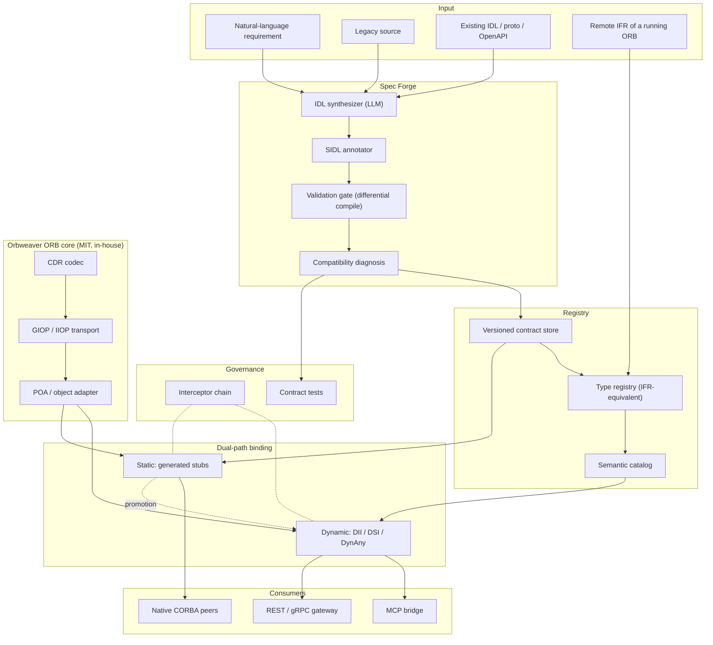

# Orbweaver — Development Plan

> Version 0.7 · 2026-08-13 · **Phases 0–3.5 complete; Phase 4 substantially landed; Phase 5 half landed** — see [`PHASE0.md`](PHASE0.md) · [`PHASE1.md`](PHASE1.md) · [`PHASE2.md`](PHASE2.md) · [`PHASE3.md`](PHASE3.md) · [`PHASE5.md`](PHASE5.md)
> 한국어판: [`PLAN.ko.md`](PLAN.ko.md)

**Changes from v0.5** — §7 rewritten from a serial weekly roadmap into **landed work plus parallel streams**. The serial plan was written for one thread of work; execution ran ahead of it (Phases 0–3.5 done, Phase 5 half done, Phase 4 untouched) and the remaining items no longer depend on each other in a line. Each remaining stream now states its own batch unit, its own oracle and its codification target, so it can run as an independent batch → oracle → repair → codify loop (§5.1), and cross-stream integration points are named explicitly. No scope was added or removed; this is a re-ordering of what was already planned, plus honest completion status.

**Changes from v0.4** — Added the object model (§4.7) and identity/credential propagation (§4.8), which turned out to be one subject rather than two: **an IOR is a bearer address**, so making references first-class immediately raises who may hold one. Consequences: AnyJSON gains object-reference and nil rows, and has no raw-IOR encoding by design (§4.5); references crossing the MCP boundary are capability handles, not IORs; three new components (`orbweaver-object`, `orbweaver-capability`, `orbweaver-identity`); five new risks (R13–R17), of which **R13 confused deputy is the default behaviour rather than a failure mode**. Phase 2 extends to 11 weeks, a 2-week Phase 3.5 lands capability handles *with* the MCP bridge rather than after it, and identity propagation becomes its own Phase 5. Timeline 45 → 58 weeks.

**Changes from v0.3** — Added the operating model (§5.1): all work runs as a batch → oracle → repair → codify loop rather than item by item, justified by the Phase 0 measurement in which 20 generated files produced 7 failures sharing 1 root cause. Added the automation roster (§5.2) mapping each loop step to a defined agent role in `.claude/agents/`. Working rules extracted to `CLAUDE.md`. Wire-compatibility rules renumbered §5.1 → §5.3.

**Changes from v0.2** — Detailed review pass. Added: wire-level decisions — GIOP version and codeset strategy, IOR acquisition, the v1 type-support matrix, runtime model (§4.4); the normative AnyJSON mapping (§4.5); the MCP projection triad with default-deny exposure (§4.6); concrete wire-compatibility rules (§5.3, then numbered §5.1); a threat model with two new risks — metadata prompt injection and bridge amplification (§9.0, R11–R12); diagnostics-as-product for the self-repair loop (§3.3); benchmark discipline (§8).

**Changes from v0.1** — The licensing policy was tightened to *MIT or MIT-equivalent, otherwise build it ourselves*. Since no CORBA ORB exists under MIT, the ORB core moved from "adopt omniORB/TAO" to "implement in-house against the published OMG wire specification". Existing ORBs are now interoperability test fixtures rather than dependencies. Timeline extended from 30 to 45 weeks.

---

## 0. Summary

Orbweaver turns a natural-language requirement into a compiler-verified OMG IDL contract and then into a live ORB binding, with no hand-written stubs anywhere in the path. It ships as an MIT-licensed ORB implementation plus an AI specification pipeline layered on top of it.

Three propositions define the design.

**1. CORBA is already a runtime self-describing type system.** The Interface Repository, `TypeCode`, DII/DSI and `DynAny` together let a caller discover and correctly invoke an interface it has never seen, at runtime, with zero generated code. This is structurally the same capability MCP standardized as `tools/list` in 2025 — CORBA shipped it in 1996. Building an AI interface layer on this foundation means the discovery mechanism does not have to be invented.

**2. For an LLM, IDL's verbosity is an asset.** The strictness that drove human developers to REST is exactly what makes machine-generated interfaces verifiable. An IDL compiler rejects malformed IDL deterministically, every time. That gives the system a ground-truth oracle that OpenAPI-based approaches lack.

**3. The bottleneck is specification quality, not code generation.** [AutoMCP](https://arxiv.org/html/2507.16044v2) compiled 5,066 endpoints across 50 real APIs into MCP servers: 76.5% worked immediately, reaching 99.9% after an average of 19 lines of *specification* fixes per API. The residual failures were spec defects — missing security schemes (62%), undocumented runtime headers (47%), malformed base URLs (41%). Generation was not the hard part. Consequently the first-class deliverable here is **SIDL**, a semantic annotation vocabulary, not a code generator.

**Strategy.** Build both a dynamic path (runtime invocation, no codegen) and a static path (generated stubs), and promote interfaces from the first to the second once they stabilize. Explore dynamically, settle statically.

---

## 1. Background

### 1.1 Current cost

| Stage | Today | Elapsed | Failure mode |
|---|---|---|---|
| Interface design | Hand-written IDL | days–weeks | Depends on domain expertise; inconsistent across teams |
| Stub/skeleton generation | Manual compiler invocation | minutes | Fragmented build scripts |
| Server implementation | Inherit skeleton, implement by hand | weeks | Repetitive boilerplate |
| Client integration | Cross-team negotiation, then hand-coding | weeks | ORB version and policy mismatches |
| Change propagation | Recompile and redeploy everything | weeks | Backward-compatibility impact is unknowable in advance |

### 1.2 Why now

**The legacy is load-bearing.** Naval combat systems, command and control, telecom switching, air traffic control, core banking, large physics installations. These are environments where a rewrite is not an option, so the integration cost is paid forever.

**New builds are moving to DDS, and that is an opportunity rather than a threat.** Korean defense programs are standardizing on DDS-based middleware, with domestic vendors registered against the OMG standard. Critically, **CORBA and DDS-XTypes share OMG IDL 4.x** — one specification pipeline can target both, converting a shrinking CORBA market into an expansion path.

**Java severed its own connection.** [JEP 320](https://openjdk.org/jeps/320) removed `java.corba` and `javax.rmi.CORBA` in JDK 11. Java legacy now requires a third-party ORB simply to keep running, and that forced migration is itself demand for automation.

**Agents are becoming the callers.** When an LLM rather than a person invokes an interface, a contract that is verbose but precise outperforms one that is terse but ambiguous. The complexity humans rejected in CORBA is the precision agents need.

### 1.3 Scope

**In scope** — IDL synthesis and normalization, semantic annotation, validation, code generation, dynamic invocation runtime, type registry, semantic catalog, MCP bridge, contract-test generation, observability and audit.

**Out of scope (v1)** — CORBA Component Model, Real-Time CORBA scheduling, rewriting business logic in existing systems, GIOP over protocols other than TCP, bidirectional GIOP (needed for callback-style systems behind firewalls; revisit after v1), and wire support for `valuetype`/`fixed` (the parser accepts them; wire support is a Phase 4 decision gate — §4.4).

---

## 2. Why CORBA suits AI automation

### 2.1 Mechanisms that already exist

| Mechanism | Function | Value for AI automation |
|---|---|---|
| **Interface Repository** | Runtime-queryable store of every IDL definition | An agent tool catalog that already exists; no `tools/list` to invent |
| **TypeCode** | Self-describing type representation for any value | Runtime type checking and marshalling without model inference |
| **DII** | Assemble and issue a request at runtime, no stub | **Integration with zero code generation** — the shortest path to automation |
| **DSI** | Receive and dispatch a request at runtime, no skeleton | Generic bridges, mocks and proxies without codegen |
| **DynAny** | Compose and decompose `any` values against type information | Lossless conversion between LLM-produced JSON and CORBA parameters |
| **Portable Interceptors** | Cross-cutting hooks on the request path | **Guardrails**: authorization, dry-run, approval, audit logging, tracing |
| **POA** | Servant lifecycle and activation policy | Safe registration and retirement of dynamically created services |
| **Naming / Trading** | Name- and property-based service lookup | Backing store beneath the semantic search layer |
| **IOR** | Portable handle to a stateful remote object | Session and context continuity for agents |

The conclusion that follows: while the MCP ecosystem designs a dynamic tool-discovery protocol from scratch, CORBA has most of those requirements standardized already. What needs building is not a new protocol but **a semantic layer and AI orchestration on top of IFR and DII**.

### 2.2 What IDL lacks — the actual work

IDL is strict about syntax and silent about meaning. Consider:

```idl
long transfer(in long acct, in long amt);
```

Perfectly typed. It tells an agent nothing about whether `amt` is won or cents, whether the call is idempotent, whether it is destructive, whether `acct` is PII, or whether a timeout is safe to retry. This is precisely the class of defect AutoMCP found dominating real-world failures.

**SIDL** closes the gap using OMG IDL 4.x's own `@annotation` construct — a standard feature, not an extension:

```idl
// sidl_annotations.idl — project-standard annotation vocabulary
@annotation ai_desc       { string  text;  };  // intent, in prose
@annotation ai_unit       { string  unit;  };  // KRW, meter, millisecond, ...
@annotation ai_effect     { string  kind;  };  // pure | read | write | destructive
@annotation ai_idempotent { boolean value; };  // safe to retry
@annotation ai_pii        { string  level; };  // none | low | high
@annotation ai_example    { string  json;  };  // few-shot material
@annotation ai_precond    { string  expr;  };  // precondition; drives test generation
@annotation ai_authz      { string  scope; };  // required permission scope

module bank {
  @ai_desc("Transfers funds between accounts. Rolls back in full on failure.")
  interface Transfer {
    @ai_effect("destructive") @ai_idempotent(FALSE)
    @ai_authz("bank.transfer.write")
    @ai_example("{\"from\":1001,\"to\":2002,\"amount\":50000}")
    void execute(
      @ai_pii("high") in long from,
      @ai_pii("high") in long to,
      @ai_unit("KRW") in long amount
    ) raises (InsufficientFunds, AccountFrozen);
  };
};
```

Annotations are stored alongside the type in the registry, where one vocabulary drives both directions: at runtime it is the tool description an agent reads; at build time it is the source for generated contract tests and guardrail policy.

**Risk on this design** — most deployed ORB compilers predate IDL 4 and may reject annotations outright. Phase 0 assumption C measures this. The fallback is structured comments plus a sidecar YAML file, which remains viable because we own the parser.

---

## 3. Research findings

### 3.1 ORB implementations, and the licensing verdict

Verified 2026-08 via the GitHub API and each project's license text.

| ORB | Language | Status | License (verified) | Verdict under MIT-only |
|---|---|---|---|---|
| **ACE / TAO** | C++ | DOC Group, actively maintained (commits through 2026-03) | DOC License — permissive, MIT-equivalent in effect; no SPDX identifier | ⚠️ Not literally MIT. **Interop target** |
| **omniORB / omniORBpy** | C++ / Python | 4.3.4 released 2026-01-05; 4.3.3 in 2025-03 | LGPL (libraries) + GPL (tools) | ❌ Excluded. **Interop target** |
| **JacORB** | Java | 3.9 stable; repository active through 2026-04 | LGPL | ❌ Excluded. **Interop target** |
| **GlassFish CORBA** | Java | Eclipse Foundation, `org.glassfish.corba:glassfish-corba-orb` | EPL / GPLv2+CPE | ❌ Excluded |
| **MICO** | C++ | Low maintenance | GPL / LGPL | ❌ Excluded |
| **Orbacus** | C++ / Java | Micro Focus | Commercial | ❌ Excluded |

**The finding that reshapes this plan: no CORBA ORB is available under MIT.** Under a strict MIT-or-build-it policy, every mature open-source ORB is excluded, and the ORB core must be implemented in-house.

**This is materially less painful than it first appears, because interoperability requires no license.** GIOP and IIOP are published OMG specifications. Implementing the wire protocol creates no obligation toward TAO, omniORB or JacORB — we are not linking their code, deriving from it, or redistributing it. Those ORBs therefore move from the dependency list to the **interoperability test matrix**: pulled into throwaway CI containers to verify that Orbweaver speaks GIOP correctly, never shipped.

Two consequences worth planning around:
- **Scope grows.** CDR encoding, GIOP message framing, IIOP transport, IOR parsing, POA and a type registry are all now first-party work. Estimated at ~15 additional weeks (§7).
- **Control grows with it.** Owning the parser makes the annotation fallback (§2.2) possible, and owning the registry means the semantic catalog is not bolted onto a foreign IFR but is the registry.

### 3.2 IDL parsers and code generation

| Project | Language | IDL version | License (verified) | Usable under policy |
|---|---|---|---|---|
| **foxglove/omgidl** | TypeScript | OMG IDL | **MIT** | ✅ Yes — reference and possible seed |
| tier4/idl_parser | Rust | IDL 4.2 explicit | Apache-2.0 | ⚠️ Permissive but not MIT — **reference only** |
| eProsima/IDL-Parser | Java | OMG IDL | Apache-2.0 | ⚠️ Reference only |
| ArduPilot/OMG-IDL-Parser | — | OMG IDL | Apache-2.0 | ⚠️ Reference only |
| Remedy IT RIDL | Ruby | IDL2/3/3+ | Dual, unverified | ⚠️ Architecture reference — its pluggable generator framework is a good model |
| sugarsweetrobotics/idl_parser | Python | OMG IDL | **None declared** | ❌ No license means all rights reserved |
| asenac/idl-parser | C++ | OMG IDL | **None declared** | ❌ Unusable |
| omniidl | Python-hosted | CORBA IDL | GPL-family | ❌ Excluded. Useful as a **conformance oracle** in CI only |
| tao_idl | C++ | CORBA IDL | DOC License | ⚠️ **Conformance oracle** in CI only |

**Decision.** Write `orbweaver-idl` as an MIT-licensed OMG IDL 4.2 front end. `foxglove/omgidl` is the only MIT prior art and serves as reference; the Apache-2.0 parsers inform grammar handling but no code is copied. `tao_idl` and `omniidl` run in CI as differential oracles — if our parser and two independent implementations disagree about a construct, that is a bug report, not a release.

### 3.3 AI stack

- **Models** — Claude Opus 5 for design and hard reasoning; Claude Sonnet 5 for bulk transformation. Tool use plus structured output produces the IDL AST directly, eliminating a class of string-parsing errors.
- **Prompt caching** — Required to keep a large legacy IDL corpus resident across repeated transformations; this dominates cost at scale.
- **Retrieval** — Registry contents, existing IDL and a domain glossary are embedded so that synthesis can retrieve similar interfaces as few-shot references.
- **Self-repair loop** — Generate, compile, feed the compiler's diagnostics back verbatim, regenerate. IDL compilers emit precise errors, which makes this loop converge quickly. Expected to be the single highest-leverage mechanism in the pipeline.
- **Diagnostics as a product surface** — the self-repair loop is only as good as the error messages it feeds on, so `orbweaver-idl` emits structured diagnostics (JSON: source span, expected/found, fix hint) designed to be returned to the model verbatim. Error-message quality is a tested feature, not a nicety.

### 3.4 Adjacent standards

| Subject | Established fact | Implication |
|---|---|---|
| **MCP** (2025-11-25 spec) | Clients no longer read schemas at build time; they call `tools/list` at runtime and receive a live catalog | Structurally a re-derivation of IFR + DII. The registry only needs projecting into MCP |
| **AutoMCP** (arXiv 2507.16044) | 50 APIs, 5,066 endpoints. 76.5% immediate success; 99.9% after ~19 lines of spec fixes per API. Failures: security schemes 62%, undocumented headers 47%, bad base URLs 41% | Direct evidence that specification quality is the bottleneck — the basis for SIDL |
| **DDS / DDS-XTypes** | Shares OMG IDL 4.x. Korean defense standardization underway with domestic vendors on the OMG register | One pipeline can emit both CORBA and DDS artifacts — the strategic hedge against CORBA's decline |
| **CORBA-NG discussion** | Community proposals to port IOR, IDL and IIOP callback semantics into MCP, arguing that complexity excessive for humans is appropriate for agents | Same insight as §2, but those proposals replace IDL with Protobuf. **Orbweaver keeps standard IDL and IIOP**, preserving lossless connection to existing assets — the differentiator |

---

## 4. Architecture

### 4.1 Overview



### 4.2 Components

All components are MIT-licensed and written in this repository.

| # | Component | Responsibility |
|---|---|---|
| 01 | `orbweaver-cdr` | OMG Common Data Representation encode/decode, both endiannesses, alignment rules |
| 02 | `orbweaver-giop` | GIOP 1.2 native with 1.0/1.1 compatibility both directions; IIOP over TCP; codeset negotiation; IOR parse/emit; `corbaloc:`/`corbaname:` resolution and a CosNaming client; connection management |
| 03 | `orbweaver-poa` | Servant lifecycle, object activation policies, request dispatch |
| 04 | `orbweaver-idl` | OMG IDL 4.2 front end with `@annotation`, AST, pluggable back ends |
| 05 | `orbweaver-registry` | Type registry (IFR-equivalent); also ingests remote IFRs from foreign ORBs |
| 06 | `orbweaver-dynamic` | DII/DSI/DynAny equivalents; lossless JSON ↔ CORBA `any` conversion |
| 07 | `orbweaver-forge` | S1–S5 pipeline: ingest, synthesize, annotate, validate, register |
| 08 | `orbweaver-gen` | Static generation: stubs, skeletons, server scaffolds, client SDKs, build files |
| 09 | `orbweaver-mcp` | Projects the registry as MCP `tools/list`; delegates invocation to `orbweaver-dynamic` |
| 10 | `orbweaver-guard` | Interceptor chain: authorization, dry-run, approval for destructive calls, audit log |
| 11 | `orbweaver-test` | Contract and property test generation from annotations; DynAny-driven fuzzing |
| 12 | `orbweaver-console` | Catalog browser, contract diff viewer, invocation traces |
| 13 | `orbweaver-object` | Object references as values, `_is_a`/`_is_equivalent`/`_hash`, POA object ids and activation policies, servant managers (§4.7) |
| 14 | `orbweaver-capability` | The handle table: mints, resolves, scopes and expires the opaque references that cross the MCP boundary, so an agent never holds a dialable IOR (§4.7) |
| 15 | `orbweaver-identity` | Credential store, OAuth2/JWT ↔ CSIv2 token exchange, SAS context encoding, delegation policy (§4.8) |

### 4.3 Dual-path binding

Pure code generation breaks automation the moment a schema changes, because every change forces regeneration and redeployment. Pure dynamic invocation is too slow for a hot path. Running both and promoting between them satisfies each constraint where it actually binds.

| | Dynamic path | Static path |
|---|---|---|
| Mechanism | DII + DynAny | Generated stubs |
| Code generated | None | Full |
| Schema change | Adapts automatically | Regenerate and redeploy |
| Latency | Higher | Lowest |
| Type safety | Runtime | Compile time |
| Best for | Discovery, experiments, low-frequency calls | Hot paths, real-time constraints |

**Promotion criteria** — at least 1,000 calls per day, schema unchanged for 30 days, and a green regression suite. Demotion is automatic on a breaking schema change.

### 4.4 Wire-level decisions

Settled here so Phase 1 does not relitigate them mid-build.

**GIOP version strategy.** The version spoken on a connection is dictated by the peer: an IIOP profile in an IOR advertises a GIOP minor version a client must not exceed, and legacy clients may dial us with old versions. Orbweaver therefore implements **GIOP 1.2 natively, with 1.0/1.1 compatibility in both directions**, honoring their header and alignment differences. `Fragment` handling (introduced in 1.1) is mandatory on receive and supported on send. Bidirectional GIOP is explicitly deferred (§1.3).

**Codeset negotiation is a first-class requirement, not an afterthought.** GIOP transmits `char`/`string` and `wchar`/`wstring` under codesets negotiated via the CodeSets service context, and `wchar` is undefined in GIOP 1.0. Korean legacy systems commonly run EUC-KR-family native codesets, so a wrong negotiation corrupts precisely the text this project's home market cares about. v1 ships UTF-8, UTF-16, ISO-8859-1 and EUC-KR conversion, and the interop matrix includes Korean-text round-trips against every fixture ORB.

**Object reference acquisition.** DII is useless without an IOR to aim at. v1 resolves references from IOR strings and files, `corbaloc:` and `corbaname:` URLs, and a **CosNaming client** — the standard INS surface — implemented inside `orbweaver-giop`, because discovery is meaningless if the registry cannot reach a live object.

**v1 wire-type support matrix.** Full CDR round-trip for primitives, `string`/`wstring`, `enum`, `struct`, `union`, `sequence`, arrays, `exception`, `any` and `TypeCode` (including indirection). **Deferred: `valuetype` (chunked encoding and truncation are a project of their own), abstract interfaces, and `fixed`.** The parser accepts all of them; wire support waits for a Phase 4 decision gate informed by pilot demand.

**Runtime model.** The Rust core is async (tokio) with a blocking C-ABI facade; the Python control plane binds through PyO3 against the blocking facade. The transport stays concurrent under many in-flight requests without imposing async complexity on pipeline code.

### 4.5 AnyJSON — the JSON ↔ `any` mapping

The dynamic path stands on a deterministic, lossless, bidirectional mapping between agent-side JSON and CDR values. Handwaving here produces silent data corruption, so the mapping is a normative spec (**AnyJSON v1.1**) with property-tested round-trips:

| IDL construct | JSON encoding | Why |
|---|---|---|
| `short`/`long`, `float`/`double` | JSON number | Within IEEE-754 exact range |
| `long long` / `unsigned long long` | **JSON string** | JSON numbers lose integer precision past 2^53 |
| `fixed` | JSON string | Decimal fidelity |
| `octet` sequence | base64 string | Binary safety |
| `enum` | Symbolic name string | Ordinals are wire detail, not meaning |
| `union` | `{"_d": <discriminator>, "_v": <value>}` | The active member is explicit |
| `struct`/`exception` | JSON object, member order preserved from IDL | CDR is positional |
| `string`/`wstring` | JSON string (UTF-8); codeset conversion happens at the wire | One text representation agent-side |
| `any` | `{"_t": <TypeCode repr>, "_v": ...}` | Self-description survives the crossing |
| **`TypeCode` repr** | a **name** for a type whose identity fits in one (`"double"`, `"string"`), otherwise a **structure**: `{"kind": ..., "id": ..., "name": ..., "members"/"element"/"cases": ...}` | v1.1 (D008). A name loses what the wire keeps — `string<5>` and `string` are one word and two TypeCodes — and a repository id needs a registry both ends share, which is the property CDR carries the whole TypeCode to avoid. **Additive**: every v1 document still reads |
| **`::CORBA::TypeCode` as a value** | the same `<TypeCode repr>`, standing alone | A type code *is* a value here, not a description of the one beside it: it is what `describe()` returns and what every Interface Repository description is made of |
| **object reference** | `{"_ref": <handle>, "_type": <repository id>}` | A **handle**, never a raw IOR — see §4.7 |
| **nil reference** | `{"_ref": null}` | Distinct from an absent field |
| NaN / ±Inf | `{"_f": "nan" \| "+inf" \| "-inf"}` | JSON has no encoding for them |

Verification: for every golden-corpus type, `any → JSON → any` must reproduce identical CDR bytes (§8).

### 4.6 Projecting the registry into MCP

Naive projection — one MCP tool per operation — collapses at legacy scale: thousands of operations make `tools/list` unusable and blow the agent's context. The default projection is therefore a **generic triad**:

- `search_interfaces(query)` — semantic search over the catalog (names, SIDL annotations, embeddings)
- `describe_interface(id)` — the full contract: operations, types, annotations, examples
- `invoke_operation(ref, op, args, options)` — delegated to the dynamic invoker, guarded by `orbweaver-guard`

Curated per-operation tools remain available as an opt-in for small, stable, high-traffic surfaces. **Exposure is default-deny**: nothing in the registry becomes callable through MCP until explicitly allowlisted (§9.0).

---

## 5. Pipeline

| Stage | Input | Processing | Output |
|---|---|---|---|
| **S1** Ingest | Requirements, legacy source, IFR dumps | Extract domain entities and operations | Intermediate representation |
| **S2** Synthesize | IR plus retrieved similar IDL | Generate IDL 4.2 draft as AST | `.idl` |
| **S3** Annotate | `.idl` | Infer `@ai_*` annotations; queue uncertain ones for review | SIDL |
| **S4** Validate | SIDL | Differential compile, lint, naming rules, compatibility check | Report, or self-repair loop |
| **S5** Register | Validated SIDL | Commit, load into registry, embed | Catalog entry |
| **S6** Bind | Catalog | Dynamic invocation, or static generation and build | Working binding |
| **S7** Verify | Binding | Contract tests, interceptors, tracing | Pass verdict plus telemetry |

**The *Automation target* column this table carried until 2026-08-19 — 95 / 90 / 80 / 100 / 100 / 85 / 90 — is now aspiration A9 in §11.** Seven percentages, and no run in the tree computes any of them, because "automation" of a stage was never given a denominator: automated *what* — items, operations, human touches? What *is* measured per stage is a different quantity — `forge-pipeline`'s `first-pass:` line, one per stage it runs, which is the §11 first-pass row and covers S1–S4 only. S4 and S5 are deterministic programs, so a percentage there is a category error rather than a target; S6 and S7 have no run that reports anything per stage. A table of seven untestable numbers is worse than no column, so the column moved to where untestable numbers are kept, with the trigger that would make it testable.

**S4 is the safety belt of the whole system.** An LLM writes plausible IDL that may be semantically wrong; an IDL compiler rejects syntactically wrong IDL every time without exception. That asymmetry — probabilistic synthesis, deterministic verification — is what makes the trust model work. Everything upstream of S4 is allowed to be uncertain because S4 is not.

**What S4 does not gate: repeatability.** Running S1–S3 twice over one unchanged requirement, with unchanged prompts, produced two different contracts and both passed every gate — different names, a different parameter type, and an authorization scope that drifted from the one the requirement states literally ([`pipeline-runs/2026-08-14-end-to-end.md`](pipeline-runs/2026-08-14-end-to-end.md), Cause A). What S2 is allowed to choose, and what a regeneration owes an already-registered contract, was settled by [`decisions/D005-contract-stability.md`](decisions/D005-contract-stability.md) (**APPROVED**): option C first — the scope-shaped literal token a requirement states must survive into the `//@ ai_authz` S3 emits, checked by string equality with no model — then option B, `validate_against`, which diffs a regeneration against what is already registered.

### 4.7 The object model

Everything so far treats a target as an address plus an operation name. That is
enough for one-shot calls and not enough for anything else. CORBA's object model
— references as first-class values, identity, lifecycle — is what makes a
*conversation* possible, and the AI path needs conversations: `search_interfaces`
→ `describe_interface` → `invoke_operation` is a workflow in which something has
to hold a reference between steps. An agent that cannot hold a reference can only
call targets it already knew about, which is the static world this project exists
to escape.

**References as values.** `Object`-typed parameters and returns marshal inline
(§9.3.6), not as encapsulations. Registries hand them out, factories return them,
and callbacks pass them in. Without this, an interface as ordinary as
`Registry::lookup(in string name) -> Target` is uncallable.

**Identity.** `_is_a` for narrowing, `_is_equivalent` and `_hash` for comparison,
`_non_existent` for liveness. Two of these have sharp edges worth planning
around: `_is_equivalent` is permitted to return false for two references that do
denote the same object, so it can confirm identity but never refute it; and
`_is_a` is answerable **locally** from the registry's inheritance graph, which is
both faster and works when the target is unreachable.

**Lifecycle.** A POA with object ids and activation policies, plus servant
managers. `ServantLocator` is what produces `LOCATION_FORWARD`, which the client
already follows (§Batch 1) but which we cannot yet *emit*. Dynamically created
services need registration and retirement that cannot leak references to
servants that are gone.

#### An IOR is a bearer address, and that changes the MCP surface

This is where the object model stops being a data-modelling question.

**An IOR names an endpoint and an object key, and nothing else.** Anything
holding one and able to reach the network can invoke the target directly. Hand a
raw IOR to an agent and you have handed it a way around `orbweaver-guard` —
around the authorization checks, the `destructive` approvals and the audit log
(§4.6, R12). The guard would still be in the architecture diagram and no longer
in the call path.

So references crossing the MCP boundary are **capability handles**: opaque,
unguessable tokens that the bridge maps to IORs in its own table. The agent can
pass a handle back to `invoke_operation` and cannot dial it. Handles carry the
target's repository id so an agent can reason about type, are scoped to the
session that obtained them, and expire.

Raw IORs remain available to native CORBA peers over the static path, where the
caller is already inside the trust boundary. The handle exists for the boundary,
not for the protocol.

**IOR은 베어러 주소다.** 엔드포인트와 객체 키만 담고 있어서, 그것을 쥐고 네트워크에
닿을 수 있는 누구든 대상을 직접 호출할 수 있다. 원시 IOR을 에이전트에 넘기는 것은
`orbweaver-guard`를 우회할 수단을 넘기는 것이다 — 인가 검사도, `destructive` 승인도,
감사로그도 함께 우회된다. 그래서 MCP 경계를 넘는 참조는 **능력 핸들**이다: 브릿지가
자기 테이블에서 IOR로 매핑하는 불투명·추측불가 토큰이며, 세션에 종속되고 만료된다.

### 4.8 Identity and credential propagation

The bridge authenticates to a legacy target with **its own** credentials. The
target therefore sees `orbweaver` on every call, whichever user or agent asked.
Every audit trail records the same principal, and any authorization decision the
target makes is being made about the wrong subject. This is the confused-deputy
problem, and an AI bridge is an unusually attractive deputy: it is trusted,
long-lived, and reachable by many callers.

브릿지는 **자기** 자격증명으로 레거시에 인증한다. 그러면 대상은 누가 요청했든 모든
호출에서 `orbweaver`만 본다. 감사 기록은 전부 같은 주체를 가리키고, 대상이 내리는
인가 판단은 잘못된 주체에 대한 판단이 된다. 혼동된 대리자 문제이며, AI 브릿지는
신뢰받고 오래 살아 있으며 많은 호출자가 닿을 수 있어 특히 매력적인 대리자다.

Three things must travel, and they are not the same thing:

| Layer | Question it answers | Mechanism |
|---|---|---|
| **Transport identity** | Which process is connected? | mTLS / SSLIOP certificate |
| **Caller identity** | On whose behalf is this call made? | CSIv2 SAS identity token |
| **Authorization attributes** | What is that caller allowed to do? | Scopes, matched against `@ai_authz` |

**The standard surface is CSIv2.** `TAG_CSI_SEC_MECH_LIST` (33) in the IOR
declares what a target accepts; the `SecurityAttributeService` context
(ServiceId 15) carries `EstablishContext` with its client-authentication,
identity and authorization tokens; GSSUP covers username/password, and
`ITTPrincipalName` / `ITTX509CertChain` / `ITTAnonymous` cover identity assertion.

**The bridge is a token exchange point, and that is a trust boundary rather than
a mapping function.** Agents arrive holding OAuth2 or JWT credentials; legacy
targets understand GSSUP or an identity token. Something must convert one into
the other, and whatever does that conversion is asserting to the target that a
claim it cannot itself verify is true. That deserves to be designed, logged and
constrained — not implemented as a lookup table.

**브릿지는 토큰 교환 지점이며, 이는 매핑 함수가 아니라 신뢰 경계다.** 변환을 수행하는
주체는 대상에게 "대상이 스스로 검증할 수 없는 주장이 참이다"라고 단언하는 것이다.

#### Four things that will be uncomfortable, stated now

1. **CSIv2 interop across vendors is poor.** The Phase 1 audit flagged it and the
   literature agrees. Plan for a working subset against named peers plus explicit
   fallbacks, and treat "CSIv2 support" as a per-peer claim rather than a feature
   we either have or do not.
2. **Many legacy targets have no authentication at all.** Against those the bridge
   cannot delegate; it can only *record*. Asserting an identity the target ignores
   is theatre, and documenting it as a security control would be worse than
   leaving it out. Where the target cannot enforce, the bridge is the only
   enforcement point and must say so in the catalogue.
   *대상이 강제할 수 없는 곳에서는 브릿지가 유일한 강제 지점이며, 카탈로그에 그렇게
   표시해야 한다. 대상이 무시하는 신원을 주장하는 것은 연극이다.*
3. **Delegation done wrong is privilege escalation.** Impersonation is default-deny
   and enabled per interface with a recorded decision, never inherited from "the
   agent was trusted enough to connect".
4. **Token lifetime and connection lifetime disagree.** CORBA connections are
   long-lived by design and tokens expire by design. Re-establishment has to
   happen mid-connection, and a call must not silently proceed on an expired
   context.

**Credential hygiene.** A store of credentials that reach legacy systems is a
high-value target and is treated as one: never logged, never written to disk in
recoverable form, held for the shortest useful lifetime, and excluded from
diagnostics by construction rather than by remembering to redact. The audit-log
entry records *which* principal was asserted, never the material that asserted it.

### 5.1 The operating model: batch → oracle → repair → codify

Every stage above runs as a **batch loop**, not item by item. Work the whole set
at once, verify the whole set at once, fix by root cause, then make the cause
impossible.

This is not a preference; Phase 0 measured it. Twenty IDL files generated in one
pass produced seven failures, and **all seven shared a single root cause**
(case-insensitive identifier clashes). Processing item by item would have
produced seven separate patches and never surfaced the rule. Batching made the
cause visible, and one fix moved the batch from 65% to 100%.

| Step | Rule | Why |
|---|---|---|
| **1. Batch** | Produce every item in one pass. **Do not consult the oracle mid-pass.** | Peeking contaminates the first-pass measurement and lets symptoms be patched one at a time, hiding the shared cause |
| **2. Oracle** | Run every deterministic check across the whole batch, then **cluster diagnostics by root cause, not by item** | The clustering is the deliverable. Seven failures sharing one cause are one finding |
| **3. Repair** | One fix per cause, applied to every affected item at once. Re-verify the **whole** batch | A fix that helps only one item means the cluster was mis-drawn — report that rather than paper over it |
| **4. Codify** | Turn each confirmed cause into a lint rule, a prompt constraint, a corpus case, or a project rule | A cause that is only fixed returns; a cause that is codified cannot. This is what makes each round cheaper than the last |

Repeat until a round yields no new causes. **Report the first-pass rate and the
round count separately** — the first measures the generator, the second measures
the oracle.

The economics are the point: per-item work has constant cost per batch, while
codification makes the marginal batch cheaper. The dominant Phase 0 cause is the
worked example — fixing seven files bought one batch; a lint rule plus a prompt
constraint plus a negative corpus case buys every future batch.

**Feedback sources.** Deterministic oracles (IDL compilers, `cargo test`, the
interop harness) catch what is wrong. They cannot catch what is *missing* —
an unimplemented `Fragment` handler is invisible to every test that never sends
a large message. A separate adversarial review against the specification supplies
that second kind of feedback, and the two are not interchangeable.

### 5.2 Automation roster

The loop is executed by defined agent roles (`.claude/agents/`), each with the
tool access its step requires and no more.

| Role | Step | Tools | Constraint that makes it work |
|---|---|---|---|
| `batch-synth` | Produce | no Bash | **Cannot** run the oracle, so first-pass rate stays honest and shared causes stay visible |
| `oracle-sweep` | Verify | read + Bash | Must return causes with affected items, never a bare failure list |
| `batch-repair` | Fix | edit + Bash | One fix per cause; challenges the clustering before acting; reports newly-broken items as the headline |
| `codifier` | Persist | edit + Bash | Must prove each new rule fires on the original failure before claiming it |
| `spec-auditor` | Review | read + web | Audits against the specification, not the tests; separates undocumented gaps from planned deferrals |

Withholding Bash from `batch-synth` is the load-bearing constraint of the whole
design. It is what makes the first-pass number mean something and what forces
root causes into the open.

### 5.3 What counts as a breaking change

CDR encodes by position, not by tag. Anyone whose intuition was trained on protobuf will over-trust IDL evolution, so the registry encodes these rules and the semantic differ enforces them:

| Change | Verdict | Reason |
|---|---|---|
| Add an operation or attribute to an interface | Compatible for clients; **server-first rollout required** | Old servers answer `BAD_OPERATION` |
| Add / remove / reorder / retype a struct, union or exception member | **Breaking** | Positional CDR, no tags |
| Add an enum constant at the end | **Conditionally breaking** | Wire-legal, but out-of-range for old receivers — treated as breaking unless receivers update first |
| Change an operation signature, `raises` clause included | **Breaking** | — |
| Add a new type or interface | Compatible | — |
| Rename anything | **Breaking** at the contract level | Repository IDs change |

Consequence: interface evolution happens through **versioned interfaces** (a `Transfer_2` in a versioned module, plus `@ai_since` metadata), never by editing deployed types in place. The differ blocks any registration that edits a released type unless the change is in the compatible set or carries an explicit approval.

**Status — implemented and measured (Phase 2 Batch 5).** `orbweaver-registry::diff` implements the table and `idl-diff` is the gate, exiting non-zero on `BREAKING` and `conditionally breaking` unless given `--approve <reason>`, which prints the reason beside the findings.

The table's central claim was verified on the wire rather than asserted: against an omniORB servant built from the previous contract, a client encoding a struct whose two members had been swapped received **the other member's value, with no exception raised**. A caller cannot detect this, which is why the check has to happen before release. The *server-first* row was verified in both states — `BAD_OPERATION` from an un-updated server, correct answers after the additive release, with the un-recompiled old client unaffected throughout. See `docs/PHASE2.md`.

Two limits: "released" currently means the file `idl-diff` is pointed at rather than a contract read from a registry of record, and value types and `fixed` have no evolution rules yet because they are not on the wire yet.

---

## 6. Technology decisions

| Area | Choice | Rationale |
|---|---|---|
| ORB core | **In-house, MIT** | No MIT ORB exists. GIOP/IIOP are open specifications, so interoperability needs no license |
| Core language | **Rust** | Wire-protocol parsing is the classic memory-safety hazard; strong binary handling; C ABI for embedding |
| Control plane | **Python 3.12+** | Richest AI SDK ecosystem; binds to the Rust core via PyO3 |
| IDL front end | **`orbweaver-idl`, in-house** | Owning the parser makes the annotation fallback possible |
| Conformance oracles | tao_idl, omniidl in CI | Differential testing only; never linked or shipped |
| Interop matrix | TAO, omniORB, JacORB containers | Wire-compatibility verification; disposable, never redistributed |
| LLM | **Claude Opus 5 / Sonnet 5** | Long context, structured output, prompt caching |
| Agent exposure | **MCP** | Its runtime discovery model matches IFR/DII structurally |
| Storage | **PostgreSQL + pgvector** | Contract metadata and semantic search in one engine |
| Observability | **OpenTelemetry** via interceptors | Standard tracing without touching call sites |
| Deployment | **Docker + Kubernetes** | With IOR endpoint rewriting; see R7 |

---

## 7. Roadmap

### 7.1 How to read this section

The serial 58-week plan this section used to hold assumed one thread of work.
Execution outran it: the work through Phase 3.5, plus half of Phase 5, landed
ahead of Phase 4 because each batch's oracle was already in place. What remains
is therefore organised as **parallel streams**, not phases: each stream is
independently useful, runs its own batch → oracle → repair → codify loop
(§5.1), and names the oracle it answers to. Streams only meet at the
integration points in §7.4.

Two rules carry over unchanged from the operating model:

- **A stream advances one batch at a time**, whole-set, with the oracle run
  across the whole batch. No stream item is "in progress" for longer than one
  batch.
- **A stream is blocked only by its named dependencies**, never by another
  stream's schedule. Anything listed in §7.3 can start today.

### 7.2 Landed, with measurements

| Was planned as | Landed as | Evidence |
|---|---|---|
| Phase 0 — feasibility (3 wk) | Complete, verdict GO; 12/12 asserted interop cases; B: 65% → 100% in one repair round | `PHASE0.md` |
| Phase 1 — wire core (10 wk) | Complete. Bidirectional interop with omniORB 4.3.4 **and** JacORB 3.9 at GIOP 1.0/1.1/1.2; codeset negotiation incl. EUC-KR; fragmentation; naming | `PHASE1.md` |
| Phase 2 — IDL, registry, objects (11 wk) | Complete. Front end in full oracle agreement; registry with TypeCode derivation verified against both peers; POA + object model; §5.3 differ with the breaking case **proved on the wire**; differential conformance in CI | `PHASE2.md` |
| Phase 3 — dynamic + bridge (10 wk) | S4 and everything below S1–S3 complete: dynamic invocation against both peers, AnyJSON with byte-identical round-trips, MCP triad over stdio, S4 gate with measured fix coverage (9/10) | `PHASE3.md` |
| Phase 3.5 — capability handles (2 wk) | Complete, landed **with** the bridge as required: session-scoped, expiring, entropy-backed; transcript-searched leak test | `PHASE3.md` |
| Phase 5 — identity (8 wk) | **Half landed.** CSIv2 wire (SAS, GSSUP, mech lists) unit-tested both byte orders; delegation default-deny with recorded reasons; credential hygiene structural; `@ai_authz` scopes enforced. Measured: neither fixture advertises CSIv2 at all | `PHASE5.md` |

| Phase 4 — static generation, promotion (was not started at v0.6) | **Substantially landed.** Rust client stubs with the §8 static-equals-dynamic oracle against both peers; **server skeletons** driven by omniORB's own python client (narrow, attributes, `out` parameters, a oneway then a twoway on one connection, user exceptions by class); the promotion gate I4 live-verified. What remains is not restated here — the `orbweaver-gen` row of `COMPONENTS.md` carries it and is refreshed after every wave. This table's business is what was planned against what landed, and the three items this cell used to list had all landed while it still named them | `COMPONENTS.md`, harness stream-B group |

Not started from the original plan: Phase 6 (productionization) and the
model-in-the-loop stages S1–S3.

**Landed since v0.6, by stream** — the streams below are written as scope, not
as status, so the status is here and the measurements are in
[`COMPONENTS.md`](COMPONENTS.md), which is refreshed after every wave:
**B** stubs + skeletons; **C** SSLIOP behind an off-by-default feature, peer
proof measured BLOCKED (brew's omniORBpy ships no `sslTP` binding);
**D** search v2 and D003-A's vector union (the synonym class remains
UNMEASURED — no key here), D004 approved with tier 1 built; **E** concurrent connections
with a cap and a `CloseConnection` refusal; **F** the residency machine, the
trading wire surface, the interceptor chain, the event channel and tenancy;
plus the CosNaming server, the read-only IFR facade, and a contract/property
crate whose fuzz found that recursive types could not be marshalled at all.

### 7.3 The remaining work, as parallel streams

> Stream F (the MoE control plane, our first application domain) is specified
> in [`PLAN-MOE.md`](PLAN-MOE.md), reviewed and adopted 2026-08-14. The rule
> that defines that stream — *the data plane stays out of CORBA permanently* —
> is enforced by no gate in this project and cannot be fully stated as a
> predicate over a contract — a finding approval did not change. What to do
> about it was settled by
> [`decisions/D006-plane-rule-tensor.md`](decisions/D006-plane-rule-tensor.md)
> (**APPROVED**): option E, `Expert::process` and `Router::dispatch` are
> excluded rather than bounded, because no check can tell an activation from
> any other `Tensor`. `Router::select` is deliberately left open there.
> The core CORBA services (Naming, Event, Trading, LifeCycle, IFR facade) are
> planned as a suite in [`PLAN-SERVICES.md`](PLAN-SERVICES.md) (2026-08-14).
> What that suite deliberately excludes (Notification, OTS, Time, PSS,
> Concurrency, Collections, federation, the Security Service beyond CSIv2) is
> sketched with its un-defer trigger in
> [`PLAN-DEFERRED.md`](PLAN-DEFERRED.md) (2026-08-13).

Every stream lists: **what** (unchanged scope from v0.5), **depends on**
(all satisfied today unless named), **batch unit** (what one loop iteration
produces), and **oracle** (what verifies the whole batch deterministically).

#### Stream A — AI pipeline: S1–S3 (was Phase 3's model-in-the-loop half)

- **What:** `orbweaver-forge` stages S1 ingest, S2 synthesize, S3 annotate;
  SIDL vocabulary v1 finalized; the self-repair loop driven by S4's
  `--repair-prompt`.
- **Depends on:** S4 (landed), the corpus (landed), a model API key at run time.
- **Batch unit:** one requirements set → N IDL files, generated in one pass
  with **no oracle peeking mid-pass** (§5.1 rule 1).
- **Oracle:** S4 (`sidl-validate --json`) over the whole batch, then the
  differential compilers. First-pass rate and round count reported separately.
- **Codify into:** prompt constraints and new corpus cases; every confirmed
  generation failure becomes a negative-corpus file.

#### Stream B — Static generation and promotion (was Phase 4)

- **What:** `orbweaver-gen` stubs/skeletons from the registry (Rust first,
  then Python); promotion engine (dynamic → static with regression gating);
  contract tests generated from annotations; `valuetype`/`fixed` wire decision
  gate.
- **Depends on:** registry and dynamic path (landed). Nothing else.
- **Batch unit:** one backend target across the **whole golden corpus** at
  once — generate every stub, compile every stub, run every one against the
  fixtures.
- **Oracle:** the §8 rule *static result equals dynamic result*, byte-compared
  per operation over both peers, both byte orders. The dynamic path is the
  reference implementation the static one must agree with.
- **Codify into:** generator template fixes; any divergence found becomes a
  corpus case exercising it.

#### Stream C — Transport security and token exchange (rest of Phase 5)

- **What:** ~~SSLIOP / TLS transport~~ (landed behind an off-by-default
  feature; the peer proof is measured BLOCKED, `spikes/tls/PEER-STATUS.md`);
  ~~OAuth2/JWT → `Caller` token exchange~~ (landed as a seam — the verifier is
  a trait this project does not implement, because a verifier wrong in the
  accepting direction interoperates perfectly and no oracle we own sees it); mid-connection
  re-establishment on token expiry (R17); catalogue marking for targets that
  cannot enforce.
- **Depends on:** csiv2 module and `Caller` seam (landed). TLS needs a
  certificate fixture, which is a batch-one deliverable, not a dependency.
- **Batch unit:** one mechanism at a time across **every fixture peer** — e.g.
  "TLS to omniORB-with-SSLIOP and JacORB-with-SSL in both directions" is one
  batch, not two.
- **Oracle:** the harness, extended per batch; per-peer claims recorded in the
  catalogue exactly as §4.8 requires ("CSIv2 support" is per-peer, never a
  feature flag).
- **Codify into:** per-peer capability records; new harness groups.

#### Stream D — Catalog depth and operability (was Phase 6, minus TLS)

- **What:** embedding index and semantic search behind `search_interfaces`
  (upgrading today's honest lexical match); OpenTelemetry via interceptors;
  `orbweaver-console`; governance workflow around `idl-diff --approve`.
- **Depends on:** MCP bridge (landed). Embeddings need a model at run time;
  everything else is self-contained.
- **Batch unit:** one operability surface at a time, across every existing
  harness group (e.g. "every spike emits trace spans" is one batch).
- **Oracle:** search quality measured against a frozen query set with known
  answers; traces asserted present in the harness, not assumed.
- **Codify into:** the frozen query benchmark, per §8's discipline.

#### Stream E — Wire hardening (carried-forward known gaps, now grouped)

- **What:** the carried-forward list, now mostly landed: ~~`LocateRequest`~~,
  ~~`CancelRequest`/`CloseConnection` send~~, ~~multi-profile failover~~,
  ~~`TAG_ALTERNATE_IIOP_ADDRESS`~~ (all measured against both peers,
  2026-08-13/14), ~~concurrent connections~~ (cap 64, refusal spoken as
  §9.4.7's `CloseConnection`), ~~concurrent **dispatch**~~ (2026-08-14: the
  cross-crate batch this list said not to smuggle into a giop-only one —
  `SharedDispatch` is `&self`/`Sync`, all five servants ported with a sharing
  decision argued per servant, and the lock discipline enforced by
  `orbweaver_giop::guarded` rather than documented), ~~fragment *reception*~~
  (no peer fragments, so the specification is the oracle: hand-built §9.4.9
  streams found two reception bugs), ~~request multiplexing~~, ~~connection
  pooling~~, ~~`#pragma prefix`~~. **Nothing on this list is outstanding.** It
  carried a second, un-struck copy of its own last three items through three
  passes — each pass struck the first copy and left the second — which is one
  of the reasons §7.2 stopped restating status at all.

  One measurement from that batch is worth carrying forward, because it is the
  kind of mistake the next concurrency change will make too: the server-side
  counter written to witness overlap (`ServerStats::peak_at_servant`) sits
  *outside* the servant's own lock, so it counts callers queued for that lock
  as well as the one holding it — and reached N on a serialized server. A
  counter outside the lock cannot tell overlap from queueing; the witness has
  to be a rendezvous the servant can only complete when calls really are
  simultaneous. The negative control found this, not review.
- **Depends on:** nothing. Pure `orbweaver-giop` work.
- **Batch unit:** one capability across **both peers and all three GIOP
  versions** at once.
- **Oracle:** the interop harness; a capability without an independent peer
  check is recorded as self-tested only, in the report, every time.
- **Codify into:** harness groups; the "unmeasured is not passing" rule already
  covers regressions.

### 7.4 Integration points — where streams are required to meet

These are the only cross-stream synchronisation points. Everything else is
independent by construction.

| Point | Streams | What must be true |
|---|---|---|
| **I1. Generated stubs are guarded** ✅ | B × C | Static stubs go through the same `Exposure`/`Delegation`/audit path as dynamic calls. A stub that bypasses the guard recreates the §4.7 bypass in compiled form. Checked by the transcript-leak test running against a static client. **Verified**: stubs are generic over `Invoker`; `Guarded` applies exposure, `ai_authz` scopes and `destructive` approval per operation, refuses as `NO_PERMISSION` before anything is sent, and its audit log is leak-checked live against omniORB. |
| **I2. Pipeline output is exposed safely** ✅ | A × D | S5 registration feeds the catalog with **exposure off by default**; a generated interface becoming agent-visible requires the same explicit allowlist as a hand-written one. **Verified**: `pipeline::register` re-checks every item at the gate (a forged `Valid` is refused), grants nothing — the exposable list is a menu in `exposure.todo.tsv`, every row `exposed=no` — and the proof runs a real `Bridge` over the registered batch: invisible under `Exposure::nothing()`, one `allow_interface` exposes exactly one interface, the neighbour stays dark. Durable store (§6) remains future work; `register` is its seam. |
| **I3. Search does not launder annotations** ● | A × D | The embedding index treats `ai_desc` as data (R11); injection cases from the negative corpus are part of the frozen query benchmark. **Partly verified**: the injection class holds 5/5 in both the frozen v1 set and the widened v2 set, lexically and with a vector index attached, and the discipline earned its keep — D003-A's first run leaked a JSON-shaped injection query past the 0.60 gate at 0.617 because `interface_text` was embedding repository-id boilerplate as content, which is now a pinned bench test. **Not verified**: the same class against a real embedding model, because no API key exists here; the harness reports that arm SKIPPED rather than passing. |
| **I4. Promotion respects identity** ● | B × C | A promoted static path carries the same `Caller` assertion behaviour as the dynamic path it replaced. **Gate landed and live-verified**: `verify_promotion` fed both paths' real outcomes against a stock ORB in the gen-corpus oracle — the static audit line captured from a real `Guarded`, a caller-less rebuild of the same call refused as `IdentityDropped` with results identical, and `PromotionPolicy` recommending the observed traffic. The dynamic path's audit line is still *reconstructed* from `Bridge::caller` session state in the guard's format, because the dynamic bridge path emits no audit lines yet; capture replaces reconstruction when it does. |

### 7.5 Batch discipline for parallel execution

Running streams in parallel does not relax §5.1 — it sharpens two rules:

- **One stream, one loop.** A batch never spans streams; an integration point
  (§7.4) is verified by its own dedicated batch after the contributing batches
  land, never "along the way".
- **The harness is the merge gate.** Every stream lands through the same
  `run_checks.sh` + CI; a stream may add groups but never skip existing ones.
  Two streams landing the same week interleave at whole-batch granularity, so
  a red harness always names exactly one batch.

## 8. Verification strategy

| Layer | Method | Pass criterion |
|---|---|---|
| Wire protocol | Round-trip against **omniORB and JacORB**, both directions — the interop matrix is those two peers × {our client → peer server, peer client → our server}, and `run_checks.sh` has one group per cell | All four cells measured and green; an absent fixture is reported `SKIPPED` and counted unmeasured, never passing |
| CDR encoding | Against **omniORB and JacORB**, three ways: values round-tripped through each peer and compared **decoded**; bytes a peer wrote, recorded in `crates/orbweaver-giop/tests/union_labels_from_a_peer.rs` and re-captured from the live fixture by `spikes/union_label_capture.py`, **re-encoded** by our encoder; and a `TypeCode` derived from IDL compared with the one each peer returns (`registry-check`, harness group *type registry*) | Decoded values equal; re-encoded bytes equal on every byte the specification defines — **padding excluded by a mask, never compared**; derived `TypeCode` structurally equal to the peer's. Never "byte-identical" over a raw buffer: see the CDR paragraph below |
| IDL syntax | Differential compile against tao_idl and omniidl | Zero unexplained disagreements |
| IDL semantics | `sidl-validate` naming and semantic rules over the corpus; S3's own annotation gate over everything the pipeline emits | Zero S4 errors; zero `s3/missing-ai_desc`/`-ai_effect`/`-ai_authz` on pipeline output — annotation completeness is gated at 100% *there*, and **no run computes an annotation-coverage percentage over an arbitrary contract set** |
| Backward compatibility | Semantic diff, breaking-change detection | Zero unapproved breaking changes |
| Dynamic invocation | DII round-trip over the golden corpus | 100% lossless |
| Generated code | Compile, contract tests, static result equals dynamic result | Zero mismatches |
| End to end | `spikes/estate/run.sh` — thirteen legacy-shaped contracts through nine stages, ingestion to agent call | Every stage measured and every assertion held; a stage that cannot be measured is a failure, never a skip. This measures **path completion, not effort saved** |
| AI quality | `forge-pipeline` over `corpus/requirements/inputs` (20, frozen) and `corpus/requirements/inputs-v2` (26 — those 20 byte-for-byte plus 6), every release | Both sets run; per-stage first-pass rate and round count recorded under `docs/pipeline-runs/`, compared at release review against the previous release's record. One case is 5.0 points at n = 20, so a "drop" smaller than that is not a signal |
| Codesets | Korean-text round-trips (EUC-KR / UTF-8 / UTF-16) against every fixture ORB | 100% lossless |
| AnyJSON | `any → JSON → any` across the golden corpus | Byte-identical CDR |
| Performance | `call-bench`: dynamic path vs static stub, four operation shapes over one loopback connection shared by both clients, calls interleaved | Every series measured and both paths agreeing on every answer; p50 ratios reported, and judged against §11 at release review |

**Benchmark discipline.** The AI benchmark is frozen and versioned; a hold-out subset is never touched during prompt development, and cases rotate between releases so the pipeline is not tuned to its own exam.

**On four rows this table carried as criteria and could not test.** Each named a number nothing computed. They are restated above against what the tree contains — counted on 2026-08-18, not recalled — and whatever is left over is kept as an **aspiration in §11**, with a trigger, rather than as a criterion here.

- **Wire protocol** named **TAO** as a round-trip peer. `tao_idl` is an optional *front-end* oracle in `spikes/differential.sh` — absent on the machine this was written on, where the script reports it `SKIPPED` and counts it unmeasured — and nothing in the tree round-trips against TAO at the wire level. The peers that exist are omniORB and JacORB, in both directions, with a `run_checks.sh` group per cell, so "100% of the interop matrix" now names the four cells it means. A TAO wire peer becomes aspiration **A6**.
- **IDL semantics** asked for **annotation coverage ≥ 90%**, and nothing has ever computed it. `contract-check`'s annotation output is advice that exits 0 by construction — a byte instability is a defect in code we wrote, an annotation smell is an opinion about prose somebody else wrote, and the two must not share an exit code — and no run in this tree prints a coverage percentage at all. What *does* gate is narrower and stricter: S3's own check raises `s3/missing-ai_desc`, `s3/missing-ai_effect` and `s3/missing-ai_authz` at Error severity, so every operation the pipeline emits carries all three or the stage fails; and at the MCP boundary an operation with no stated `ai_effect` is refused rather than allowed. **The 90% was not lowered to a number today's code happens to reach.** The arithmetic is trivial and the denominator is not — coverage of *which* contracts, counted over operations or over parameters too — and inventing one to make the row green is precisely the failure this revision is about. Aspiration **A3**.
- **End to end** promised **"pilot integration with a real legacy system, ≥80% reduction versus manual"**. There is no pilot, no cooperative owner and no logged manual baseline — §1.1's "days–weeks" is an estimate table with no source and no procedure for taking the number — so the percentage has no denominator and no run could fail it. `spikes/estate/run.sh` is the nearest thing in the tree and measures a different quantity: thirteen contracts with the texture of a fifteen-year-old estate, through nine stages, every stage asserted. It reads no clock at any point. The row now claims that and only that; the pilot is aspiration **A5**.
- **AI quality** asked for a **100-case** benchmark. `corpus/requirements/inputs` holds 20 and `inputs-v2` holds 26, counted 2026-08-18, and v1 is frozen on purpose — it is the denominator of every assumption-B number this project has published, so it is not being grown to satisfy a sentence. The pass criterion is the testable half and survives with two corrections. "First-pass rate" is singular, and the benchmark stopped producing one number on 2026-08-13 when the stages were split: a run yields one rate per stage, and quoting a single figure hides which stage moved. And at n = 20 one case is five percentage points, so an unqualified "a drop" fires on a single item. 100 cases is aspiration **A7**.

**On the CDR row.** Until 2026-08-19 it read *"Differential against reference ORBs on the golden corpus — Byte-identical"*, and that contradicted the wire rule this project's own instructions carry: CDR padding content is undefined by the specification, omniORB does not zero it, so a byte-for-byte comparison against a reference ORB produces false failures — which is not a hypothesis, it is what `spikes/union_label_capture.py` did for a week, green on the local omniORB and red for ten CI runs on the Linux one, on bytes the specification says nothing about; the script's own header records it. Nor was there ever a golden-corpus differential against a peer: the corpus round-trips against **our own** encoder (the *Dynamic invocation* and *AnyJSON* rows, where byte-identity is ours to demand because both sides are ours), and the peer comparisons run over `spikes/echo.idl` types and the recorded captures. The row now names the three comparisons that exist and the one thing each asserts. Byte-identity survives in one place only, and deliberately: our re-encoding of a peer's recorded bytes, over the bytes the specification defines, because that is the check our own round trip could never perform — encode and decode agreed with each other in any byte order while a `long long` discriminated union could not be decoded at all.

**On the performance row.** It has said *LAN* since v0.2 and what exists is loopback. `call-bench` (`crates/orbweaver-test/src/bin/call_bench.rs`) runs both clients in one process, over one loopback connection, against our own servant — so the row now says loopback. A LAN hop, a NIC or a foreign peer adds its cost to **both** columns, so the *ratio* §11 targets survives the move and the absolute microseconds do not; a LAN run, a foreign ORB and anything concurrent stay unmeasured. `run_checks.sh` runs the benchmark at `--samples 200` and fails only when a series cannot be measured or the two paths disagree on an answer — both defects on any machine at any speed. The ratio target is not gated there: see §11.

---

## 9. Threats and risks

### 9.0 Threat model

Putting an AI bridge in front of legacy CORBA widens the attack surface in ways a risk table alone does not capture. The standing posture:

| Threat | Vector | Control |
|---|---|---|
| Plaintext legacy IIOP | Eavesdropping / MITM on 683/tcp | TLS on new paths; mTLS tunnels around legacy; network segmentation (R3) |
| **Tool poisoning via remote metadata** | A remote IFR or ingested IDL carries hostile text in names, comments or annotations that an agent reads as instructions | Remote-sourced metadata is untrusted by default: sanitized, rendered as data rather than instructions, and quarantined from agent-visible descriptions until human-approved |
| Over-broad agent authority | An agent discovers more than intended and calls destructive operations | **Default-deny MCP exposure** (§4.6); `@ai_effect("destructive")` requires human approval; `@ai_authz` scopes enforced in `orbweaver-guard` |
| Unauthenticated legacy servers | Many deployed CORBA services trust the network | The bridge is the enforcement point: it authenticates callers even when the target cannot |
| Audit gaps | Untraceable agent actions | Every invocation logs caller identity, MCP-request-id ↔ GIOP-request-id correlation, an argument digest, and the verdict |

**On dry-run honesty** — a true server-side dry-run needs target cooperation that legacy will not provide. The guard's dry-run is a **client-side gate**: it validates, marshals and shows what would be sent, without sending it. Documentation must not oversell this.

### 9.1 Risk register

| ID | Risk | Impact | Likelihood | Mitigation |
|---|---|---|---|---|
| **R0** | **In-house ORB fails to interoperate** — GIOP has version and vendor-specific quirks | Critical | Medium | **Phase 0 assumption A, tested first.** Interop CI from the first commit of Phase 1. If it fails, revisit the licensing constraint before proceeding |
| **R1** | **`@annotation` unsupported by deployed ORB compilers** — most predate IDL 4 | Critical | Medium | Phase 0 assumption C. Fallback: structured comments plus sidecar YAML, viable because we own the parser |
| **R2** | **No IFR deployed in the target environment** — common in practice | High | High | Registry is first-party and populated from IDL source. Offline mode operates from IDL text alone |
| **R3** | **IIOP is insecure by default** — GIOP/IIOP is plaintext on 683/tcp; CSIv2+TLS integration is a known source of cross-vendor incompatibility | High | High | TLS mandatory on new paths. Legacy wrapped in mTLS tunnels or sidecars to avoid depending on foreign ORB configuration. Penetration test as a Phase 5 gate |
| **R4** | LLM hallucinates IDL | Medium | High | Compile gate blocks 100% of syntactic errors. Semantic errors caught by contract tests and human review queue |
| **R5** | Specification defects dominate, per AutoMCP | Medium | High | S3's gate refuses any pipeline output missing `ai_desc`, `ai_effect` or `ai_authz`, and the MCP boundary refuses an operation whose effect is unstated. **A coverage *rate* is not computed and blocks no registration** — §11 A3. Gaps back-inferred from traffic observation |
| **R6** | CORBA expertise is scarce | Medium | High | Secure at least one experienced ORB engineer or external advisor. Accumulate operational knowledge internally |
| **R7** | **IOR addressing under NAT/containers** — an internal IP baked into an IOR is uncallable externally | Medium | High | Endpoint rewriting templated into every deployment. Hazard verified in Phase 0 assumption D; the rewriter is `orbweaver_giop::nat` plus `Server::ior_mapped`, measured by dialing in `spikes/nat_rewrite.sh` (docs/PHASE6.md). A real routing domain remains unmeasured — the container probe under `spikes/nat/` is written and unrun |
| **R8** | Scope growth from building the ORB core | Medium | Medium | Phases 1–2 are strictly wire and compiler work with no AI scope creep. GIOP 1.2 over TCP only in v1 |
| **R9** | CORBA market contraction | Strategic | Medium | IDL 4.x is shared with DDS; land a DDS target early. Position as an OMG IDL automation platform, not a CORBA product |
| **R10** | Dynamic path too slow | Low | Medium | Structurally solved by promotion. Hot paths always use static stubs |
| **R11** | **Prompt injection through interface metadata** — hostile IFR/IDL text steers the agent (tool poisoning) | High | Medium | §9.0 controls: metadata untrusted by default, sanitized on render, quarantined until approved |
| **R12** | **The bridge amplifies legacy exposure** — unauthenticated internal services become AI-reachable | High | Medium | Default-deny allowlist, per-interface exposure review, bridge-level authentication, network segmentation |
| **R13** | **Confused deputy** — the target sees the bridge's identity on every call, so its authorization decisions and audit trail are about the wrong subject | Critical | **High** — this is the default behaviour, not a failure mode | Caller identity propagated via CSIv2 SAS (§4.8). Where a target cannot enforce, the catalogue records that the bridge is the only enforcement point rather than implying the target checks |
| **R14** | **A raw IOR escapes to an agent** — an IOR is a bearer address, so holding one bypasses the guard entirely | Critical | Medium | Capability handles at the MCP boundary (§4.7); raw IORs never serialised into agent-visible payloads; AnyJSON has no encoding that could carry one |
| **R15** | **CSIv2 interop is poor across vendors** — a known weakness, not a surprise | High | High | Working subset per named peer, explicit fallbacks, and "CSIv2 support" reported per peer rather than as a feature flag |
| **R16** | **Credential store is a high-value target** | High | Medium | Never logged or persisted in recoverable form, shortest useful lifetime, excluded from diagnostics by construction; audit records which principal was asserted, never the material |
| **R17** | **Token lifetime disagrees with connection lifetime** — CORBA connections are long-lived, tokens expire | Medium | High | Mid-connection re-establishment; a call on an expired context fails rather than silently proceeding |

---

## 10. Licensing policy

**Policy — every shipped component is MIT or MIT-equivalent, or it is written here.**

Because the OMG specifications are open, this is achievable rather than aspirational: the wire format and the interface language are public, so a clean MIT implementation is a matter of engineering effort, not permission.

| Component | License (verified 2026-08) | Disposition |
|---|---|---|
| Orbweaver, all crates and packages | **MIT** | Shipped |
| `foxglove/omgidl` | **MIT** | Reference; may seed the IDL front end with attribution |
| tier4/idl_parser, eProsima/IDL-Parser, ArduPilot | Apache-2.0 | Reference only; no code copied |
| ACE / TAO | DOC License (permissive, no SPDX id) | Interop fixture and conformance oracle in CI; never linked or shipped |
| omniORB / omniORBpy | LGPL + GPL tools | Interop fixture and conformance oracle in CI; never linked or shipped |
| JacORB | LGPL | Interop fixture in CI; never linked or shipped |
| sugarsweetrobotics/idl_parser, asenac/idl-parser | **No license declared** | Not used. Absent a license, all rights are reserved |

**On the interop fixtures.** Running an LGPL or GPL ORB in a CI container to verify wire compatibility does not create a derivative work of it and imposes no license obligation on Orbweaver — no linking, no code reuse, no redistribution. This boundary is deliberate and must be preserved: no Orbweaver code may import, link, or vendor any part of these projects.

**Fixture hygiene.** The CI images containing GPL/LGPL ORBs are built or pulled inside CI and never published as project artifacts — publishing them would be redistribution, and it is the one way to break this boundary by accident.

**Standing requirement.** License facts are re-verified before each release, and any new dependency is checked against this policy before it enters the tree.

---

## 11. Success metrics

| Metric | Baseline | Target | Instrument that takes the number |
|---|---|---|---|
| Time to define a new interface | 3–10 days — §1.1 estimate, never measured | < 1 hour | **none** — aspiration **A1** |
| Time to bind a new service (dynamic path) | 2–4 weeks — §1.1 estimate, never measured | < 10 minutes | **none** — aspiration **A2** |
| IDL first-pass compile rate | — | ≥ 85% | `forge-pipeline` over `corpus/requirements/inputs`, which prints **one block per stage** — `S1 ingest`, `S2 synthesize`, `S3 annotate`, `S4 validate` — each with the line `first-pass: a/N valid (x%) — after round 1, before any repair`. *This* row is the `S2 synthesize` block, the stage whose gate is the compile; the `S1` and `S3` lines are recorded beside it under `docs/pipeline-runs/` and this row sets no target for them. `S4 validate` prints the same line but rewrites nothing and runs `1 allowed` round, so its figure is a gate verdict, not a first-pass rate |
| Compile rate within three self-repair rounds | — | ≥ 98% | the same block's `rounds: r used, 3 allowed` (`--max-rounds 3` is the default) and its `result:` line — `all N item(s) valid`, or `NOT all valid — k item(s) still failing after r round(s)`, from which the rate is (N − k)/N |
| Semantic annotation coverage | 0% | ≥ 90% | **none** — no run computes a coverage percentage; what is gated instead is in §8. Aspiration **A3** |
| Contract tests auto-generated | 0% | ≥ 80% | **none** — audited 2026-08-19: `orbweaver-gen` emits stubs, skeletons and a runtime, and no test; "contract tests generated from annotations" is still a scope line in stream B (§7.3). Restated when the generator counts what it emits. Aspiration **A8** |
| Breaking changes caught pre-merge | Manual | 100% | `idl-diff` (§5.3), gated by `run_checks.sh` |
| Interop matrix pass rate | — | 100% | the four cells §8 names, one `run_checks.sh` group per cell |
| Dynamic-path overhead vs static stub — `call-bench` p50 ratio, loopback, n ≥ 2000 per path per shape after 300 warm-up pairs | 1.06–1.07× on the widest shape (`echo_many`, 64 × 24 B strings), twelve-core laptop under load ~3–4, 2026-08-18 | ≤ 1.5× on **every** shape; no absolute-latency clause | `call-bench --samples 2000 --max-ratio 1.5` at release review; not gated by `run_checks.sh` |
| Human intervention across the pipeline | 100% | ≤ 15% | **none** — aspiration **A4** |

**Reading the performance row.** From v0.2 until this revision it read *"≤ 5 ms added and ≤ 3× static (LAN echo, p50)"*, and nothing could pass or fail it. It named no operation shape and no payload — measured overhead ranges 1.00× to 1.07× across four shapes and a fifth shape would move it either way. It gave no sample count, no machine, and no percentile discipline beyond "p50". And its two clauses disagree by three orders of magnitude: on a ~21µs call, "≤ 5 ms added" allows 240 entire calls of overhead where "≤ 3× static" allows 42µs, so which clause binds is a completely different test. The row above instead names the benchmark, the shapes it fixes — `add` (two longs), `echo_text` at 16 B and at 4 KiB, `echo_many` (64 × 24 B strings) — the transport, the sample count and the warm-up, so that two runs measure the same thing.

**Why 1.5× and not 1.1×.** Measured 2026-08-18 on one twelve-core laptop under load ~3–4, at n = 2000 per path per shape and again at a shorter n = 400: p50 added is 0.1–0.6µs on the scalar shape, 0.4µs at 16 B, 0.5µs at 4 KiB and 1.9–2.0µs at 64 strings — ratios 1.00–1.03×, 1.02×, 1.02× and 1.06–1.07×. Those p50s move by a few tenths of a microsecond between runs of the same binary on a busy machine, which is ±0.02–0.03× of ratio; a 1.1× target would therefore sit a couple of noise widths above today's widest figure and would fail on the day the machine was busy rather than the day the ORB got slower, and a threshold that teaches everyone to re-run it is worse than no threshold. 1.5× is roughly ten microseconds of added cost on this transport: more than any plausible per-call change costs — D009's codeset indirection measured ~31 ns **per string**, so it would take some 300 strings in one call to reach it — and still tight enough to fail the changes that would matter, an extra round trip, a per-call lookup that touches the filesystem, or a copy that scales with payload bytes. The retired 3× would have sat quietly through the dynamic path becoming twice as expensive. Loopback is also the least forgiving denominator this ratio has: a slower transport adds its fixed cost to both columns, so the same absolute overhead reads as a *smaller* ratio in the field — a figure that passes here passes on a LAN.

**What this target does not cover.** Loopback, not a LAN. Our own server and our own skeleton in the same process, not a foreign ORB. One call at a time on one connection — nothing here says what either path does under concurrency. One machine class, which is why the absolute microseconds are reported and deliberately not made part of the target. The ratio is **not** gated by `run_checks.sh`; that run gates on measurement only (§8). It is checked at release review on an otherwise idle machine with `cargo run -q --release -p orbweaver-test --bin call-bench -- --samples 2000 --max-ratio 1.5`, which fails per shape and is off by default, and the figure is recorded together with the machine it came from. On the machine above `--max-ratio 1.5` exits 0 at `--samples 400`.

### Aspirations — stated, and with no instrument

A table where some rows are gates and others are wishes, with nothing telling them apart, is worse than either: the reader cannot tell which claims the project is standing behind. The last column above is what tells them apart, and the rows reading **none** are collected here — together with the two §8 rows that were the same thing in the verification table, and the column §5 carried until 2026-08-19.

These are not deleted. They are why the project exists, and a plan that hides its intent in order to look rigorous has traded one dishonesty for another. What each gets instead is what [`PLAN-DEFERRED.md`](PLAN-DEFERRED.md) requires of a deferral: an **observable trigger**, not a feeling. "If we need it" is not a trigger.

| ID | Aspiration | What is missing | Observable trigger |
|---|---|---|---|
| **A1** | Time to define a new interface < 1 hour | No clock is read anywhere in the pipeline, and the 3–10 day baseline is an estimate in §1.1 with no source and no procedure | A pilot owner who will log **both** paths on the *same* interface — the automated run and the hand-written one — so the ratio has a denominator taken the same way twice |
| **A2** | Time to bind a new service < 10 minutes | As A1 | As A1, on a service the owner has not already bound by hand |
| **A3** | Semantic annotation coverage ≥ 90% | Nothing computes a coverage percentage. `contract-check`'s annotation output is advice that never gates, deliberately, and S3's gate is all-or-nothing on pipeline output rather than a rate over a corpus | The first contract set that must be **reported on** rather than gated — an ingested estate whose owner asks how much of it an agent can actually read. That question fixes the denominator, which is the hard half |
| **A4** | Human intervention across the pipeline ≤ 15% | No run counts human touches, and nothing defines the denominator — touches per contract, per operation and per release are three different metrics | The first pipeline run in which every human touch is *already* a record — an MCP approval, a review-queue item, a hand edit — so the numerator can be counted without instrumenting the humans |
| **A5** | Pilot integration with a real legacy system, ≥80% reduction versus manual (was §8 *End to end*) | No pilot, no cooperative owner, no logged manual baseline. `spikes/estate/run.sh` measures path completion over contracts we wrote, not effort saved on contracts somebody maintains | A real estate with an owner who accepts both the measurement and the blast radius. A1 and A2 are this same trigger seen from the other end, and one pilot satisfies all three |
| **A6** | TAO as a wire round-trip peer (was named in §8 *Wire protocol*) | `tao_idl` is a front-end oracle only, optional in `spikes/differential.sh` and absent here; no TAO **server** fixture exists anywhere in the tree | A peer that runs TAO — a pilot, or a CI image that can carry it without ever being published (§10, fixture hygiene) |
| **A7** | A 100-case requirement benchmark (was §8 *AI quality*) | 20 frozen cases in `inputs/` and 26 in `inputs-v2/`, counted 2026-08-18. v1 stays frozen because it is the denominator of every published assumption-B figure | The benchmark being used to **gate** a release rather than report one. That needs an independent evaluator first: generator and evaluator are still the same model, so every rate here is indicative and §8's criterion is a comparison, not a threshold |
| **A8** | Contract tests auto-generated ≥ 80% (§11 row) | Nothing generates a test: `orbweaver-gen` emits stubs, skeletons and a runtime. The numerator does not exist and the denominator — a test per operation? per annotation? — is undefined | The generator emitting its first test, at which point it counts what it emits and the ratio has both halves. That is stream B's "contract tests generated from annotations", not a metric batch |
| **A9** | Per-stage automation targets — S1 95 / S2 90 / S3 80 / S4 100 / S5 100 / S6 85 / S7 90 (was §5's *Automation target* column) | "Automation" of a stage has no denominator: no run counts what a stage did without a human against what it did with one. The nearest measured quantity, `forge-pipeline`'s per-stage `first-pass:` line, measures validity, not automation, and stops at S4 | As A4, per stage — the first run in which every human touch is already a record, so the automated fraction of a stage is a count and not an estimate. A4 is this same number over the whole pipeline |

**A7 first, if any of them.** Of the nine, only it and A8 need no outside party — no pilot owner, no fixture the licensing boundary complicates — and A8 is a build (stream B) rather than a measurement, so A7 is the only one this project can move on its own *as a measurement*. A5 and A6 both wait on somebody else, A1, A2 and A4 wait on A5, and A9 waits on A4.

---

## 12. Immediate actions

The v0.1 list, kept as it was written: it is a record of what the plan asked for on day one, and what landed against it lives in §7.2, not here. One item is annotated because it names a peer the tree does not have.

1. **Start Phase 0.** Assumption A (GIOP interop) is the single highest-risk item and now gates the entire in-house strategy. Test it in week 1.
2. **Build golden IDL corpus v0** — 20–30 representative patterns.
3. **Stand up the interop CI harness** — TAO, omniORB and JacORB containers, wired before Phase 1 code exists. *Historical, kept as written.* What stood up is §8's matrix — **omniORB and JacORB**, both directions, one `run_checks.sh` group per cell — and TAO never became a wire peer: `tao_idl` is an optional front-end oracle and no TAO server fixture exists in the tree. This item is not rewritten to say "two peers" because it would then read as if two had been asked for; the missing third is aspiration **A6** in §11, which carries the trigger; [`decisions/D010-what-remains-and-what-cannot-be-measured-here.md`](decisions/D010-what-remains-and-what-cannot-be-measured-here.md) B6 is the same absence seen from the fixture side. Neither is restated here.
4. **Select a pilot system** — real IDL assets, a cooperative owner, low blast radius.
5. **Staff the team** — one engineer with ORB and wire-protocol experience (essential), two backend engineers, one AI engineer.
6. **Freeze AI benchmark v1** — with a hold-out subset, before any prompt tuning begins.

---

## Appendix — References

**Standards**
[OMG IDL 4.2](https://www.omg.org/spec/IDL/4.2/) ·
[CORBA 3.4 Interoperability (GIOP/IIOP)](https://www.omg.org/spec/CORBA/3.4/Interoperability/PDF) ·
[MCP Tools specification (2025-11-25)](https://modelcontextprotocol.io/specification/2025-11-25/server/tools) ·
[JEP 320](https://openjdk.org/jeps/320)

**Reference implementations (interop targets, not dependencies)**
[DOC Group ACE/TAO](https://github.com/DOCGroup/ACE_TAO) ·
[OCI TAO](https://theaceorb.com/) ·
[omniORB documentation](https://omniorb.sourceforge.io/docs.html) ·
[JacORB](https://github.com/JacORB/JacORB) ·
[OMG free CORBA downloads](https://www.omg.org/corba/corbadownloads.htm)

**IDL tooling**
[foxglove/omgidl (MIT)](https://github.com/foxglove/omgidl) ·
[tier4/idl_parser (Apache-2.0)](https://github.com/tier4/idl_parser) ·
[eProsima IDL-Parser](https://github.com/eProsima/IDL-Parser) ·
[Remedy IT RIDL](https://www.remedy.nl/opensource/ridl.html)

**Dynamic invocation**
[omniORB — The Dynamic Invocation Interface](https://www.cl.cam.ac.uk/research/dtg/attarchive/omniORB/doc/3.0/omniORB/omniORB011.html) ·
[Oracle Tuxedo — Using the DII](https://docs.oracle.com/cd/E13203_01/tuxedo/tux91/creclient/dii.htm) ·
[VisiBroker — Dynamic Interfaces](https://www.ime.usp.br/~reverbel/SOD-97/Manuais/vbrokerc++/prog_gd/noframes/chap09.htm)

**AI and interface automation**
[AutoMCP (arXiv 2507.16044)](https://arxiv.org/html/2507.16044v2) ·
[A Second Life for CORBA in MCP 2.0](https://dev.to/grimch/a-second-life-for-corba-in-mcp-20-an-example-of-ai-and-humans-leveraging-their-combined-3c64) ·
[OOPS — LLM-generated REST API specs](https://www.sciencedirect.com/science/article/abs/pii/S0164121226001470) ·
[AgentModernize (arXiv 2605.17535)](https://arxiv.org/pdf/2605.17535)

**Korean industry context and security**
[Defense-proven DDS middleware — ETNews](https://www.etnews.com/20230508000133) ·
[Hanwha Systems Smart DDS](https://www.hanwhasystems.com/kr/business/defense/naval/combat02.do) ·
[DDS security — ETRI trends analysis](https://ettrends.etri.re.kr/ettrends/131/0905001659/26-5_112-122.pdf) ·
[Port 683: CORBA IIOP security](https://www.connected.app/ports/683)
